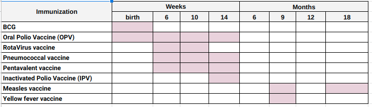

## Goal

Reproduce this table from gsheets in markdown:




## Filled in with ✅ and ❌

|| 6 mo&nbsp;&nbsp;&nbsp; | 12 mo&nbsp; | 18 mo&nbsp; | 2 yr&nbsp;&nbsp;&nbsp; | 2.5 yr | 3 yr&nbsp;&nbsp;&nbsp; | 3.5 yr | 4 yr&nbsp;&nbsp;&nbsp; | 4.5 yr | 5 yr&nbsp;&nbsp; |
|------------|--|--|--|--|--|--|--|--|--|--|
| Vitamin A  | ✅ | ✅ | ✅ | ✅ | ✅ | ✅ | ✅ | ✅ | ✅ | ✅ |
| Deworming  | ❌|  ✅ | ✅ | ✅ | ✅ | ✅ | ✅ | ✅ | ✅ | ✅ |
| Vitamin Z  | ✅ | ✅ | ✅ | ❌ | ✅ | ✅ | ✅ | ❌ | ✅ | ✅ |

## Filled in with 🟢  and ❌

|| 6 mo&nbsp;&nbsp;&nbsp; | 12 mo&nbsp; | 18 mo&nbsp; | 2 yr&nbsp;&nbsp; | 2.5 yr | 3 yr&nbsp;&nbsp;&nbsp; | 3.5 yr | 4 yr&nbsp;&nbsp;&nbsp; | 4.5 yr | 5 yr&nbsp;&nbsp; |
|------------|--|--|--|--|--|--|--|--|--|--|
| Vitamin A  | 🟢 | 🟢 | 🟢 | 🟢 | 🟢 | 🟢 | 🟢 | 🟢 | 🟢 | 🟢 |
| Deworming  | ❌|  🟢 | 🟢 | 🟢 | 🟢 | 🟢 | 🟢 | 🟢 | 🟢 | 🟢 |
| Vitamin Z  | 🟢 | 🟢 | 🟢 | ❌ | 🟢 | 🟢 | 🟢 | ❌ | 🟢 | 🟢 |

## Empty with just 🟢

|| 6 mo&nbsp;&nbsp;&nbsp; | 12 mo&nbsp; | 18 mo&nbsp; | 2 yr&nbsp;&nbsp;&nbsp; | 2.5 yr | 3 yr&nbsp;&nbsp;&nbsp; | 3.5 yr | 4 yr&nbsp;&nbsp;&nbsp; | 4.5 yr | 5 yr&nbsp;&nbsp; |
|------------|--|--|--|--|--|--|--|--|--|--|
| Vitamin A  | 🟢 | 🟢 | 🟢 | 🟢 | 🟢 | 🟢 | 🟢 | 🟢 | 🟢 | 🟢 |
| Deworming  | |  🟢 | 🟢 | 🟢 | 🟢 | 🟢 | 🟢 | 🟢 | 🟢 | 🟢 |
| Vitamin Z  | 🟢 | 🟢 | 🟢 |  | 🟢 | 🟢 | 🟢 |  | 🟢 | 🟢 |

## Empty with just 🟢 and wrapped headers

|| 6<br />mo | 12<br />mo | 18<br />mo | 2<br />yr | 2.5<br />yr | 3<br />yr | 3.5<br />yr | 4<br />yr | 4.5<br />yr | 5<br />yr | 
|------------|--|--|--|--|--|--|--|--|--|--|
| Vitamin A  | 🟢&nbsp; | 🟢&nbsp; | 🟢&nbsp; | 🟢&nbsp; | 🟢&nbsp; | 🟢&nbsp; | 🟢&nbsp; | 🟢&nbsp; | 🟢&nbsp; | 🟢&nbsp; |
| Deworming  | |  🟢 | 🟢 | 🟢 | 🟢 | 🟢 | 🟢 | 🟢 | 🟢 | 🟢 |
| Vitamin Z  | 🟢 | 🟢 | 🟢 |  | 🟢 | 🟢 | 🟢 |  | 🟢 | 🟢 |

## Empty with just 🟢,  wrapped headers, centered content

|| 6<br />mo | 12<br />mo | 18<br />mo | 2<br />yr | 2.5<br />yr | 3<br />yr | 3.5<br />yr | 4<br />yr | 4.5<br />yr | 5<br />yr | 
|:------------:|:--:|:--:|:--:|:--:|:--:|:--:|:--:|--:|:--:|:--:|
| Vitamin A  | 🟢 | 🟢 | 🟢 | 🟢 | 🟢 | 🟢 | 🟢 | 🟢 | 🟢 | 🟢 |
| Deworming  | |  🟢 | 🟢 | 🟢 | 🟢 | 🟢 | 🟢 | 🟢 | 🟢 | 🟢 |
| Vitamin Z  | 🟢 | 🟢 | 🟢 |  | 🟢 | 🟢 | 🟢 |  | 🟢 | 🟢 |

## Empty with just 🟢 & css styling

<div class="special-sauce-table"></div>

|| 6 mo | 12 mo | 18 mo | 2 yr | 2.5 yr | 3 yr | 3.5 yr | 4 yr | 4.5 yr | 5 yr | 
|------------|--|--|--|--|--|--|--|--|--|--|
| Vitamin A  | 🟢 | 🟢 | 🟢 | 🟢 | 🟢 | 🟢 | 🟢 | 🟢 | 🟢 | 🟢 |
| Deworming  | |  🟢 | 🟢 | 🟢 | 🟢 | 🟢 | 🟢 | 🟢 | 🟢 | 🟢 |
| Vitamin Z  | 🟢 | 🟢 | 🟢 |  | 🟢 | 🟢 | 🟢 |  | 🟢 | 🟢 |

Hidden CSS/HTML used to achieve this:

```html

<div class="special-sauce-table"></div>

|| 6 mo | 12 mo | 18 mo | 2 yr | 2.5 yr | 3 yr | 3.5 yr | 4 yr | 4.5 yr | 5 yr |
|------------|--|--|--|--|--|--|--|--|--|--|
| Vitamin A  | 🟢 | 🟢 | 🟢 | 🟢 | 🟢 | 🟢 | 🟢 | 🟢 | 🟢 | 🟢 |
| Deworming  | |  🟢 | 🟢 | 🟢 | 🟢 | 🟢 | 🟢 | 🟢 | 🟢 | 🟢 |
| Vitamin Z  | 🟢 | 🟢 | 🟢 |  | 🟢 | 🟢 | 🟢 |  | 🟢 | 🟢 |

<style>
    .special-sauce-table + table td  {
        width: 3em ;
    }
</style>
```

<!-- this style would go in theme .css file, not inline here --> 
<style>
    .special-sauce-table + table td  {
        width: 3em ;
    }
</style>

## Empty with just 🟢 and two tables all HTML

<table>
<thead>
  <tr>
    <th></th>
    <th colspan="3">Months</th>
    <th colspan="7">Years</th>
  </tr>
  <tr>
    <th></th>
    <th>6</th><th>12</th><th>18</th><th>2</th><th>2.5</th><th>3</th><th>3.5</th><th>4</th><th>4.5</th><th>5</th>
  </tr>
</thead>
<tbody>
  <tr>
    <td>Vitamin A </td>
    <td>🟢</td><td>🟢</td><td>🟢</td><td>🟢</td><td>🟢</td><td>🟢</td><td>🟢</td><td>🟢</td><td>🟢</td><td>🟢</td>
  <tr>
  </tr>
    <td> Deworming </td>
    <td>🟢</td><td>🟢</td><td>🟢</td><td>🟢</td><td>🟢</td><td>🟢</td><td>🟢</td><td>🟢</td><td>🟢</td><td></td>
  <tr>
  </tr>
    <td> Vitamin Z </td>
    <td>🟢</td><td>🟢</td><td>🟢</td><td></td><td>🟢</td><td>🟢</td><td>🟢</td><td></td><td>🟢</td><td>🟢</td>
  </tr>
</tbody>
</table>

Achieved with this HTML:

```html
<table>
<thead>
  <tr>
    <th></th>
    <th colspan="3">Months</th>
    <th colspan="7">Years</th>
  </tr>
  <tr>
    <th></th>
    <th>6</th><th>12</th><th>18</th><th>2</th><th>2.5</th><th>3</th><th>3.5</th><th>4</th><th>4.5</th><th>5</th>
  </tr>
</thead>
<tbody>
  <tr>
    <td>Vitamin A </td>
    <td>🟢</td><td>🟢</td><td>🟢</td><td>🟢</td><td>🟢</td><td>🟢</td><td>🟢</td><td>🟢</td><td>🟢</td><td>🟢</td>
  <tr>
  </tr>
    <td> Deworming </td>
    <td>🟢</td><td>🟢</td><td>🟢</td><td>🟢</td><td>🟢</td><td>🟢</td><td>🟢</td><td>🟢</td><td>🟢</td><td></td>
  <tr>
  </tr>
    <td> Vitamin Z </td>
    <td>🟢</td><td>🟢</td><td>🟢</td><td></td><td>🟢</td><td>🟢</td><td>🟢</td><td></td><td>🟢</td><td>🟢</td>
  </tr>
</tbody>
</table>
```

## Empty with just 🟢 and two tables

### Months

|| 6 mo | 12 mo | 18 mo | 
|------------|--|--|--|
| Vitamin A  | 🟢 | 🟢 | 🟢 |
| Deworming  | |  🟢 | 🟢 |
| Vitamin Z  | 🟢 |  | 🟢 |

### Years

|| 2 yr | 2.5 yr | 3 yr | 3.5 yr | 4 yr | 4.5 yr | 5 yr |
|------------|--|--|--|--|--|--|--|
| Vitamin A  | 🟢 | 🟢 | 🟢 | 🟢 | 🟢 | 🟢 | 🟢 |
| Deworming  | |  🟢 | 🟢 | 🟢 | 🟢 | 🟢 | 🟢 |
| Vitamin Z  | 🟢 | 🟢 | 🟢 |  | 🟢 | 🟢 |  |
