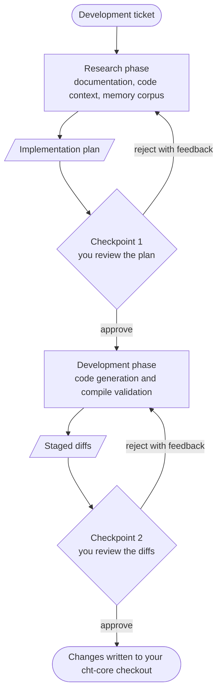

[CHT Agent](https://github.com/medic/cht-agent) is an experimental multi-agent system that assists with cht-core development. You give it a development ticket, and it researches the issue against CHT documentation and the cht-core codebase, proposes an implementation plan for your approval, and generates code changes for your review. A human approves the output at every phase boundary; the agent never commits or pushes on its own.


CHT Agent is a proof of concept under active development. Interfaces and workflows change frequently. Check the [repository](https://github.com/medic/cht-agent) for the latest status before relying on it.


## How it works

The system runs as a pipeline of supervised phases, each built on [LangGraph](https://www.langchain.com/langgraph):



1. **Research**: agents search CHT documentation (via the [CHT Docs MCP Server]()) and analyze the cht-core codebase (via the [CHT Code Context MCP Server]()). The phase produces an implementation plan.
2. **Checkpoint 1**: you review the plan. Approve it, or reject it with feedback and the research phase retries.
3. **Development**: a code generation agent implements the plan against your local cht-core checkout, validates that the result compiles, and stages the changes with a diff preview.
4. **Checkpoint 2**: you review the diffs before anything is written into cht-core.

The repository also contains a *memory distillation pipeline* that mines merged cht-core pull requests into structured knowledge files under `agent-memory/`. Work to feed this corpus into the research phase is tracked in [cht-agent#135](https://github.com/medic/cht-agent/issues/135).

## Prerequisites

- Node.js 22.x
- A local [cht-core](https://github.com/medic/cht-core) checkout on a clean branch
- One of two LLM credentials:
  - the [Claude Code CLI](https://code.claude.com/docs/en/overview) installed and logged in, or
  - an Anthropic API key

## Quickstart

Clone and install:

```bash
git clone https://github.com/medic/cht-agent.git
cd cht-agent
npm ci
npm run build
```

Configure the environment:

```bash
cp .env.example .env
```

Edit `.env` and set two things. First, point `CHT_CORE_PATH` at your cht-core checkout:

```bash
CHT_CORE_PATH=/path/to/cht-core
```

Second, choose an LLM provider. The default routes all model calls through your Claude Code CLI login:

```bash
LLM_PROVIDER=claude-cli
```

To use the Anthropic API instead, unset `LLM_PROVIDER` and set `ANTHROPIC_API_KEY`.

Write a ticket as a Markdown file with YAML front matter. The `domain` field is required; see `tickets/` in the repository for complete examples:

```markdown
---
title: Add contact search functionality to webapp
type: feature
priority: high
domain: contacts
---

# Description

Users need the ability to search for contacts by name or phone number...
```

Validate the ticket, then run the research phase:

```bash
npm run validate-ticket tickets/my-ticket.md
npm run research tickets/my-ticket.md
```

The research phase prints its findings and an implementation plan. To run the full workflow, research plus code generation with both approval checkpoints:

```bash
npm run full tickets/my-ticket.md
```

At checkpoint 2 the agent shows unified diffs of every proposed file change. Nothing is written into your cht-core checkout until you approve.

## The memory corpus

The knowledge files under `agent-memory/domains/` record how past cht-core issues were solved: the problem, the root cause, the fix, the files involved, and reusable patterns. Each entry is keyed to the cht-core issue it resolves and is reviewed by a human before promotion into the corpus.

To regenerate or extend the corpus, the pipeline scrapes merged cht-core pull requests, filters them, and distills drafts for review:

```bash
npm run run-pipeline -- --pr <number>     # one PR
npm run run-pipeline -- --since 24        # PRs merged in the last 24 hours
npm run validate-schema                   # check all entries against the schema
```

## Contributing

Development follows the standard [contribution process](). Issues and design documents live in the [cht-agent repository](https://github.com/medic/cht-agent/issues); start with issues labeled `Good first issue`. All AI-assisted contributions follow the community [AI guidelines]().
