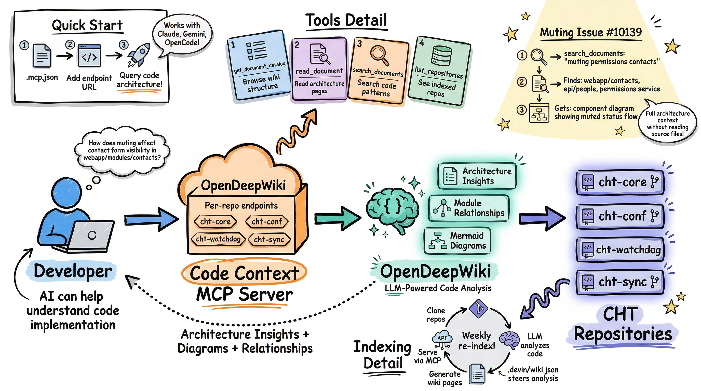

The CHT Code Context MCP Server gives AI agents and developers direct access to **CHT source code architecture** through [OpenDeepWiki](https://github.com/AIDotNet/OpenDeepWiki) integration. In comparison to documentation search, this server understands the _code itself_, such as module relationships, component patterns, and architectural diagrams. This enables agents and AI-assisted developers to reason about implementation, not just documentation.

Connect to the hosted MCP servers to enable your AI tools to explore CHT code architecture:

| Repository | MCP Endpoint |
|---|---|
| `cht-core` | `https://opendeepwiki.dev.medicmobile.org/api/mcp?owner=medic&name=cht-core` |
| `cht-conf` | `https://opendeepwiki.dev.medicmobile.org/api/mcp?owner=medic&name=cht-conf` |
| `cht-watchdog` | `https://opendeepwiki.dev.medicmobile.org/api/mcp?owner=medic&name=cht-watchdog` |
| `cht-sync` | `https://opendeepwiki.dev.medicmobile.org/api/mcp?owner=medic&name=cht-sync` |

## Why use the MCP server?

- **Code architecture understanding**: Query auto-generated architectural analysis of CHT repositories, such as module relationships, component dependencies, and design patterns, instead of manually reading thousands of source files across multiple repos.
- **Auto-generated Mermaid diagrams**: Get visual component relationship diagrams on demand. OpenDeepWiki automatically generates and maintains Mermaid diagrams that map how CHT modules interact, making it easy for agents and developers to understand complex subsystems at a glance.
- **Multi-repo awareness**: A single query can span `cht-core`, `cht-conf`, `cht-watchdog`, and `cht-sync`. The server understands cross-repo dependencies.
- **Always fresh**: OpenDeepWiki re-indexes CHT repositories on a weekly schedule (with on-demand re-indexing available), so the code architecture analysis stays current with the latest changes.
- **Complements CHT Docs MCP**: While the [CHT Docs MCP Server](/ai/mcp-servers/cht-docs-mcp-server/) searches documentation, forum posts, and GitHub issues via Kapa AI, this server understands the _source code_. Together, they give agents both "what the docs say" and "how the code actually works."
- **Platform independent**: Built on OpenDeepWiki, which supports GitHub, GitLab, and Gitea. Community members and country implementations (for example, those hosted on GitLab) can deploy the same setup for their own repositories.

## Client configuration

Each CHT repository is exposed as a separate MCP server endpoint. Configure one or more depending on which repos your work involves. Start with `cht-core-wiki` and add other repos as needed.

### Claude Code

Add to your project's `.mcp.json`:

```json
{
  "mcpServers": {
    "cht-core-wiki": {
      "type": "http",
      "url": "https://opendeepwiki.dev.medicmobile.org/api/mcp?owner=medic&name=cht-core"
    },
    "cht-conf-wiki": {
      "type": "http",
      "url": "https://opendeepwiki.dev.medicmobile.org/api/mcp?owner=medic&name=cht-conf"
    },
    "cht-watchdog-wiki": {
      "type": "http",
      "url": "https://opendeepwiki.dev.medicmobile.org/api/mcp?owner=medic&name=cht-watchdog"
    },
    "cht-sync-wiki": {
      "type": "http",
      "url": "https://opendeepwiki.dev.medicmobile.org/api/mcp?owner=medic&name=cht-sync"
    }
  }
}
```

Or add a single repo via the CLI:

```bash
claude mcp add cht-core-wiki --transport http \
  "https://opendeepwiki.dev.medicmobile.org/api/mcp?owner=medic&name=cht-core"
```

### Claude Desktop

Edit the config file:
- macOS: `~/Library/Application Support/Claude/claude_desktop_config.json`
- Windows: `%APPDATA%\Claude\claude_desktop_config.json`

```json
{
  "mcpServers": {
    "cht-core-wiki": {
      "type": "http",
      "url": "https://opendeepwiki.dev.medicmobile.org/api/mcp?owner=medic&name=cht-core"
    }
  }
}
```

### ChatGPT

Requires Pro, Plus, Team, Enterprise, or Edu subscription.

1. Enable Developer Mode: **Settings** → **Connectors** → **Advanced** → **Developer mode**
2. Create Connector: **Settings** → **Connectors** → **Create**
3. Enter name "CHT Core Wiki" and URL `https://opendeepwiki.dev.medicmobile.org/api/mcp?owner=medic&name=cht-core`

### Gemini CLI

Add to `~/.gemini/settings.json`:

```json
{
  "mcpServers": {
    "cht-core-wiki": {
      "url": "https://opendeepwiki.dev.medicmobile.org/api/mcp?owner=medic&name=cht-core"
    }
  }
}
```

### OpenCode

Add to `~/.config/opencode/opencode.json` or your project `opencode.json`:

```json
{
  "mcp": {
    "cht-core-wiki": {
      "type": "remote",
      "url": "https://opendeepwiki.dev.medicmobile.org/api/mcp?owner=medic&name=cht-core",
      "enabled": true
    }
  }
}
```

## Available tools

> [!TIP]
> To guarantee a tool is invoked, explicitly name it in your prompt. For example: *"search_documents for 'muting' in cht-core to understand how muted places affect contact form visibility"*

Each repository endpoint exposes the same four tools:

| Tool | Purpose | Parameters |
|---|---|---|
| `get_document_catalog` | Get the table of contents for a repository's generated wiki. Use this first to discover available documentation paths. | `owner` (required), `name` (required), `language` (optional, default: `en`) |
| `read_document` | Read a specific document from the generated wiki. Use `get_document_catalog` first to find available paths. | `owner` (required), `name` (required), `path` (required), `startLine` (optional), `endLine` (optional, max 200 lines), `language` (optional) |
| `search_documents` | Search across all generated documents in a repository for content matching a query. Returns matching document paths and snippets. | `owner` (required), `name` (required), `query` (required), `language` (optional) |
| `list_repositories` | List all repositories indexed by the OpenDeepWiki instance. Returns repository names, owners, and indexing status. | None |

### Recommended query patterns

**Discover structure first, then drill down:**
1. `get_document_catalog` — see the full table of contents
2. `search_documents` with your topic — find relevant pages
3. `read_document` on the specific path — get the detailed analysis

**Cross-repo investigation:**
When working on features that span repos, query multiple endpoints. For example, a configuration change might require searching `cht-conf-wiki` for the compilation pipeline and `cht-core-wiki` for the API endpoint that receives the upload.

## Learn more

The CHT Code Context MCP Server is part of the [CHT Agent](https://github.com/medic/cht-agent) multi-agent system for assisting in CHT development tasks. It serves as the **Code Context Layer** in the Research Supervisor, complementing the Documentation Access Layer powered by the [CHT Docs MCP Server](/ai/mcp-servers/cht-docs-mcp-server/). 

- **Decision document**: [Code Context Layer Recommendation](https://github.com/medic/cht-agent/blob/main/designs/layer_recommendations/code-context-layer.md)
- **OpenDeepWiki project**: [github.com/AIDotNet/OpenDeepWiki](https://github.com/AIDotNet/OpenDeepWiki)