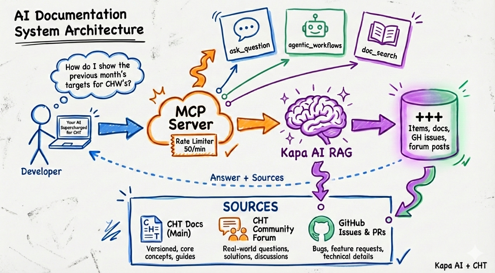

The CHT Docs MCP Server provides AI agents and humans with direct access to CHT knowledge through [Kapa AI](https://kapa.ai) integration. Connect to the hosted MCP server at `https://mcp-docs.dev.medicmobile.org/mcp` to enable your AI tools to search and query CHT sources.

## Why use the MCP server?

- **Unified search**: Query indexed items across documentation, GitHub issues, forum discussions, and source code in one place instead of manually searching across multiple sources
- **Self-improving system**: Every question improves the knowledge base through usage pattern analysis and human-curated custom answers

## Client configuration

### Claude Code

Add `.mcp.json` to your project root:

```json
{
  "mcpServers": {
    "cht-kapa-docs": {
      "type": "http",
      "url": "https://mcp-docs.dev.medicmobile.org/mcp"
    }
  }
}
```

Alternatively, run this command in your project directory:

```bash
claude mcp add --transport http cht-kapa-docs https://mcp-docs.dev.medicmobile.org/mcp
```

### Claude Desktop

Edit the config file:
- macOS: `~/Library/Application Support/Claude/claude_desktop_config.json`
- Windows: `%APPDATA%\Claude\claude_desktop_config.json`

```json
{
  "mcpServers": {
    "cht-kapa-docs": {
      "type": "http",
      "url": "https://mcp-docs.dev.medicmobile.org/mcp"
    }
  }
}
```

### ChatGPT

Requires Pro, Plus, Team, Enterprise, or Edu subscription.

1. Enable Developer Mode: **Settings** → **Connectors** → **Advanced** → **Developer mode**
2. Create Connector: **Settings** → **Connectors** → **Create**
3. Enter name "CHT Kapa Docs" and URL `https://mcp-docs.dev.medicmobile.org/mcp`

### Gemini CLI

Add to `~/.gemini/settings.json`:

```json
{
  "mcpServers": {
    "cht-kapa-docs": {
      "url": "https://mcp-docs.dev.medicmobile.org/mcp"
    }
  }
}
```

### OpenCode

Add to `~/.config/opencode/opencode.json` or your project `opencode.json`:

```json
{
  "mcp": {
    "cht-kapa-docs": {
      "type": "remote",
      "url": "https://mcp-docs.dev.medicmobile.org/mcp",
      "enabled": true
    }
  }
}
```

## Available tools

> [!TIP]
> To guarantee a tool is invoked, explicitly start your prompt with it. For example: "ask_question How can I show individual CHW's historical aggregated targets?"

| Tool | Purpose | Parameters |
|------|---------|------------|
| `ask_question` | Ask CHT documentation questions | `question` (required), `threadId` (optional) |
| `search_docs` | Search documentation directly | `query` (required), `maxResults` (optional) |
| `get_sources` | List available doc sources | None |

## Rate limits

- **Per IP**: 10 requests/minute
- **Global**: 50 requests/minute

## Learn more

The CHT Docs MCP Server is a key component of the [CHT Agent multi-agent system](https://github.com/medic/cht-agent) for automating CHT development tasks.
