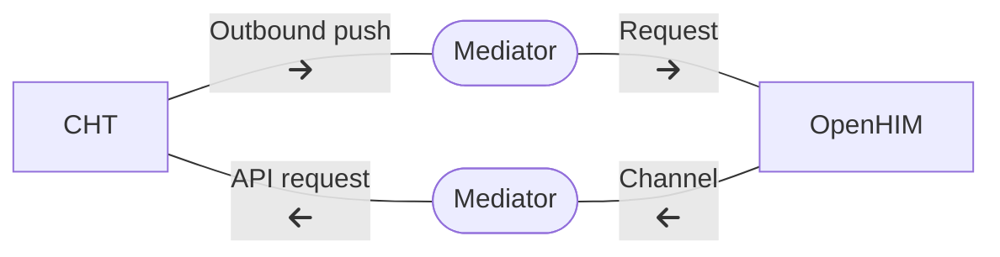

# Introduction

Interoperability is the ability of health information systems to work together, even if they weren't specifically designed to work together. With interoperability, patient information can be seen, exchanged, and used across different platforms. This is different from _integration_ which requires custom development to connect two specific systems together. 

Interoperability is the best practice for health systems because it allows information from one system to be shared with one or more other systems with no additional development.

# Components

Useful components and reference information for interoperability include:

- [OpenHIE](https://ohie.org/) defines the architecture for an interoperability layer.
- [OpenHIM](http://openhim.org/) is a middleware component designed to ease interoperability between systems.
- [HL7 FHIR](https://www.hl7.org/fhir/index.html) is a messaging format to allow all systems to understand the format of the message.
- [ICD-11](https://www.who.int/standards/classifications/classification-of-diseases) and [LOINC](https://loinc.org/) are examples of classification systems.

# CHT

The structure of documents in the CHT database reflect the configuration of the system, and therefore do not map directly to a FHIR message format. To achieve interoperability you should use middleware to convert the CHT datastructure into a standardized form so the other systems can read it.

The recommended approach is to use OpenHIM as the middleware component with [Mediators](http://openhim.org/docs/configuration/mediators/) to do the conversion. [Outbound Push]() should be configured to make a request to the middleware when relevant documents are created or modified in the CHT. A Mediator then calls [CHT APIs]() to gather any additional data required to create a FHIR resource which is then routed to OpenHIM. OpenHIM will then route the resource to any other configured systems.

Conversely to bring data in to the CHT, OpenHIM should be configured to route the updated resource to a Mediator, which then calls the relevant CHT APIs to update the document in the CHT database. This will then be replicated to users' devices as per usual.

A reference application for this pattern is available in the [CHIS Interoperability repository](https://github.com/medic/chis-interoperability).

