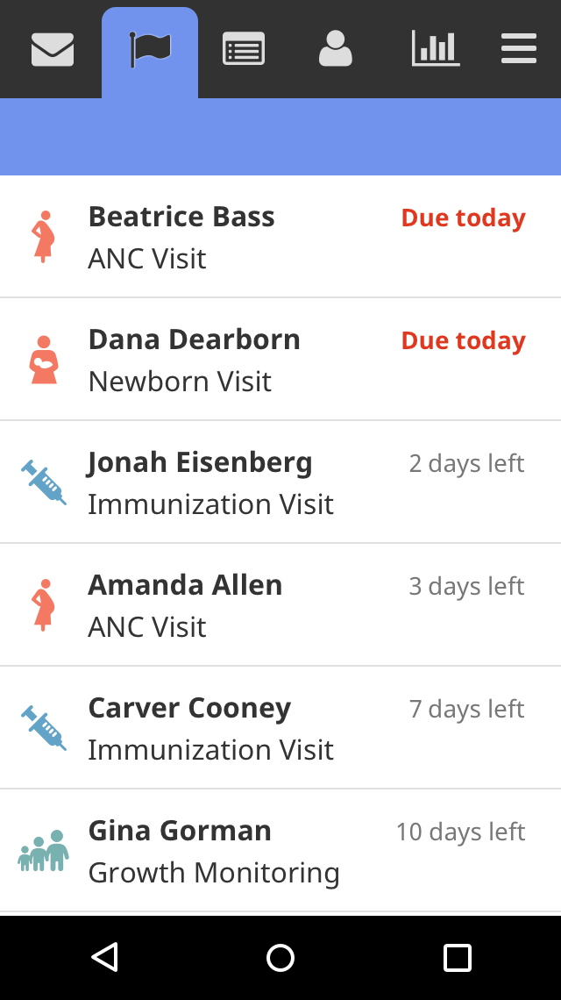
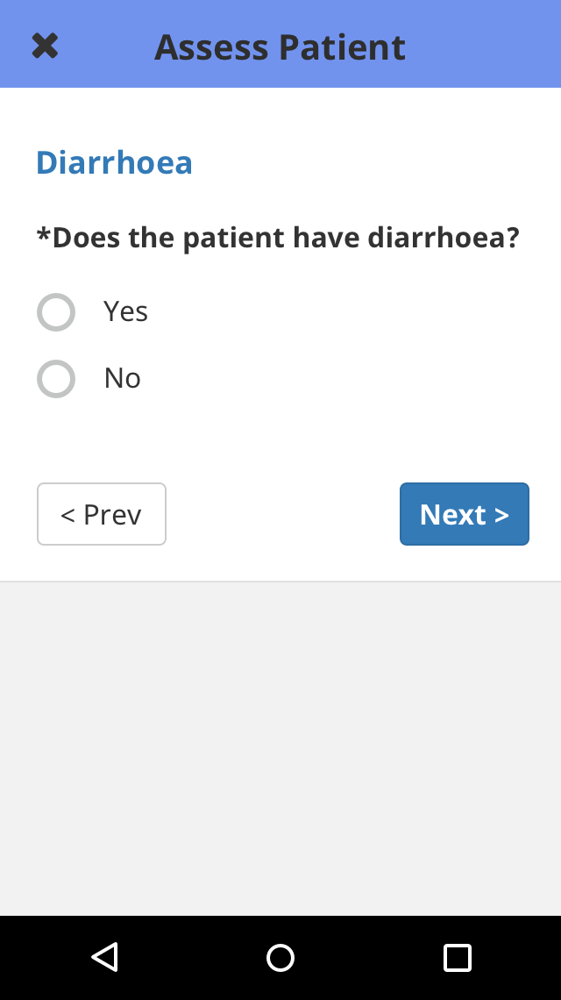
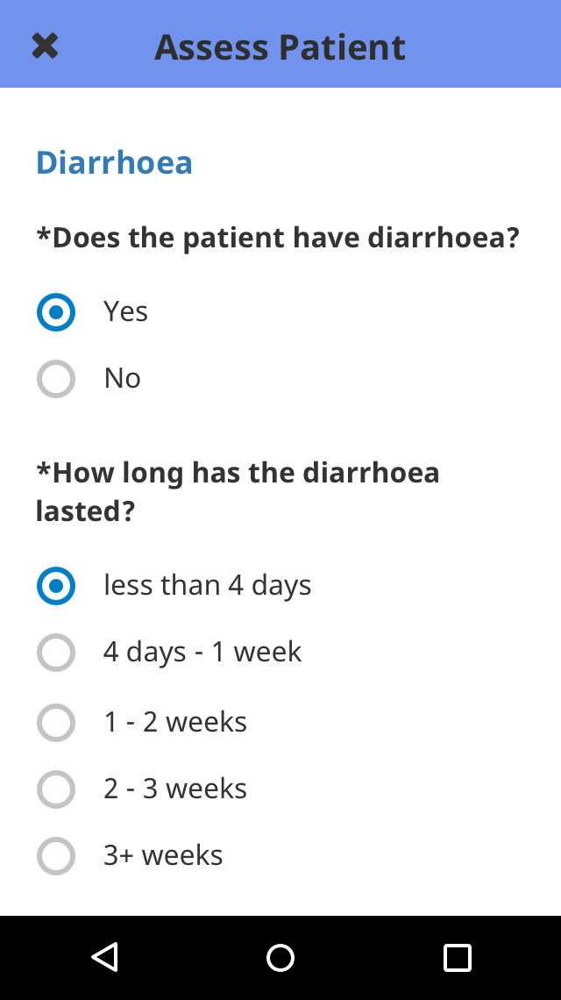
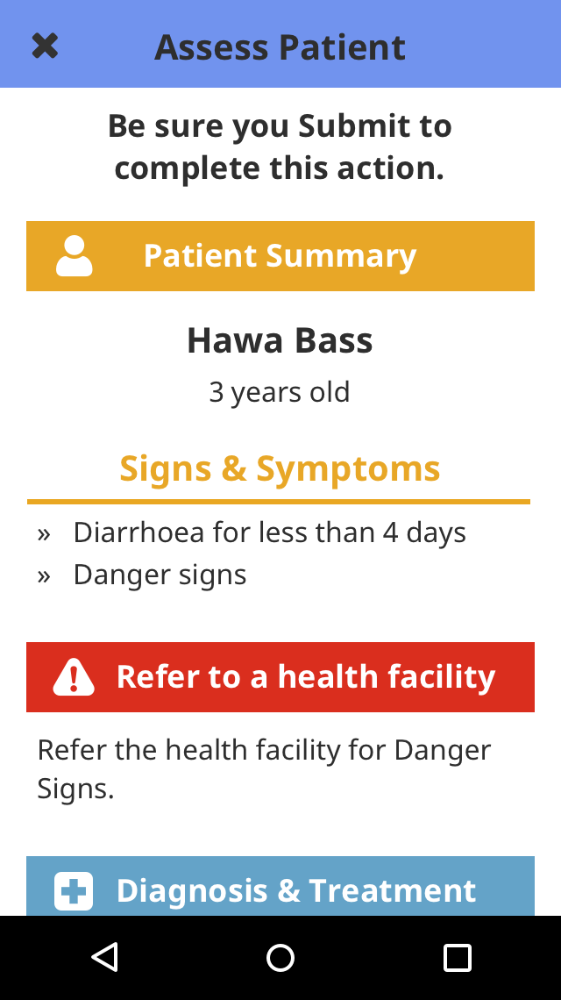
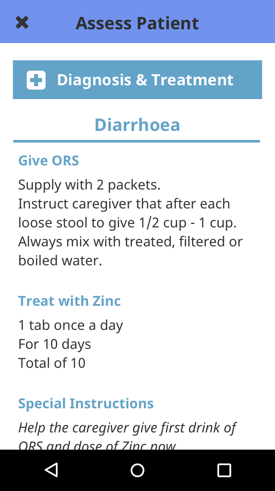
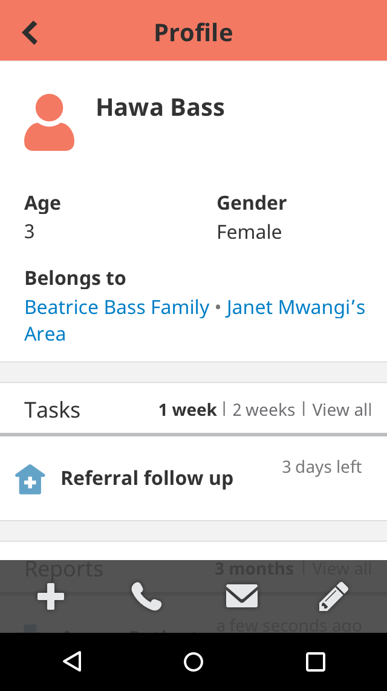

<!-- ## Tasks: Care Follow-Up Workflows -->

Tasks help CHWs plan their day by prompting them to complete follow-up visits and other activities. The list might include upcoming scheduled ANC or Immunization visits, treatment or referral follow-ups, or other required activities such as a household survey.

## Main List

On the Tasks tab is a consolidated list of tasks for all people and families that the user looks after. The task definition determines how long the task will show on this list before and after it is due.

Each task has an icon on the left side which indicates which type of task it is. The first bold line of text is the person or family that the task is about. The second line of text is the name of the task. The due date for the task is located in the upper right hand corner. If a task is overdue, the due date will be red.

Tasks are listed in order of due date. Tasks that are past due will appear at the top of the list. CHWs should strive to complete tasks before they are overdue. Many programs add targets to track task completion and timeliness.

 

## Care Guides

When a CHW clicks on a task, the care guide configured for that task displays. CHWs are then guided through questions for that specific workflow.

  
  
  
  

For more information on Care Guides, see the “[Decision Support for Care Guides]()” section of this overview. 

When the user completes the care guide, the task will be cleared from the Tasks tab, and the report will be accessible from the Reports page or on the profile of the person or place whom the report is about.

## Profile Page

Tasks are also accessed from a the People tab in the app.

Tasks for a particular person or place can be viewed on the contact’s profile in the “Tasks” section. Filters allow you to choose how many tasks you’d like to view for each due date.

 
