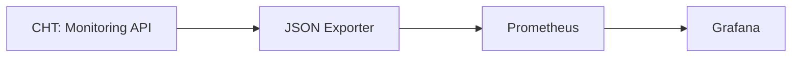
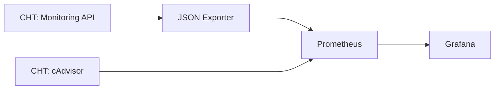

{}
These instructions apply to both CHT 3.x (beyond 3.12) and CHT 4.x.  
{}

## Going beyond basic setup

After you have done the [setup of CHT Watchdog]() and configured it to run [with TLS and have backups enabled](), you may want to extend it to scrape other Prometheus data sources so that Grafana can send alerts on non-CHT Core metrics.

### Default Flow

Let's look at how the default deployment of Watchdog works when configured to only gather metrics from the [monitoring API]():



### Additional Flows 

While the additions to Prometheus don't have to reside on the same server as the CHT, this guide assumes the metrics being added are to increase the CHT stability. As such, the focus of this guide is on using a Dockerized instance of [cAdvisor](https://prometheus.io/docs/guides/cadvisor/) running on the CHT instance. When enabled, we can expose metrics from Docker itself which Prometheus can directly ingest:



By reading this guide you should not only be able to set up cAdvisor, but be familure with extending CHT Watchdog to support any other vital metrics.

### Steps to new integrations

While this is a specific example for cAdvisor, these same steps will be taken to extend Watchdog for other metrics:

1. Create both cAdvisor and Caddy Docker Compose files on the CHT server
2. Adding a new scrape config on the Watchdog server
3. Start the Caddy and a cAdvisor containers along with the CHT Core
4. Restart the Prometheus and Grafana server to include the new scrape config mounts 
5. Importing an exising cAdvisor dashboard from `grafana.com`

After completing these steps, we now have Docker metrics we can alert on.  Read on below on how to set this up!

[](cadvisor.screenshot.png)

## Additional Configuration files

### On the CHT instance

#### cAdvisor

On your CHT instance you'll need to add a Docker composer file, again using our example cAdvisor service. Note this also includes a Redis caching layer. Also note that we're reducing cAdvisors CPU use by adding 3 extra flags in the `command` stanza.  In our example, we've put this file in `/root/cadvisor_compose.yml` with this contents:

```yaml
version: '3.9'
services:
  cadvisor:
    image: gcr.io/cadvisor/cadvisor:latest
    container_name: cadvisor
    ports:
      - 127.0.0.1:8080:8080
    volumes:
      - /:/rootfs:ro
      - /var/run:/var/run:rw
      - /sys:/sys:ro
      - /var/lib/docker/:/var/lib/docker:ro
    depends_on:
      - redis
    networks:
      - cht-net
    command:
      - "--housekeeping_interval=30s"
      - "--docker_only=true"
      - "--disable_metrics=percpu,sched,tcp,udp,disk,diskIO,accelerator,hugetlb,referenced_memory,cpu_topology,resctrl"
  redis:
    image: redis:latest
    container_name: redis
    ports:
      - 6379:6379
    networks:
      - cht-net
```

#### Caddy

Like we did in the [TLS section](), we'll add both a `Caddyfile` and a `caddy-compose.yml` file.  

Starting with the `Caddyfile`, let's assume you're server's DNS entry is `cht.example.com`.  We can expose cAdvisor's service running on localhost port `8080` with this compose file. This tells Caddy to reverse proxy requests to the public interface to the private Docker network interface on port 8080 where cAdvisor is running:

```yaml
cht.example.com:8080 {
    reverse_proxy cadvisor:8080
}
```

Then we can add the compose file to run Caddy. Note that it's mounting the config file we just created:

```yaml
version: "3.9"
services:
  caddy:
    image: caddy:2-alpine
    restart: unless-stopped
    ports:
      - "8080:8080"
    volumes:
      - /root/Caddyfile:/etc/caddy/Caddyfile
    networks:
      - cht-net
```

### On the Watchdog instance


<style>
.mermaid { padding-bottom: 20px; }
</style>


