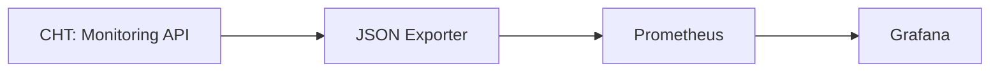
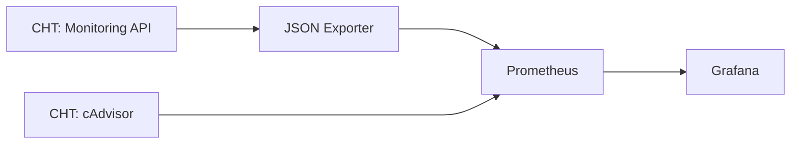

{}
These instructions apply to both CHT 3.x (beyond 3.12) and CHT 4.x.  
{}

## Going beyond basic setup

After you have done the [setup of CHT Watchdog]() and configured it to run [with TLS and have backups enabled](), you may want to extend it to scrape other Prometheus data sources and send other Grafana alerts.

### Default Flow

Let's look at how the default deployment of Watchdog works when configured to only gather metrics from the [monitoring API]():



### Additional Flows 

While the additions to Prometheus don't have to reside on the same server as the CHT, this guide assumes the metrics being added are to increase the CHT stability. As such, the focus of this guide is on using a Dockerized instance of [cAdvisor](https://prometheus.io/docs/guides/cadvisor/) running on the CHT instance. When enabled, we can expose metrics from Docker itself which Prometheus can directly ingest:



After we add the scrape config to Prometheus and the dashboard to Grafana, helpful Docker metrics we can alert on are available:


## Additional Configuration files

### Add Service on CHT instance

On your CHT instance you'll need to add a Docker composer file.  In our example, we'll use the cAdvisor service, which also includes a Raddis caching layer. Note that we're reducing cAdvisors CPU use by adding 3 extra flags to the `command` stanza.  In our example, we've put this file in `/root/cadvisor_compose.yml` with this contents:

```yaml
version: '3.9'
services:
  cadvisor:
    image: gcr.io/cadvisor/cadvisor:latest
    container_name: cadvisor
    ports:
      - 127.0.0.1:8080:8080
    volumes:
      - /:/rootfs:ro
      - /var/run:/var/run:rw
      - /sys:/sys:ro
      - /var/lib/docker/:/var/lib/docker:ro
    depends_on:
      - redis
    networks:
      - cht-net
    command:
      - "--housekeeping_interval=30s"
      - "--docker_only=true"
      - "--disable_metrics=percpu,sched,tcp,udp,disk,diskIO,accelerator,hugetlb,referenced_memory,cpu_topology,resctrl"
  redis:
    image: redis:latest
    container_name: redis
    ports:
      - 6379:6379
    networks:
      - cht-net
```

### Add Prometheus Scrape Config


