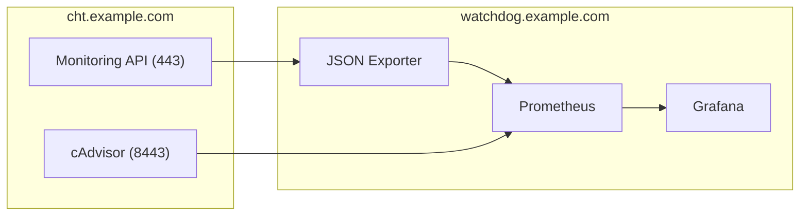
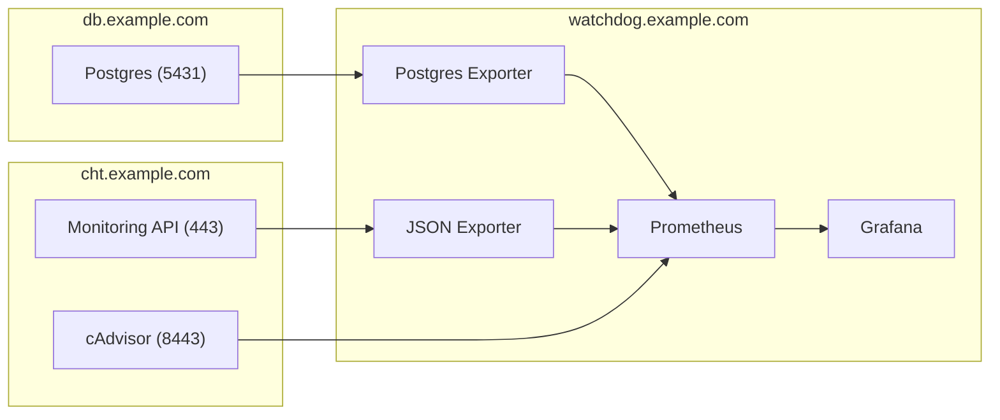

{}
These instructions apply to both CHT 3.x (beyond 3.12) and CHT 4.x.  
{}

## Introduction

Assuming initial Watchdog [setup]() is done, you have made it [production ready]() and finally added [container monitoring](),  there may be additional Postgres metrics you want to ingest to alert on. Or, you may want to create an entirely new dashboard in Grafana with no alerts for viewing health metrics like CHW visits per county or household registration rates.

This guide will walk you through adding one a Postgres query as a datasoruce to Watchdog.  It references CHT Core (`cht.example.com`),  CHT Watchdog (`watchdog.example.com`) and a Postgres server (`db.example.com`).   

It should be noted that this workflow can be added regardless if you've made it production ready or added container monitoring.  However, for completeness, this guide assumes you have done both. As well, while this page shows how to add one query, you could add multiple if you need to.

### Base Flow

Here's what Watchdog data flow looks like base off the intro above after adding [container monitoring]():



### Postgres Flow

This guide will have you deploy a [Postgres Exporter](https://github.com/prometheus-community/postgres_exporter) on your Watchdog server (`watchdog.example.com`).  This, in turn, will query your Postgres server (`db.example.com`):



After reading this guide you should not only be able to set up an initial single query, but also be able to add more queries and report and alert on them.

## Steps to add a query

All steps are done on the CHT Watchdog instance and assume you have a credentials for your Postgres server for Watchdog to user. As well, it assumes that you installed Watchdog in `~/cht-watchdog`: 

1. [Prepare query in config file]()
2. [Add new Postgres Exporter]()
3. [Adding new scrape config]()
4. [Load new Compose files with existing ones]()
5. [Configure the dashboard]()
6. [Save the dashboard for easy deployment and future updates]()

### Prepare query in config file

Add a YAML file for with your query called `~/extra-sql-queries.yml`. In this example we'll be using a query from the [App Monitoring Data Ingestion repo](https://github.com/medic/cht-app-monitoring-data-ingest/), but it can be any query as long as the user you're using in the next step has access to the database and table:

```yaml
replication_failure_reasons:
  query: |
    SELECT 
      metric as failure_type,
      sum(count) AS "count"
    FROM 
      public.app_monitoring_replication_failure_reasons
    WHERE 
      partner_name IN ('partner_name_here')
    GROUP BY 
      failure_type
    ORDER BY 
      count DESC
  metrics:
    - failure:
        usage: "LABEL"
        description: "Name of the failure"
    - sequence:
        usage: "TABLE"
        description: "Replication failure reasons"
```

Note that you can use any value on the first line, seen as  `replication_failure_reasons` above.  It will be the field name we'll use in the 4th step below when exploring the new data in Grafana.

### Add new Postgres Exporter

In a new file  `~/extra-sql-compose.yml`, define your new Postgres exporter as well as add a mount to the existing Grafana and Prometheus services. Note that the `DATA_SOURCE_NAME` value will need to have the following variables added to you `.env` file you created to deploy Watchdog:

* `EXTRA_SQL_USER` - Postgres user to use when logging in
* `EXTRA_SQL_PASS` - Password for `EXTRA_SQL_USER` above
* `EXTRA_SQL_SERVER` - URL or IP for your Postgres server
* `EXTRA_SQL_PORT` - Port of server, defaults to `5432` it not declared.
* `EXTRA_SQL_DATABASE` - Actual string of database name (eg `extra_monitoring` or `health_stats`), will be different for each install.

```yaml
services:

  prometheus:
    volumes:
      - ./extra-sql-prometheus.yml:/etc/prometheus/scrape_configs/extra-sql-prometheus.yml:ro

  grafana:
    volumes:
      - ./extra-sql-dashboard.json:/etc/grafana/provisioning/dashboards/CHT/cht_admin_extra_sql.json:ro

  extra_sql_exporter:
    image: prometheuscommunity/postgres-exporter:latest
    command:
      # disables the collection of all metrics except for custom queries 
      - '--no-collector.database'
      - '--no-collector.postmaster'
      - '--no-collector.process_idle'
      - '--no-collector.replication'
      - '--no-collector.replication_slot'
      - '--no-collector.stat_bgwriter'
      - '--no-collector.stat_database'
      - '--no-collector.statio_user_tables'
      - '--no-collector.stat_statements'
      - '--no-collector.stat_user_tables'
      - '--disable-default-metrics'
      - '--disable-settings-metrics'
    volumes:
      - ./extra-sql-queries.yml:/extra-sql-queries.yml
    environment:
      DATA_SOURCE_NAME: "postgresql://${EXTRA_SQL_USER:-NO DB USER SPECIFIED}:${EXTRA_SQL_PASS:-NO DB PASSWORD SPECIFIED}@${EXTRA_SQL_SERVER:-.NO DB SERVER SPECIFIED}:${EXTRA_SQL_PORT:-5432}/${EXTRA_SQL_DATABASE:-.NO DB SPECIFIED}?sslmode=disable"
      PG_EXPORTER_EXTEND_QUERY_PATH: "/extra-sql-queries.yml"
    restart: always
    networks:
     - cht-watchdog-net
```

If there's a missing mount target, then Docker will error.  Avoid the error by creating an empty file called `~/extra-sql-dashboard.json`.  We'll use this in the last step below

### Adding new scrape config

Create the `~/extra-sql-prometheus.yml` file and point the config to our new Postgres Exporter which is `extra_sql_exporter:9187` on the last line below.  This will tell Prometheus to scrape the new data every 1 minute:

```yaml
scrape_configs:
  - job_name: 'extra-sql'
    scrape_interval: 1m
    static_configs:
      - targets: ['extra_sql_exporter:9187']
```

### Load new Compose files with existing ones

Now that you've added the new configuration files, we can load it alongside the existing ones.  Assuming you've followed the [Watchdog Setup](), this would be:

```shell
cd ~/cht-monitoring
docker compose -f docker-compose.yml -f ../cadvisor-compose.yml -f ../extra-sql-compose.yml up -d
```

### Configure the dashboard

Now that the new Postgres Exporter is running on your Watchdog instance and CHT Watchdog's Prometheus has additional scrape configs to ingest the new metrics, we can now visualize it in a Grafana Dashboard and then alert on it:

1. In the "Metric" field enter `replication_failure_reasons_count` from the step above where we defined `extra-sql-queries.yml`
2. Click the blue "Run query" in the upper right. 
3. We'll make this a table, but you can configure the dashboard as desired. 
4. Click "Add to dashboard"


### Save the dashboard for easy deployment and future updates

An optional last step is on the dashboard you just created, click the "Save" icon:


Copy the resulting JSON into the empty file we created above `~/extra-sql-dashboard.json`.  By saving it here, it makes it easy to put into revision control and make updates in the future.  As well it will automatically load this the next time you open the Watchdog webpage.

An additional optional step is to make your dashboard a peer of the existing "Admin Details" and "Admin Overview".  Do this by editing the JSON in `~/extra-sql-dashboard.json`, find the line with `"graphTooltip": 0,` and add this JSON after it:

```json
  "links": [
    {
      "asDropdown": true,
      "icon": "external link",
      "includeVars": true,
      "keepTime": true,
      "tags": [],
      "targetBlank": false,
      "title": "CHT Admin Extra SQL",
      "tooltip": "",
      "type": "dashboards",
      "url": ""
    }
  ],
```

This will make your new dashboard show up natively with the two existing CHT dashboards:


#### Full Dashboard JSON

For reference, here is the full JSON of the dashboard we created above as shown in the "Save" modal:

```JSON
{
  "annotations": {
    "list": [
      {
        "builtIn": 1,
        "datasource": {
          "type": "grafana",
          "uid": "-- Grafana --"
        },
        "enable": true,
        "hide": true,
        "iconColor": "rgba(0, 211, 255, 1)",
        "name": "Annotations & Alerts",
        "type": "dashboard"
      }
    ]
  },
  "editable": true,
  "fiscalYearStartMonth": 0,
  "graphTooltip": 0,
  "links": [
    {
      "asDropdown": true,
      "icon": "external link",
      "includeVars": true,
      "keepTime": true,
      "tags": [],
      "targetBlank": false,
      "title": "CHT Admin Extra SQL",
      "tooltip": "",
      "type": "dashboards",
      "url": ""
    }
  ],
  "liveNow": false,
  "panels": [
    {
      "datasource": {
        "type": "prometheus",
        "uid": "PBFA97CFB590B2093"
      },
      "fieldConfig": {
        "defaults": {
          "custom": {
            "align": "auto",
            "cellOptions": {
              "type": "auto"
            },
            "inspect": false
          },
          "mappings": [],
          "thresholds": {
            "mode": "absolute",
            "steps": [
              {
                "color": "green",
                "value": null
              },
              {
                "color": "red",
                "value": 80
              }
            ]
          },
          "unit": "short"
        },
        "overrides": [
          {
            "matcher": {
              "id": "byName",
              "options": "__name__"
            },
            "properties": [
              {
                "id": "custom.hidden",
                "value": true
              }
            ]
          },
          {
            "matcher": {
              "id": "byName",
              "options": "instance"
            },
            "properties": [
              {
                "id": "custom.hidden",
                "value": true
              }
            ]
          },
          {
            "matcher": {
              "id": "byName",
              "options": "job"
            },
            "properties": [
              {
                "id": "custom.hidden",
                "value": true
              }
            ]
          },
          {
            "matcher": {
              "id": "byName",
              "options": "server"
            },
            "properties": [
              {
                "id": "custom.hidden",
                "value": true
              }
            ]
          },
          {
            "matcher": {
              "id": "byName",
              "options": "Time"
            },
            "properties": [
              {
                "id": "custom.hidden",
                "value": true
              }
            ]
          },
          {
            "matcher": {
              "id": "byName",
              "options": "failure"
            },
            "properties": [
              {
                "id": "custom.width",
                "value": 462
              }
            ]
          }
        ]
      },
      "gridPos": {
        "h": 10,
        "w": 18,
        "x": 0,
        "y": 0
      },
      "id": 1,
      "options": {
        "cellHeight": "sm",
        "footer": {
          "countRows": false,
          "fields": "",
          "reducer": [
            "sum"
          ],
          "show": false
        },
        "showHeader": false,
        "sortBy": [
          {
            "desc": true,
            "displayName": "Value"
          }
        ]
      },
      "pluginVersion": "10.0.1",
      "targets": [
        {
          "datasource": {
            "type": "prometheus",
            "uid": "PBFA97CFB590B2093"
          },
          "editorMode": "builder",
          "exemplar": false,
          "expr": "replication_failure_reasons_count",
          "format": "table",
          "instant": true,
          "key": "Q-e238fdbd-aed6-4215-a3e8-c611c6586c64-0",
          "legendFormat": "",
          "range": false,
          "refId": "A"
        }
      ],
      "title": "Replication failure reason",
      "type": "table"
    }
  ],
  "refresh": "5s",
  "schemaVersion": 38,
  "style": "dark",
  "tags": [],
  "templating": {
    "list": []
  },
  "time": {
    "from": "now-5m",
    "to": "now"
  },
  "timepicker": {},
  "timezone": "",
  "title": "CHT Admin Extra SQL",
  "uid": "a71db640-cc40-452c-aa92-222a9b49d43b",
  "version": 8,
  "weekStart": ""
}
```
