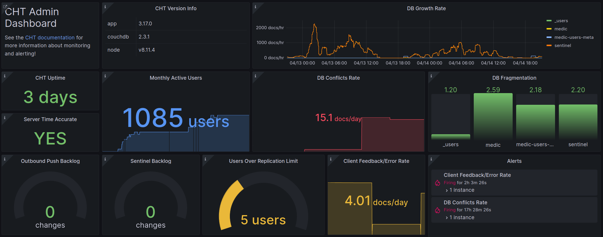

{} 
These instructions apply to both CHT 3.x (beyond 3.12) and CHT 4.x.  
{}

Medic maintains CHT Watchdog which is an opinionated configuration of [Prometheus](https://prometheus.io/) (including [json_exporter](https://github.com/prometheus-community/json_exporter)) and [Grafana](https://grafana.com/grafana/) which can easily be deployed using Docker. It is supported on CHT 3.12 and later, including CHT 4.x.  By using this solution a CHT deployment can easily get longitudinal monitoring and push alerts using Email, Slack or other mechanisms.  All tools are open source and have no licensing fees.

The solution provides both an overview dashboard as well as a detail dashboard.  Here is a portion of the overview dashboard:



[Prometheus supports](https://prometheus.io/docs/concepts/metric_types/) four metric types: Counter, Gauge, Histogram, and Summary.  Currently, the CHT only provides Counter and Gauge type metrics. When building panels for Grafana dashboards, [Prometheus Functions](https://prometheus.io/docs/prometheus/latest/querying/functions/) can be used to manipulate the metric data. Refer to the [Grafana Documentation](https://grafana.com/docs/grafana/latest/dashboards/build-dashboards/best-practices/) for best practices on building dashboards.


### Prerequisites

- [Docker](https://docs.docker.com/install/)
- [Docker Compose](https://docs.docker.com/compose/install/)
- [git](https://git-scm.com/book/en/v2/Getting-Started-Installing-Git)
- URL(s) of the CHT instance(s)

### Setup

These instructions have been tested against Ubuntu, but should work against any OS that meets the prerequisites. They follow a happy path assuming you need to only set a secure password and specify the URL(s) to monitor:

1. Run the following commands to clone this repository, initialize your `.env` file, create a secure password and create your data directories:

    ```sh
    cd ~
    git clone https://github.com/medic/cht-watchdog.git
    cd cht-watchdog
    cp cht-instances.example.yml cht-instances.yml
    cp grafana/grafana.example.ini grafana/grafana.ini
    mkdir -p grafana/data && mkdir  -p prometheus/data 
    sudo apt install -y wamerican  # ensures /usr/share/dict/words is present for shuf call below 
    cp .env.example .env
    password=$(shuf -n7 /usr/share/dict/words --random-source=/dev/random | tr '\n' '-' | tr -d "'" | cut -d'-' -f1,2,3,4,5,6,7)
    sed -i -e "s/password/$password/g" .env
    echo;echo "Initial project structure created! To log into Grafana in the browser:";echo 
    echo "    username: medic"
    echo "    password: ${password}";echo
    ```
   Note that in step 4 below you'll need the username and password which is printed after you run the above command.

2. Edit the `cht-instances.yml` file to have the URLs of your CHT instances. You may include as many URLs of CHT instances as you like.

   Here is an example:

    ```yml
    - targets:
      - https://subsub.sub.example.com
      - https://cht.domain.com
      - https://website.org
    ```
3. Run the following command to deploy the stack:

    ```sh
    cd ~/cht-watchdog
    docker compose up -d
    ```

4. Grafana is available at [http://localhost:3000](http://localhost:3000). See the output from step 1 for your username and password.

If you would like to do more customizing of your deployment, see ["Additional Configuration"](#additional-configuration).

### Upgrading

Before upgrading, you should back up both your current configuration settings as well as your Prometheus/Grafana data directories.

#### Prometheus, Grafana and JSON Exporter

To upgrade these dependencies, update the version numbers set in your `.env` file (or leave them set to `latest`).  Then run the following commands:

```shell
docker compose pull
docker compose up -d
```

#### CHT Watchdog

When you see a new version in the [GitHub repository](https://github.com/medic/cht-watchdog), first review the release notes and upgrade instructions. Then, run the following commands to deploy the new configuration (be sure to replace `TAG` with the tag name associated with the release (e.g. `1.1.0`)):

```shell
cd ~/cht-watchdog
git fetch
git -c advice.detachedHead=false checkout TAG
docker compose pull
docker compose down
docker compose up -d --remove-orphans
```

### Additional Configuration

#### couch2pg Data

With the [release of 1.1.0](https://github.com/medic/cht-watchdog/releases/tag/1.1.0), Watchdog now supports easily ingesting [couch2pg]() data read in from a Postgres database.

1. Copy the two example config files so you can add the correct contents in them.  Do so by running this code:
   
   ```shell
   cd ~/cht-watchdog
   cp exporters/postgres/postgres-instances.example.yml exporters/postgres/postgres-instances.yml
   cp exporters/postgres/postgres_exporter.example.yml exporters/postgres/postgres_exporter.yml
   ```
2. Edit `postgres-instances.yml` you just created and add your target postgres connection URL along with the proper root URL for your CHT instance as the label value. For example, if your postgres server was `db.example.com` and your CHT instance was `cht.example.com` the config would be:
   ```yaml
   - targets: [db.example.com:5432/cht]
     labels:
       cht_instance: cht.example.com
   ```
3. Edit `postgres_exporter.yml` so that the `auth_modules` object for your Postgres instance has the proper username and password. Using our `db.example.com` example from above and assuming a password of `super-secret` and a username of `pg_user`, the config would be:
   ```yaml
   db.example.com:5432/cht: # Needs to match the target URL in postgres-instances.yml
      type: userpass
      userpass:
        username: pg_user
        password: super-secret
      options:
        sslmode: disable
   ```
4. Start your instance up, being sure to include both the existing `docker-compose.yml` and the `docker-compose.postgres-exporter.yml` file:

   ```shell
   cd ~/cht-watchdog
   docker compose -f docker-compose.yml -f exporters/postgres/docker-compose.postgres-exporter.yml up -d
   ```

{}
Always run this longer version of the `docker compose` command which specifies both compose files for all future [upgrades](#upgrading).
{}

#### Prometheus Retention and Storage

By default, historical monitoring data will be stored in Prometheus (`PROMETHEUS_DATA` directory) for 60 days (configurable by `PROMETHEUS_RETENTION_TIME`). A longer retention time can be configured to allow for longer-term analysis of the data.  However, this will increase the size of the Prometheus data volume.  See the [Prometheus documentation](https://prometheus.io/docs/prometheus/latest/storage/) for more information.

Local storage is not suitable for storing large amounts of monitoring data. If you intend to store multiple years worth of metrics, you should consider integrating Prometheus with a [Remote Storage](https://prometheus.io/docs/operating/integrations/#remote-endpoints-and-storage/).

#### Alerts

This configuration includes number of pre-provisioned alert rules.  Additional alerting rules (and other contact points) can be set in the Grafana UI.

See both the Grafana [high level alert Documentation](https://grafana.com/docs/grafana/latest/alerting/) and [provisioning alerts in the UI](https://grafana.com/docs/grafana/latest/alerting/set-up/provision-alerting-resources/file-provisioning/#provision-alert-rules) for more information.

##### Deleting provisioned alert rules

The provisioned alert rules shipped with CHT Watchdog are intended to be the generally applicable for most CHT deployments. However, not all the alert rules will necessarily be useful for everyone. If you would like to delete any of the provisioned alert rules, you can do so with the following steps:

1. In Grafana, navigate to "Alerting"  and then  "Alert Rules"  and click the eye icon for the rule you want to delete.  Copy the `Rule UID` which can be found on the right and is a 10 character value like `mASYtCQ2j`.
2. Create a `delete-rules.yml` file

    ```shell
    cd ~/cht-watchdog
    cp grafana/provisioning/alerting/delete-rules.example.yml grafana/provisioning/alerting/delete-rules.yml
    ```

3. Update your new `delete-rules.yml` file to include the Rule UID(s) of the alert rule(s) you want to delete 
4. Restart Grafana

    ```shell
    docker compose restart grafana
    ```

If you ever want to re-enable the alert rules you deleted, you can simply remove the Rule UID(s) from the `delete-rules.yml` file and restart Grafana again.

##### Modifying provisioned alert rules

The provisioned alert rules cannot be modified directly. Instead, you can copy the configuration of a provisioned alert into a new custom alert with the desired changes. Then, remove the provisioned alert.

1. Open the alert rule you would like to modify in the Grafana alert rules UI and select the "Copy" button.
2. Update the copied alert rule with the desired changes and save it into a new Evaluation group.
3. [Remove the provisioned alert]().

##### Configuring Contact Points

Grafana supports sending alerts via a number of different methods. Two likely options are Email and Slack.

###### Email

To support sending email alerts from Grafana, you must update the `smtp` section of your `grafana/grafana.ini` file with your SMTP server configuration.  Then, in the web interface, add the desired recipient email addresses in the `grafana-default-email` contact point settings.

###### Slack

Slack alerts can be configured within the Grafana web GUI for the specific rules you would like to alert on.

### Configuration Reference

#### Environment Variables

All the variables in the `.env` file:

| Name                        | Default                         | Description                                                                                            |
|-----------------------------|---------------------------------|--------------------------------------------------------------------------------------------------------|
| `GRAFANA_ADMIN_USER`        | `medic`                         | Username for the Grafana admin user                                                                    |
| `GRAFANA_ADMIN_PASSWORD`    | `password`                      | Password for the Grafana admin user                                                                    |
| `GRAFANA_VERSION`           | `latest`                        | Version of the `grafana/grafana-oss` image                                                             |
| `GRAFANA_PORT`              | `3000`                          | Port on the host where Grafana will be available                                                       |
| `GRAFANA_BIND`              | `127.0.0.1`                     | Interface Grafana will bind to.  Change to `0.0.0.0` if you want to expose to all interfaces.  |
| `GRAFANA_DATA`              | `./grafana/data`                | The host directory where Grafana data will be stored                                                   |
| `GRAFANA_PLUGINS`           | `grafana-discourse-datasource`  | Comma separated list of plugins to install (e.g: `grafana-clock-panel,grafana-simple-json-datasource`) |
| `JSON_EXPORTER_VERSION`     | `latest`                        | Version of the `prometheuscommunity/json-exporter` image                                               |
| `PROMETHEUS_VERSION`        | `latest`                        | Version of the `prom/prometheus` image                                                                 |
| `PROMETHEUS_DATA`           | `./prometheus/data`             | The host directory where Prometheus data will be stored                                                |
| `PROMETHEUS_RETENTION_TIME` | `60d`                           | Length of time that Prometheus will store data (e.g. `15d`, `6m`, `1y`)                                |


#### CHT Metrics

All CHT metrics in Prometheus:

| OpenMetrics name                      | Type    | label(s)                                          | Description                                                                                                                                                                                                     |
|---------------------------------------|---------|---------------------------------------------------|-----------------------------------------------------------------------------------------------------------------------------------------------------------------------------------------------------------------|
| `cht_version`                         | N/A     | `app`, `node`, `couchdb`                          | Version information for the CHT instance (recorded in labels)                                                                                                                                                   |
| `cht_conflict_count`                  | Gauge   |                                                   | Number of doc conflicts which need to be resolved manually.                                                                                                                                                     |
| `cht_connected_users_count`           | Gauge   |                                                   | Number of users that have connected to the api recently. By default the time interval is 7 days. Otherwise it is equal to the connected_user_interval parameter value used when making the /monitoring request. |
| `cht_couchdb_doc_total`               | Counter | `medic`, `sentinel`, `medic-users-meta`, `_users` | The number of docs in the db.                                                                                                                                                                                   |
| `cht_couchdb_doc_del_total`           | Counter | `medic`, `sentinel`, `medic-users-meta`, `_users` | The number of deleted docs in the db.                                                                                                                                                                           |
| `cht_couchdb_fragmentation`           | Gauge   | `medic`, `sentinel`, `medic-users-meta`, `_users` | The fragmentation of the db, lower is better, “1” is no fragmentation.                                                                                                                                          |
| `cht_couchdb_update_sequence`         | Counter | `medic`, `sentinel`, `medic-users-meta`, `_users` | The number of changes in the db.                                                                                                                                                                                |
| `cht_date_current_millis`             | Counter |                                                   | The current server date in millis since the epoch, useful for ensuring the server time is correct.                                                                                                              |
| `cht_date_uptime_seconds`             | Counter |                                                   | How long API has been running.                                                                                                                                                                                  |
| `cht_feedback_total`                  | Counter |                                                   | Number of feedback docs created usually indicative of client side errors.                                                                                                                                       |
| `cht_messaging_outgoing_last_hundred` | Gauge   | `group`, `status`                                 | Counts of last 100 messages that have received status updates.                                                                                                                                                  |
| `cht_messaging_outgoing_total`        | Counter | `status`                                          | Counts of the total number of messages.                                                                                                                                                                         |
| `cht_outbound_push_backlog_count`     | Gauge   |                                                   | Number of changes yet to be processed by Outbound Push.                                                                                                                                                         |
| `cht_replication_limit_count`         | Gauge   |                                                   | Number of users that exceeded the replication limit of documents.                                                                                                                                               |
| `cht_sentinel_backlog_count`          | Gauge   |                                                   | Number of changes yet to be processed by Sentinel.                                                                                                                                                              |

