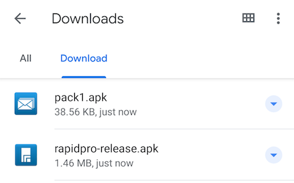
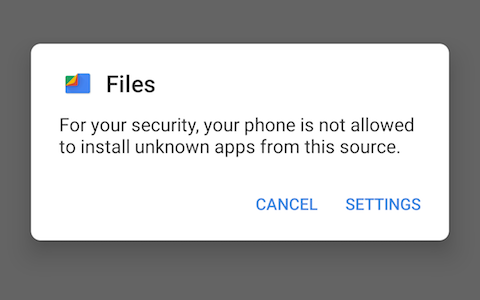
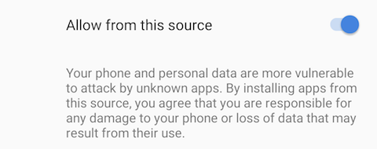
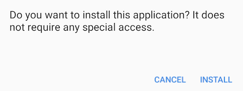
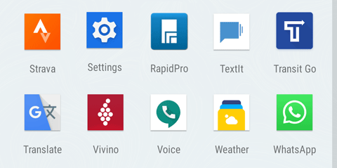
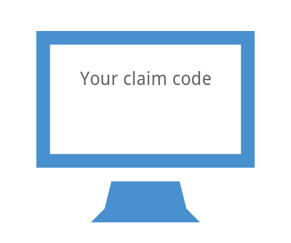

#
# RapidPro CHT APK with FCM configuration

RapidPro - CHT uses your Android phone to send and receive messages on your behalf.

Due to restrictions Android has on applications that send SMS messages, we cannot distribute the RapidPro - CHT application through the Play Store. You will need to download the application manually and install it using the steps below.

1. Download App

    On your Android device, open your browser and download the app by entering the URL: <code>[https://rapidpro.app.medicmobile.org/android/](https://rapidpro.app.medicmobile.org/android/)</code>

2. Launch the RapidPro - CHT installer

    Open the notifications shade by dragging from the top and select the downloaded file.

3. Tap Settings

You will be taken to a screen with "allow from this source" toggle

    

4. Toggle allow from this source

Make sure "allow from this source" toggle is in the On position. The go back and click install

5. Open RapidPro - CHT

Once RapidPro - CHT has been installed, open the app drawer and tap on the  RapidPro - CHT icon to start the app.

6. Send Claim Code

    When you first open RapidPro - CHT, the app will register your device with Google and our servers. Once that is complete, it will display a claim code. Copy that claim code in the form to the left and send it to your supporting engineers at Medic to connect your device.

