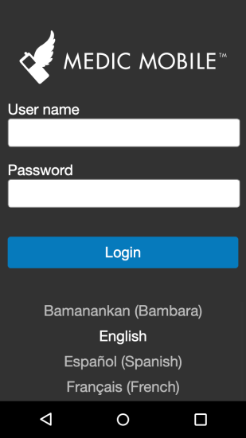
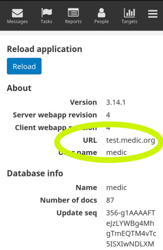

{}
This best practices guide should not be followed verbatim.  Instead, it is important to review each suggestion and assess if your deployment can benefit from it.
{}

## Introduction

Education community health workers to know the deployment's workflows is critical to delivering reliable and accurate care to a community. When onoarding or refreshing their training, it is important to enable them to learn how to use the CHT using a real mobile device with a real CHT Android application on the exact same configuration as production will use. This will give them the confidence to correctly and safely use the app to do their first household visits.

This guide assumes that CHWs will have both a training and production app installed at the same time, or the CHW will be instructed to [install and log into the production app](https://docs.communityhealthtoolkit.org/apps/concepts/access/) when training has been completed.

Just as important, is to ensure their training data does not end up polluting production data.

On-boarding is not a one-size-fits-all process. Be sure to assess which of the items below meet your deployment's needs and implement them accordingly. Within this assessment, consider if extra set up is needed (eg couch2pg hooked up to training) to enable the size you need to fit your deployment.

## Training and Documentation

When training CHWs, it is critical that they understand when they're using the training instance vs. the production instance. Consider adding a step to training documentation with explicit steps to take to tell which instance they're on.

One option is to train CHWs to know the launcher icon for the [unbranded CHT Android app](https://play.google.com/store/apps/details?id=org.medicmobile.webapp.mobile&hl=en_CA&gl=US). This app can accepts the URL for any valid CHT instance, so is easy to use for training, and then uninstall when training is complete.

Here is a screenshot of the login screen and launcher icon from the unbranded app:

Another option would be to have steps like, "Ensure you're in the training app by confirming the 'URL' in 'About' under the hamburger menu". While laborious, it is a relatively quick check which empowers the CHW to know which instance they're using:

The URL may not be a good proxy for CHWs to know which instance they're on. Will a CHW looking at  "**dev**.example.org" be able to tell the difference from "**app**.example.org"? To aid  CHWs, consider using a [different icon for the launcher and login]().

{}Careful when selecting **About** to not select **Logout**. If accidental log outs are a frequent problem the logout option can be removed [from the menu by setting `can_log_out_on_android` to false]().{}

When publishing documentation on how to use the CHT, be sure to include steps to identify which instance you're on. Consider disseminating laminated copies of key steps so CHWs can easily reference them in the field.

Checklists for Admins, Supervisors and CHWs to follow can be extremely helpful to ensure no critical steps are missed during training. An important part of this checklist will be to set up and test communication methods and groups to be used during escalation.

CHWs will have different comfort levels with smartphones. Take note of which CHWs are more fluent using the CHT and smartphones in general. Encourage CHWs to work together to solve problems with members of their training cohort which will take less time than the escalation process.

## Escalation

Another common issue with onoarding is a CHW who is unable to log into either the training or production instance. The lack of data can be just as bad as the right data in the wrong location. Ensure CHWs know who to contact when they have an issue, including when they can not log into the CHT. By using direct contact methods like SMS, WhatsApp or other non-CHT communication methods, the CHW can let their supervisor know they're having issues without waiting hours or days to get logged back into the CHT.

## Proactive Approaches

By directly uninstalling the training application from a CHWs device, you will ensure they can not use it to collect production data. While the ability to easily do a refresher training is also removed, it may be a worthwhile trade off.

Changing the password of users in the CHT on the training instance will prevent them from synchronizing data to the training instance. Use care when using this password changing approach: if a CHW goes for a long time offline collecting production data, when they come online they will not be able to access the production data stored on their device. To avoid this, couple it with monitoring solutions listed above. Otherwise, the password change is a direct and unmistakable signal that the CHW is using the wrong instance.