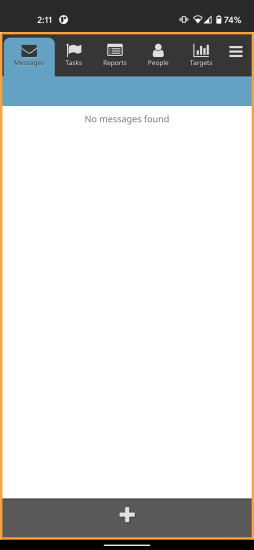

When onboarding new users, having a dedicated CHT app and instance for training can be helpful; it allows new users to do training exercises with mock data to get familiar with the app, while not having the data from their training interfering with the future use of their CHT app. Different approaches are possible, such as only entering real patient data during training, or manually deleting all the training data, but these methods are less practical for large deployments.

{}The suggestions in this guide should be assessed and adapted as needed to benefit a deployment. It is important that users don't accidentally use the wrong app. The [troubleshooting guide]() can help to monitor and remediate training data being in the production instance, or the opposite.{}

### Setting up a training app

A separate Android App can be created for training, which would point to a CHT instance dedicated to training. The training instance should have the same configuration as the production instance, and have users created for training. To differentiate the Android app used for training from the production one, create a duplicate of [your flavor]() and modify the following aspects
- **App ID**: If you want to allow both apps to be on a device at once you will need to make sure your training app has a different `applicationId`. If you want to prevent having both the training and production apps installed at the same time keep these values the same.
- **CHT Instance**: Set the `app_host` string to be the URL of your training instance, otherwise it will in effect be the same as using the production app. 
- **Launcher icons**: Consider using completely different icons, or at least change the color of the launcher icons.
- **App name**: Provide a noticeably different name to the training app. Since app names are often cut short on Android devices, make the change at beginning of the text. For example, `[TRAINING] CHW App` would be better than `CHW App [TRAINING VERSION]`, since the latter may only display as `CHW App...`.
- **Border & Message**: Consider adding a distinctive border and message when using the training app. This might be done in a more automated way in future versions of CHT Android, and in the meantime can be [modelled after this example]().

   

## Switching from training to production app

To avoid having production data in the training app, it is encouraged to **remove** the training app from the device once training is complete. 

If the production app can always be installed after the use of the training is complete, then using the same `applicationId` guarantees that only one of the apps is installed at any given time.

Changing passwords for the training users in an attempt to lock them out is not recommended. In some circumstances a user would be able to continue to use the training app for production use and not have the data sync back to the server.

It is preferable to remove the training app from devices, and [monitor the training instance for unexpected activity]() that can be brought over to the production instance if needed.
