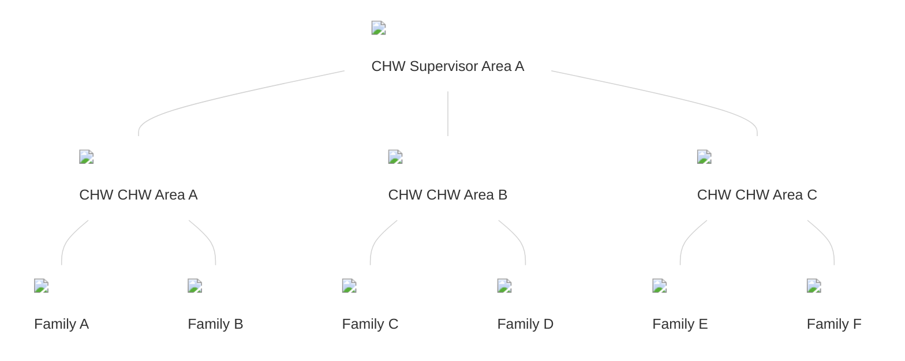
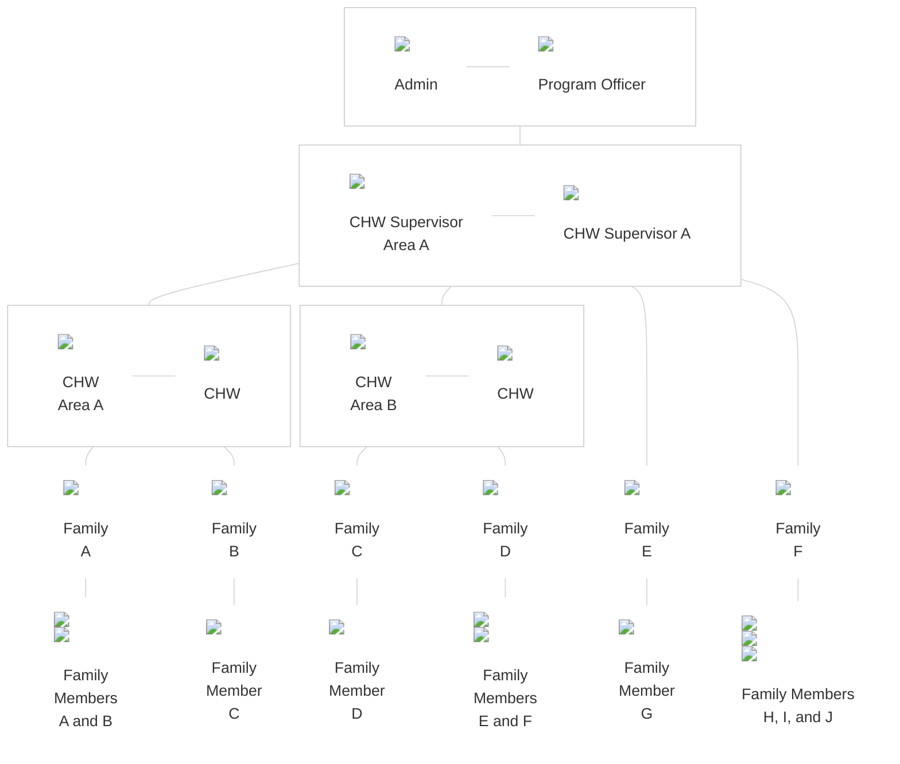

The Core Framework requires a hierarchy to organize the information in the app. It is often based on the hierarchy of a health system within a particular geographic region. 

Large deployment sites often need three or more levels of place hierarchy, while some small sites need fewer than three levels. For this reason, the Core Framework’s information hierarchies are configurable to meet a users needs.

A user logging into their app will see a custom set of people, tasks, reports, and analytics based on the hierarchy level that they belong to. This allows appropriate data sharing based on the role of the user in the health system. 

The information hierarchy is configured in the administration console. The hierarchy levels can be given different titles depending on a particular health system’s program or reporting structures. 



### Places

This is an example of a simple hierarchy that includes a CHW Supervisor area, CHW area, and families as levels which serve as “places” or units of organizing people. 

User roles can be assigned to log in at any of these levels. For example, it would be customary for a CHW to log in at the CHW Area level and view the families, and below that the people, i.e. patients or family members, who belong there.

### People

The hierarchy can be modeled after the health system, health program and/or the community.  All people are associated with a place and these places can be associated to each other. 

For example, a Family Member is part of a Family. A Family and CHWs are part of a CHW Area. A Family Member, a Family, and CHWs are part of a CHW Supervisor Area. 

Additional hierarchy levels may be added as needed and each section of the hierarchy is configurable. For instance, many large projects have unbalanced hierarchies, which is to say, some parts of the hierarchy have more or different layers than others.
The Admin level operates outside of the hierarchy structure and enables access to all levels and people within the hierarchy.
