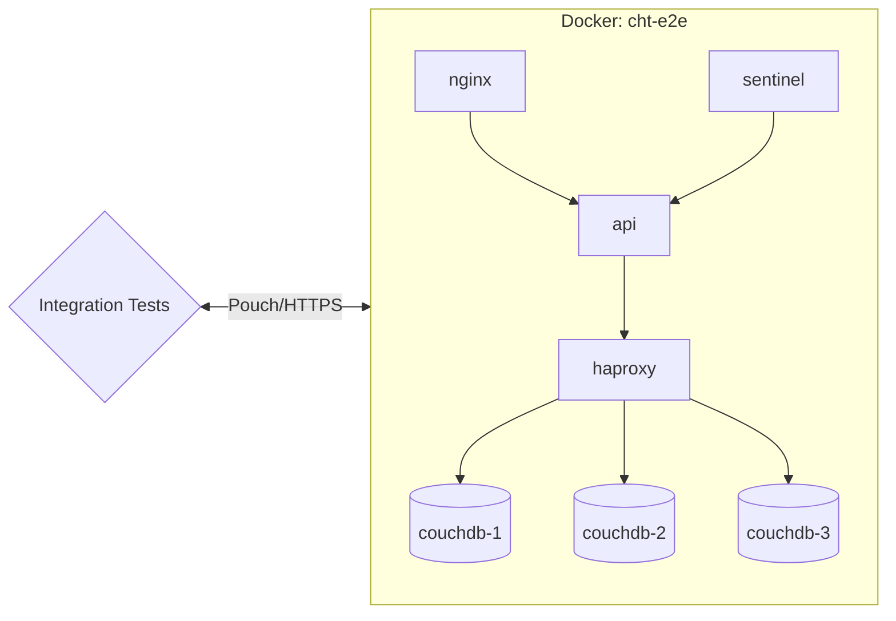
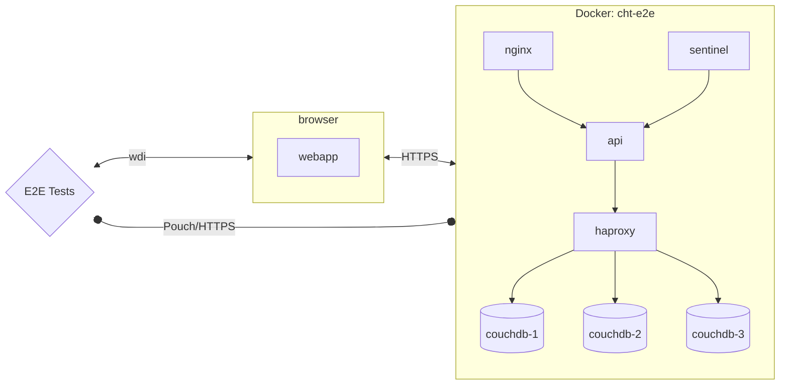

## The goal of automated testing
Developers should be able to make changes in the codebase quickly and confidently. A big part of this means knowing that new changes have not impacted other functionality in the system and everything continues to work as expected.

Of course any new functionality itself may or may not work as expected and it is up to the developer to write the appropriate tests to ensure it works correctly in both expected and unexpected scenarios. Tests should give a developer confidence in their own work, and prior tests should give future developers similar confidence.

Automation of testing should speed up development in two significant areas:
1. While making changes, new automated tests can be run regularly to ensure (without lots of manual effort) that the changes continue to work as expected
2. Avoid large amounts of time spent manually performing regression testing of the whole application to ensure existing functionality keeps working

## Test types and expectations
We seek to have a quality codebase that developers can work on with speed. This means balancing test strategies, quantity, and coverage.

When looking at a well-factored codebase there are three common ways to automate tests (ordered by levels low to high):
1. Unit tests
2. Integration tests
    - Backend integration tests
    - Frontend integration tests
3. End-to-end tests

**Note:** All the commands to execute the different tests can be found in [package.json](https://github.com/medic/cht-core/blob/master/package.json) file.

## Unit Tests

### Description
Small tests of specific behavior. Each unit test is only intended to validate an isolated piece (unit) of functionality separated from the rest of the system. Any dependencies are often mocked.

### Expectations
High coverage of functionality. If measured in branch coverage percentage,  aim for 100%. This is  the place to guarantee confidence in the system. If a higher-level test spots and error and there's no lower-level test failing, you need to evaluate if a lower test should be written.

| Execution Speed     | Complexity | Fragility |
|------------|---------|---------|
| Extremely fast | Extremely low | Extremely stable |

### Implementation
In cht-core unit tests are located in the `tests` directories of each app  (e.g. in [`webapp/tests`](https://github.com/medic/cht-core/tree/master/webapp/tests) you can find unit test for the webapp). Run them locally with: `npm run unit`.

## Integration Tests

### Description
Tests to exercise how multiple components interact with each other. With a dynamic language like JavaScript these are especially important to verify expectations of interface points. These may mock some parts, but often use the "real" components since the point is to exercise those components together. As a result, these tests likely involve more setup, potentially involving data scenarios.

### Expectations
Dramatically fewer than unit tests. The goal is not to verify all branches; it is to gain confidence in interface points.

| Execution Speed     | Complexity | Fragility |
|------------|---------|---------|
| Fast execution, but slower startup when working with a DB | Mid-to-high. Things can get complex fast when combining parts! | Mostly stable. Fragility risks tend to come from DB setup. |

### Implementation
For us, backend integration testing means testing through the entire stack of our application connected to other applications within our system. In the image below, it means that we test each application (box) and its interaction with other applications within our system.
We isolate the tests from the webapp and make the necessary shortcuts to make the test more straightforward and faster. We do not mock any part of the system.

**Backend integration tests** are located in [`tests/integration`](https://github.com/medic/cht-core/tree/master/tests/integration). Run them locally with `npm run integration-all-local` and `npm run integration-sentinel-local`.



**Frontend integration tests** (or web component tests) are designed to validate form behavior (including page layout) without needing to run the whole CHT. The web component isolates the enketo form functionality from the CHT webapp. This only covers forms and not other parts of the webapp. It does not trace behavior though the whole system and the database is never involved. Instead, the whole idea of the web component is to abstract the UI functionality away from the underlying backend complexity.

Frontend integration tests are located in [`tests/integration`](https://github.com/medic/cht-core/tree/master/tests/integration). To run them locally you need to build a cht-form Web Component with `npm run build-cht-form` and `npm run integration-cht-form` to run the web component tests.

## E2E Tests

### Description
Tests that simulate real user experiences to validate the complete system. You can think of e2e test as the user main workflows when using the system.

### Expectations
 E2e tests give us the most confidence to decide if the feature is working, but must only check the parts of code that the lower-level tests can't cover. We should push the testing levels as far down as possible.

| Execution Speed     | Complexity | Fragility |
|------------|---------|---------|
| Slow. So please make sure to check existent tests and maybe just add extra assertions or minor changes instead of directly adding a specific e2e test for your new change. Also, make sure your code is performant. | Low for the test itself (click tab, enter text into form, click submit, check text on screen. Extremely high for the setup.  | Painful fragility with high risk of race conditions and high maintenance burden. Please ensure your code is clean, organized, and utilizes effective selectors.  |

### Implementation
Our end-to-end tests are designed to test the entire system as a whole. They interact with the webapp as a user would, using [WebdriverIO](https://webdriver.io/) to control a headless browser session. They are not isolated from the rest of the system, and they do not use mocking.

End-to-end tests are located in [`tests/e2e`](https://github.com/medic/cht-core/tree/master/tests/e2e). Run them locally with the following:

- `npm run wdio-local` to run the tests for the default config
- `npm run wdio-default-mobile-local` to run the mobile tests



### How to write automated e2e tests

Read the [style guide for automated tests]() for guidelines on how to create new automated test cases for CHT-Core.

### Debugging E2E tests

End to end (e2e) tests can be really difficult to debug - sometimes they fail seemingly at random, and sometimes they only fail on certain environments (eg: ci but not locally). This can make reproducing and reliably fixing the issue challenging, so here are some tips to help!

#### Set the `DEBUG` flag

Setting the `DEBUG` environment variable (e.g. [`DEBUG=true npm run wdio-local`](https://github.com/medic/cht-core/blob/master/tests/wdio.conf.js#L103)) when running the tests locally will do the following:

- Run the browser without the `headless` flag (details in the [`wdio.conf`](https://github.com/medic/cht-core/blob/master/tests/wdio.conf.js#L35) file), so the browser will be displayed when running the tests
- Increase the test timeout from 2 minutes to 10 minutes
- Prevent Mocha from automatically retrying tests that fail (by default a failing test is retried 5 times, details in the [`wdio.conf`](https://github.com/medic/cht-core/blob/master/tests/wdio.conf.js#L198)file)
- Prevent the `cht-e2e` Docker containers from being torn down after the test finishes

#### Read the logs

Read the failure carefully - it often has really good info but sometimes it's just hard to find. Most importantly it tells you exactly the line in the test that failed and you can look that up in the source to see what it was trying to do. The error message itself is also really useful. Also sometimes one error causes the next, so always start with the first test failure before looking at the others.

##### Known failure patterns

- Can't click on an element because another element would get the click. This usually means a modal dialog was being shown. 90% of the time this is the update notification modal which means some settings change has been detected after the test started execution.
- Stale element. This means the DOM element has been removed after it was found on the page but before trying to do something with it. Generally try to find the element just before it needs it to reduce the chance of this happening

#### Other logs and screenshots

GitHub actions will artifact all files in tests/logs. This is the directory any logs, results, images, etc... should save to if you want to review them if a build fails.

##### View the CI report
There are logs and screenshots stored in the allure reports when a job failed on the CI. To access to those logs follow these steps:
- Download the CI run artifact zip file located in the failed build's `Archive Results` section.
  
- Extract the `.zip` file.
- From your cht-core directory, run `npx allure open <path>/allure-report/`. Being `<path>` the location where the zip file was extracted.

#### Running just the failing test

Running e2e tests can be quite slow so to save time modify the `specs` property of [`/tests/e2e/**/wdio.conf.js`](https://github.com/medic/cht-core/blob/master/tests/e2e/default/wdio.conf.js#L7) so it only finds your test. You can also use `describe.skip` and `it.skip` to skip specific tests.

##### IntelliJ Based

1. In a terminal, run `npm run build-dev-watch`
2. In Intellij, open the [package.json](https://github.com/medic/cht-core/blob/master/package.json) file
3. Scroll to the scripts section and click the ▶ button next to `wdio-local`
4. Select `Debug 'wdio-local'`

#### Watching the test run

Running the tests locally (e.g. with `npm run wdio-local`) will allow you to watch it run but if you interact with the page the test will fail in unexpected ways. Furthermore the browser will close after a short timeout so you won't be able to inspect the console or DOM. To do this, force quit the process running the test before it tears down and you will be able to navigate around the app, use Chrome dev tools, and inspect the docs in the database to (hopefully) work out what's going wrong.

#### Running the upgrade e2e test locally

To run the upgrade e2e tests in your local environment, follow these steps:

- Make sure your branch has been published, and it's available in the market:
    - A way to do this is by pushing the branch, let the GitHubActions to run, if all the other e2e are okay, then it will publish the branch.
    - Check that your branch name is available [here](https://staging.dev.medicmobile.org/_couch/builds_4/_design/builds/_view/releases).
- Make sure to stop all existing containers
- Set these environment variables:
    - `export MARKET_URL_READ=https://staging.dev.medicmobile.org`.
    - `export STAGING_SERVER=_couch/builds_4`.
    - `export BRANCH=<your branch name>`.
    - `export BASE_VERSION=<CHT base version>`(it can be used `latest` as the value).
    - `export TAG=<CHT version>`(Optional, e.g. `4.8.1`).
- Run the upgrade e2e tests: `npm run upgrade-wdio`

If you experience errors such as:

```
Error in hook: StatusCodeError: 404 - "{\"error\":\"not_found\",\"reason\":\"Document is missing attachment\"}\n"
```

Try the following:
- It's probably because it can't find the latest released version of CHT, double check that `MARKET_URL_READ` and `STAGING_SERVER` environment variables are set.

If you experience errors such as:

```
If you are seeing this locally, it can mean that your internet is too slow to download all images in the allotted time.
Either run the test multiple times until you load all images, download images manually or increase this timeout.
```

Try the following:
- Manually downloaded the images. To download images manually, you can use either docker-compose or docker:
  - With docker, you'd do a docker pull  <image tag> for every image you want to download.
  - With docker-compose, you'd save all docker-compose files in a folder, do a docker-compose pull, and point to your files as a source. Read more on [docker compose pull](https://docs.docker.com/engine/reference/commandline/compose_pull/)


### Test Architecture

Our GitHub actions spin up an ubuntu-22.04 machine. They install software and then launch couchdb and horticulturalist in a docker container. This is needed to run our applications in the specific node versions we support, while allowing our test code to run in versions of node it supports. This creates a paradigm to keep in mind when writing tests. Tests run on the ubuntu machine. 
Any test code that starts a server or runs an executable is running outside of the horti container. The ports are exposed for all our services and horti has access to the cht-core root via a volume. Horti can also talk to the host by getting the gateway of the docker network. 
