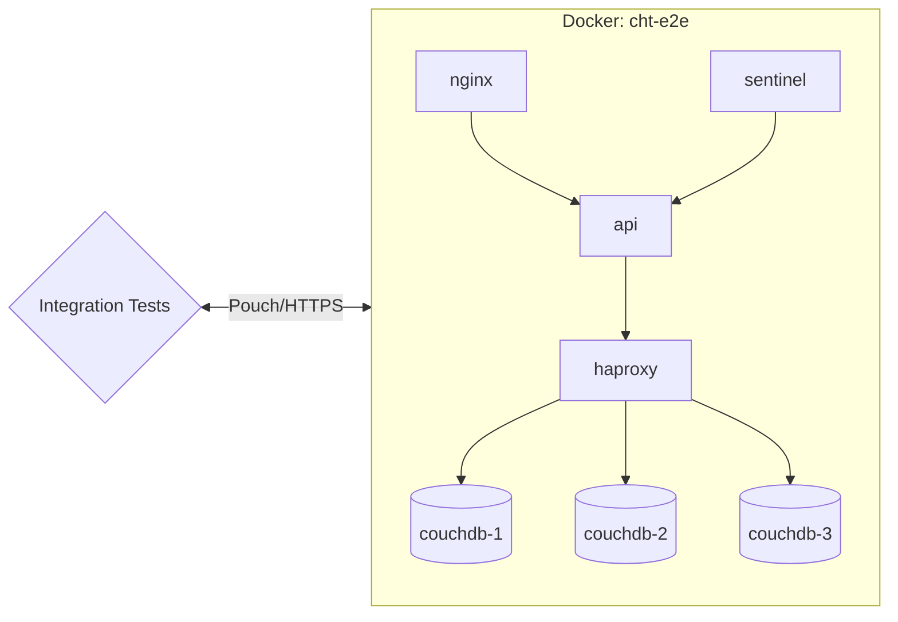
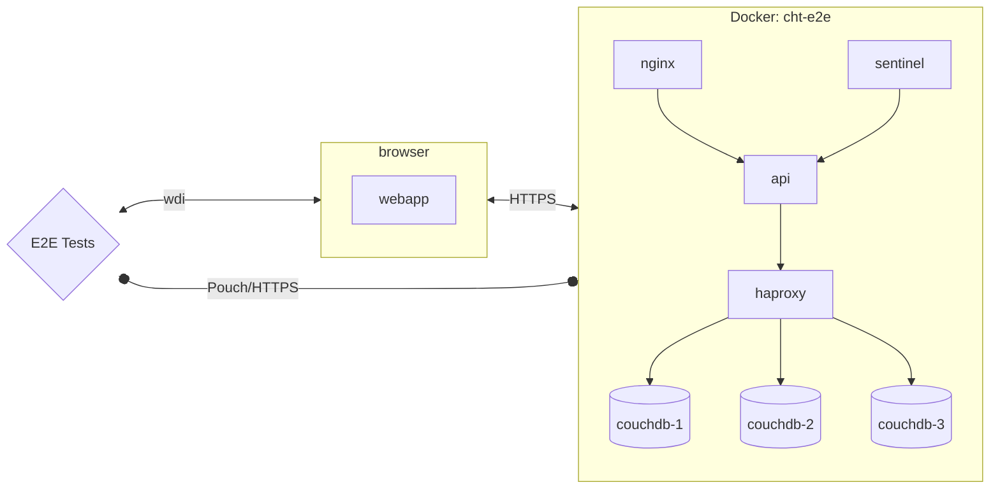

## The goal of automated testing
Contributors from all backgrounds are welcome to make changes in the codebase. The CHT testing framework is designed to help you contribute with confidence, regardless of your experience level. This guide will help you understand the CHT testing approach and how you can contribute effectively.

A key part of this confidence comes from knowing that new changes have not impacted other functionality in the system and everything continues to work as expected.
Automation of testing should speed up development in two significant areas:
1. While making changes, new automated tests can be run regularly to ensure (without lots of manual effort) that the changes continue to work as expected
2. Avoid large amounts of time spent manually performing regression testing of the whole application to ensure existing functionality keeps working

## Test types and expectations
CHT Core contains three types of tests, each serving a specific purpose (ordered by levels low to high):
1. Unit tests
2. Integration tests
    - Backend integration tests
    - Frontend integration tests
3. End-to-end tests

**Note:** All the commands to execute the different tests can be found in [package.json](https://github.com/medic/cht-core/blob/master/package.json) file.

## Unit Tests

### Description
Small tests of specific behavior. Each unit test is only intended to validate an isolated piece (unit) of functionality separated from the rest of the system. Any dependencies are often mocked.
These are typically the easiest to write and are a great starting point for new contributors.

**Write unit tests for:**
- Testing individual functions or methods
- Verifying component behavior
- Checking edge cases

### Expectations
High coverage of functionality. If measured in branch coverage percentage,  aim for 100%. This is  the place to guarantee confidence in the system. If a higher-level test spots and error and there's no lower-level test failing, you should evaluate if a lower-level test should be written.

| Execution Speed     | Complexity | Fragility |
|------------|---------|---------|
| Extremely fast | Extremely low | Extremely stable |

### Implementation
In cht-core unit tests are located in the `tests` directories of each module/service  (For example, in [`webapp/tests`](https://github.com/medic/cht-core/tree/master/webapp/tests) you can find unit test for the webapp).

### Running Unit Tests Locally
Run the full unit test suite locally with:
```bash
npm run unit
```

#### Running one module isolated
To run unit tests for a specific module/service instead of the entire suite:

```bash
# Example: Run unit tests for admin module
npm run unit-admin
```

To discover all available unit test commands, type `npm run unit` and press Tab to see autocomplete options.
This will show all available unit test commands:
```bash
unit                      unit-couchdb              unit-sentinel
unit-admin                unit-haproxy              unit-shared-lib
unit-api                  unit-haproxy-healthcheck  unit-webapp
unit-cht-deploy           unit-nginx                unit-webapp-continuous
```

#### Running individual tests within a spec
To run only specific test suites or individual tests within a module, you can use `describe.only` or `it.only` in your test files. See the [Isolating specific tests](#isolating-specific-tests) section for examples.

## Integration Tests

### Description
Tests to exercise how multiple components interact with each other. With a dynamic language like JavaScript these are especially important to verify expectations of interface points. These may mock some parts, but often use the "real" components since the point is to exercise those components together. As a result, these tests likely involve more setup, potentially involving data scenarios.

**Write integration tests for:**
- Testing interactions between components
- Verifying API endpoints
- Checking database operations

### Expectations
Dramatically fewer than unit tests. The goal is not to verify all branches; it is to gain confidence in interface points.

| Execution Speed     | Complexity | Fragility |
|------------|---------|---------|
| Fast execution, but slower startup when working with a DB | Mid-to-high. Things can get complex fast when combining parts! | Mostly stable. Fragility risks tend to come from DB setup. |

### Implementation
Backend integration testing means testing through the entire stack of the application connected to other applications within the system. In the image below, this involves testing each application (box) and its interaction with other applications within the system.
The tests are isolated from the webapp with necessary shortcuts to make testing more straightforward and faster. No part of the system is mocked.

### Backend integration tests 
Backend integration tests are located in [`tests/integration`](https://github.com/medic/cht-core/tree/master/tests/integration). 



### Running Backend Integration Tests Locally

Run the full integration test suites locally with:

```bash
# Example: Run all backend integration tests
npm run integration-all-local
```

To discover all available integration test commands, type `npm run integration-` and press Tab to see autocomplete options.
This will show all available integration test commands:
```bash
integration-all-k3d-local       integration-cht-form
integration-all-local           integration-sentinel-k3d-local
integration-api                 integration-sentinel-local
```

#### Running one spec isolated
To run a specific integration test spec instead of the entire test suite:

```bash
# Run only contact-edit tests 
npx mocha --config tests/integration/.mocharc-base.js tests/integration/contacts/contact-edit.spec.js
```

#### Running individual tests within a spec
To run only specific integration tests within a spec file, you can use `describe.only` or `it.only` in your test files. See the [Isolating specific tests](#isolating-specific-tests) section for examples.

### Frontend integration tests 
Frontend integration tests (or web component tests) are designed to validate form behavior (including page layout) without needing to run the whole CHT. The web component isolates the enketo form functionality from the CHT webapp. This only covers forms and not other parts of the webapp. It does not trace behavior though the whole system and the database is never involved. Instead, the whole idea of the web component is to abstract the UI functionality away from the underlying backend complexity.

Frontend integration tests are located in [`tests/integration/cht-form`](https://github.com/medic/cht-core/tree/master/tests/integration/cht-form). 

### Running Frontend Integration Tests Locally

To run them locally you need to ***build*** a cht-form Web Component with:
```bash
npm run build-cht-form
```
And after building you can run the tests with:
```bash
npm run integration-cht-form
```

## E2E Tests

### Description
Tests that simulate real user experiences to validate the complete system. You can think of e2e test as the user main workflows when using the system.
E2E tests verify the entire application works as expected from a user's perspective.

**Write E2E tests for:**
- Testing complete user workflows
- Verifying critical paths
- Checking cross-browser compatibility

### Expectations
E2e tests give the most confidence to decide if the feature is working, but must only check the parts of code that the lower-level tests can't cover. The testing levels should be pushed as far down as possible.

| Execution Speed     | Complexity | Fragility |
|------------|---------|---------|
| Slow. So make sure to check existent tests and maybe just add extra assertions or minor changes instead of directly adding a specific e2e test for your new change. Also, make sure your code is performant. | Low for the test itself (click tab, enter text into form, click submit, check text on screen. Extremely high for the setup.  | Painful fragility with high risk of race conditions and high maintenance burden. Ensure your code is clean, organized, and utilizes effective selectors.  |

### Implementation
Our end-to-end tests are designed to test the entire system as a whole. They interact with the webapp as a user would, using [WebdriverIO](https://webdriver.io/) to control a headless browser session. They are not isolated from the rest of the system, and they do not use mocking.

End-to-end tests are located in [`tests/e2e`](https://github.com/medic/cht-core/tree/master/tests/e2e). 


### Running E2E Tests Locally
Run the full E2E test suites locally with:

```bash
# Run default E2E tests
npm run wdio-local

# Run mobile E2E tests
npm run wdio-default-mobile-local

# Run E2E tests without rebuilding Docker images (faster for repeated runs)
npm run ci-webdriver-default
```

#### Running one spec isolated
To run a specific E2E test spec instead of the entire test suite:

```bash
# Example: Run only the tests inside the pregnancy spec
npm run wdio-local -- --spec=pregnancy.wdio-spec.js
```

To discover all available E2E test specs, browse the [`tests/e2e`](https://github.com/medic/cht-core/tree/master/tests/e2e) directory structure:

```
tests/e2e/
├── default/
|   └── enketo/
│       ├── pregnancy.wdio-spec.js
│       ├── repeat.wdio-spec.js
│       └── ...
│   └── ...
├── mobile/
│   └── contacts/
│       ├── delete.wdio-spec.js
│       └── ...
└── ...
```

You can specify any `.wdio-spec.js` file from these directories in the `--spec` parameter.

#### Running one suite isolated
To run a specific E2E test suite:

```bash
# Run all suites (default behavior)
npm run wdio-local -- --suite=all

# Example: Run tests by suite name
npm run wdio-local -- --suite=lowLevel

# Run multiple suites
npm run wdio-local -- --suite=core,workflows
```

To discover all available suite names, check the WebdriverIO configuration files in the corresponding [`tests/e2e`](https://github.com/medic/cht-core/tree/master/tests/e2e) directory. For example [`tests/e2e/default/suites.js`](https://github.com/medic/cht-core/blob/master/tests/e2e/default/suites.js)

#### Running individual tests within a spec
To run only specific E2E tests within a spec file, you can use `describe.only` or `it.only` in your test files. See the [Isolating specific tests](#isolating-specific-tests) section for examples.



## Isolating specific tests

For all test types (unit, integration, and e2e), you can isolate specific tests using `describe.only` or `it.only` in your test files:

**Example (Unit Test):**
```javascript
// In your unit test file (e.g., /webapp/tests/mocha/unit/translator.spec.js)
describe('Bootstrap Translator', () => {
  it('Translate LOAD_ASSETS to English', () => {
    // This test will be skipped
  });

  it('Translate to Spanish', () => {
    // This test will be skipped
  });
});

describe.only('Error cases', () => {
  it('Non-existant key', () => {
    // This test will run (part of describe.only)
  });
  
  it('Non-existant locale falls back to English', () => {
    // This test will run (part of describe.only)
  });
});

describe('Translation Validation', () => {
  it.only('All translations provided', () => {
    // Only this individual test will run
  });
  
  it('Validate translation keys', () => {
    // This test will be skipped
  });
});
```

**Note:** Remember to remove `.only` before committing your code, as it will prevent other tests from running.

## Contributing Section
### Ways to Get Involved
You can contribute to the CHT testing in various ways:
- Writing new tests
- Improving existing tests
- Enhancing test documentation
- Reporting test failures
- Suggesting test scenarios

### Getting Started
1. Set up your [development environment](https://docs.communityhealthtoolkit.org/contribute/code/core/dev-environment/)
2. Run existing tests to familiarize yourself
3. Join the CHT community channels for support
4. Start with small, manageable changes

### How to write automated e2e tests

Read the [style guide for automated tests]() for guidelines on how to create new automated test cases for CHT-Core.

### Debugging E2E tests

End to end (e2e) tests can be really difficult to debug - sometimes they fail seemingly at random, and sometimes they only fail on certain environments (eg: ci but not locally). This can make reproducing and reliably fixing the issue challenging, so here are some tips to help!

#### Set the `DEBUG` flag

Setting the `DEBUG` environment variable (For example: [`DEBUG=true npm run wdio-local`](https://github.com/medic/cht-core/blob/master/tests/wdio.conf.js#L103)) when running the tests locally will do the following:

- Run the browser without the `headless` flag (details in the [`wdio.conf`](https://github.com/medic/cht-core/blob/master/tests/wdio.conf.js#L35) file), so the browser will be displayed when running the tests
- Increase the test timeout from 2 minutes to 10 minutes
- Prevent Mocha from automatically retrying tests that fail (by default a failing test is retried 5 times, details in the [`wdio.conf`](https://github.com/medic/cht-core/blob/master/tests/wdio.conf.js#L198)file)
- Prevent the `cht-e2e` Docker containers from being torn down after the test finishes

#### Run the e2e tests without re-building docker images

After the tests are executed the first time using the command `npm run wdio-local`, the docker images are built in your local environment using the checkout branch name. If it is needed to run the tests repeatedly and there is a certainty that the cht-core code didn't change, you can use the command `npm run ci-webdriver-default`. This command will execute the e2e tests as they are run with the `wdio-local` command but without re-building the images. This command uses the images that were built previously, which makes the process faster.

#### Read the logs

Read the failure carefully - it often has really good info but sometimes it's just hard to find. Most importantly it tells you exactly the line in the test that failed and you can look that up in the source to see what it was trying to do. The error message itself is also really useful. Also sometimes one error causes the next, so always start with the first test failure before looking at the others.

##### Known failure patterns

- Can't click on an element because another element would get the click. This usually means a modal dialog was being shown. 90% of the time this is the update notification modal which means some settings change has been detected after the test started execution.
- Stale element. This means the DOM element has been removed after it was found on the page but before trying to do something with it. Generally try to find the element just before it needs it to reduce the chance of this happening

#### Other logs and screenshots

GitHub actions will artifact all files in tests/logs. This is the directory any logs, results, images, etc... should save to if you want to review them if a build fails.

##### View the CI report
There are logs and screenshots stored in the allure reports when a job failed on the CI. To access to those logs follow these steps:
- Download the CI run artifact zip file located in the failed build's `Archive Results` section.
  
- Extract the `.zip` file.
- From your cht-core directory, run `npx allure open <path>/allure-report/`. Being `<path>` the location where the zip file was extracted.

##### IntelliJ Based

1. In a terminal, run `npm run build-dev-watch`
2. In Intellij, open the [package.json](https://github.com/medic/cht-core/blob/master/package.json) file
3. Scroll to the scripts section and click the ▶ button next to `wdio-local`
4. Select `Debug 'wdio-local'`

#### Watching the test run

Running the tests locally (For example, with `npm run wdio-local`) will allow you to watch it run but if you interact with the page the test will fail in unexpected ways. Furthermore the browser will close after a short timeout so you won't be able to inspect the console or DOM. To do this, force quit the process running the test before it tears down and you will be able to navigate around the app, use Chrome dev tools, and inspect the docs in the database to (hopefully) work out what's going wrong.

#### Running the upgrade e2e test locally

To run the upgrade e2e tests in your local environment, follow these steps:

- Make sure your branch has been published, and it's available in the market:
    - A way to do this is by pushing the branch, let the GitHubActions to run, if all the other e2e are okay, then it will publish the branch.
    - Check that your branch name is available [here](https://staging.dev.medicmobile.org/_couch/builds_4/_design/builds/_view/releases).
- Make sure to stop all existing containers
- Set these environment variables:
    - `export MARKET_URL_READ=https://staging.dev.medicmobile.org`.
    - `export STAGING_SERVER=_couch/builds_4`.
    - `export BRANCH=<your branch name>`.
    - `export BASE_VERSION=<CHT base version>`(it can be used `latest` as the value).
    - `export TAG=<CHT version>`(Optional, For example: `4.8.1`).
- Run the upgrade e2e tests: `npm run upgrade-wdio`

If you experience errors such as:

```shell
Error in hook: StatusCodeError: 404 - "{\"error\":\"not_found\",\"reason\":\"Document is missing attachment\"}\n"
```

Try the following:
- It's probably because it can't find the latest released version of CHT, double check that `MARKET_URL_READ` and `STAGING_SERVER` environment variables are set.

If you experience errors such as:

```shell
If you are seeing this locally, it can mean that your internet is too slow to download all images in the allotted time.
Either run the test multiple times until you load all images, download images manually or increase this timeout.
```

Try the following:
- Manually downloaded the images. To download images manually, you can use either `docker compose` or `docker`:
  - With `docker`, you'd do a docker pull  <image tag> for every image you want to download.
  - With `docker compose`, you'd save all docker-compose files in a folder, do a `docker compose pull`, and point to your files as a source. Read more on [docker compose pull](https://docs.docker.com/engine/reference/commandline/compose_pull/)

If you experience errors such as:

```shell
A user session timing out while running the test.
```
This could be because there are some issues with data or there could be a large number of images and volumes that caused docker to crash.
To resolve this, it's recommended to clean all docker data for a fresh start. Note that these commands will delete everything.
The e2e tests might take a little longer to run because all the images need to be downloaded again.

Try running the following commands:
- `docker system prune`
- `docker image prune -a`
- `docker volume prune -a`
- `docker network prune`

Repeat the above steps until all data has been deleted.


### Test Architecture

CHT Core GitHub actions spin up an ubuntu-22.04 machine. They install software and then launch couchdb and horticulturalist in a docker container. This is needed to run the applications in the specific supported `node` versions, while allowing the test code to run in versions of `node` it supports. This creates a paradigm to keep in mind when writing tests. Tests run on the ubuntu machine.
Any test code that starts a server or runs an executable is running outside of the horti container. The ports are exposed for all the services and horti has access to the cht-core root via a volume. Horti can also talk to the host by getting the gateway of the docker network.


### Support and Community Resources
The CHT Community is here to help you succeed with testing:

- Questions? Ask in the [Community Forum](https://forum.communityhealthtoolkit.org/)
- Need help debugging? Check the [Troubleshooting Guide]()
- Found a bug? [Open an issue](https://github.com/medic/cht-core/issues)
- Want to contribute to testing? See the [Contribution Guide]()

Remember, every contributor was once new to the project. Don't hesitate to ask for help!
