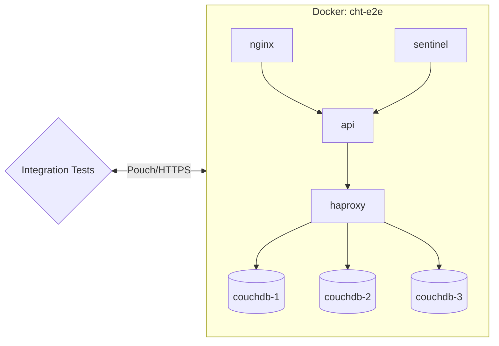
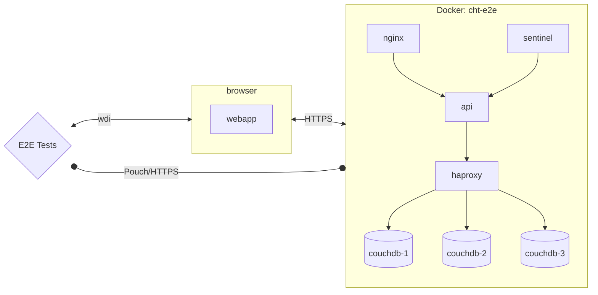

## Unit Tests

Each unit test is only intended to validate an isolated piece (unit) of functionality separated from the rest of the system. They can use mocking to replicate the behavior of other parts of the system.

Unit tests are located in the `tests` directories of each app  (e.g. in `webapp/tests` you can find unit test for the webapp). Run them locally with: `npm run unit`.

## Integration Tests

For us, integration testing means testing through the entire stack of our application connected to other applications within our system. In the image below, it means that we test each application (box) and its interaction with other applications within our system.
We isolate the tests from the webapp and make the necessary shortcuts to make the test more straightforward and faster. We do not mock any part of the system.

Integration tests are located in `tests/integration`. Run them locally with `npm run integration-all-local` and `npm run integration-sentinel-local`.



## E2E Tests

Our end-to-end tests are designed to test the entire system as a whole. They interact with the webapp as a user would, using [WebdriverIO](https://webdriver.io/) to control a headless browser session. They are not isolated from the rest of the system, and they do not use mocking.

End-to-end tests are located in [`tests/e2e`](https://github.com/medic/cht-core/tree/master/tests/e2e). Run them locally with the following:

- `npm run wdio-local` to run the tests for the default config
- `npm run wdio-standard-local` to run the tests for the standard config
- `npm run wdio-default-mobile-local` to run the mobile tests



### Debugging E2E tests

End to end (e2e) tests can be really difficult to debug - sometimes they fail seemingly at random, and sometimes they only fail on certain environments (eg: ci but not locally). This can make reproducing and reliably fixing the issue challenging, so here are some tips to help!

#### Set the `DEBUG` flag

Setting the `DEBUG` environment variable (e.g. `DEBUG=true npm run wdio-local`) when running the tests locally will do the following:

- Run the browser without the `headless` flag (details [here](https://github.com/medic/cht-core/blob/master/tests/e2e/wdio.conf.js#L86-L87)), so the browser will be displayed when running the tests
- Increase the test timeout from 2 minutes to 10 minutes
- Prevent Mocha from automatically retrying tests that fail (by default a failing test is retried 5 times, details [here](https://github.com/medic/cht-core/blob/master/tests/e2e/wdio.conf.js#L177))
- Prevent the `cht-e2e` Docker containers from being torn down after the test finishes

#### Read the logs

Read the failure carefully - it often has really good info but sometimes it's just hard to find. Most importantly it tells you exactly the line in the test that failed and you can look that up in the source to see what it was trying to do. The error message itself is also really useful. Also sometimes one error causes the next, so always start with the first test failure before looking at the others.

##### Known failure patterns

- Can't click on an element because another element would get the click. This usually means a modal dialog was being shown. 90% of the time this is the update notification modal which means some settings change has been detected after the test started execution.
- Stale element. This means the DOM element has been removed after it was found on the page but before trying to do something with it. Generally try to find the element just before it needs it to reduce the chance of this happening

#### Other logs and screenshots

There are logs and screenshots stored in the allure reports. [Here](https://github.com/medic/cht-core/blob/master/TESTING.md#view-the-ci-report) are the instructions to access that information.

#### Running just the failing test

Running e2e tests can be quite slow so to save time modify the `specs` property of `/tests/e2e/**/wdio.conf.js` so it only finds your test. You can also use `describe.skip` and `it.skip` to skip specific tests.

#### Watching the test run

Running the tests locally with `npm run wdio-local` or `npm run standard-wdio-local` will allow you to watch it run but if you interact with the page the test will fail in unexpected ways. Furthermore the browser will close after a short timeout so you won't be able to inspect the console or DOM. To do this, force quit the process running the test before it tears down and you will be able to navigate around the app, use Chrome dev tools, and inspect the docs in the database to (hopefully) work out what's going wrong.

#### Running the upgrade e2e test locally

To run the upgrade e2e tests in your local environment, follow these steps:

- Make sure your branch has been published, and it's available in the market:
    - A way to do this is by pushing the branch, let the GitHubActions to run, if all the other e2e are okay, then it will publish the branch.
    - Check that your branch name is available [here](https://staging.dev.medicmobile.org/_couch/builds_4/_design/builds/_view/releases).
- Make sure to stop all existing containers
- Set these environment variables:
    - `export MARKET_URL_READ=https://staging.dev.medicmobile.org`.
    - `export STAGING_SERVER=_couch/builds_4`.
    - `export BRANCH=<your branch name>`.
- Run the upgrade e2e tests: `npm run upgrade-wdio`

If you experience errors such as:

```
Error in hook: StatusCodeError: 404 - "{\"error\":\"not_found\",\"reason\":\"Document is missing attachment\"}\n"
```

Try the following:
- It's probably because it can't find the latest released version of CHT, double check that `MARKET_URL_READ` and `STAGING_SERVER` environment variables are set.

If you experience errors such as:

```
If you are seeing this locally, it can mean that your internet is too slow to download all images in the allotted time.
Either run the test multiple times until you load all images, download images manually or increase this timeout.
```

Try the following:
- Manually downloaded the images. To download images manually, you can use either docker-compose or docker:
  - With docker, you'd do a docker pull  <image tag> for every image you want to download.
  - With docker-compose, you'd save all docker-compose files in a folder, do a docker-compose pull, and point to your files as a source. [Compose pull documentation](https://docs.docker.com/engine/reference/commandline/compose_pull/)
