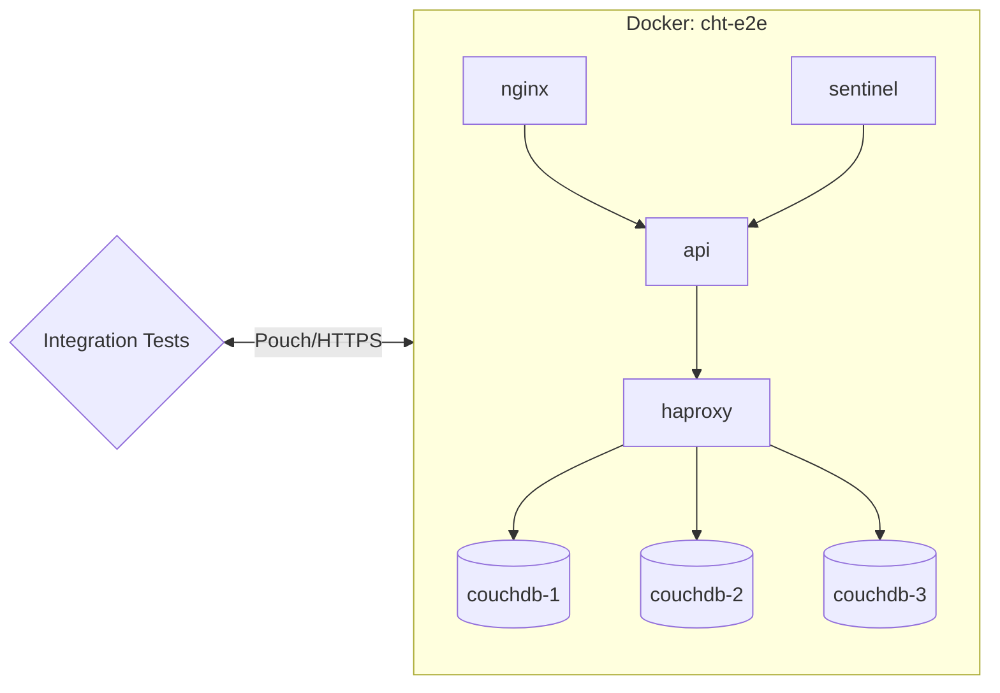
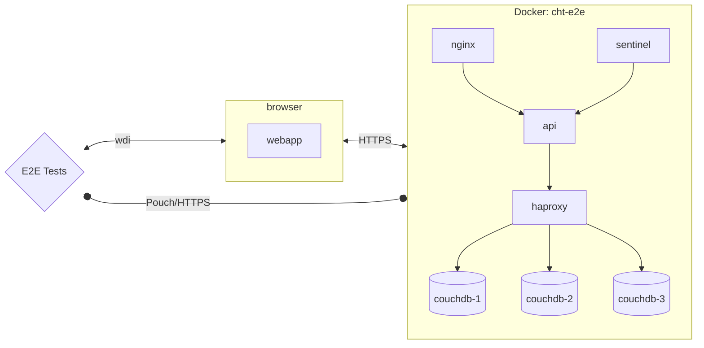

# Automated Tests

## The goal of automated testing
Developers should be able to make changes in the codebase quickly and confidently. A big part of this means knowing that new changes have not impacted other functionality in the system and everything continues to work as expected.

Of course any new functionality itself may or may not work as expected and it is up to the developer to write the appropriate tests to ensure it works correctly in both expected and unexpected scenarios. Tests should give a developer confidence in their own work, and prior tests should give future developers similar confidence.

Automation of testing should speed up development in two significant areas:
1. While making changes, new automated tests can be run regularly to ensure (without lots of manual effort) that the changes continue to work as expected
1. Avoid large amounts of time spent manually performing regression testing of the whole application to ensure existing functionality keeps working   

## Unit Tests

Each unit test is only intended to validate an isolated piece (unit) of functionality separated from the rest of the system. They can use mocking to replicate the behavior of other parts of the system.

Unit tests are located in the `tests` directories of each app  (e.g. in `webapp/tests` you can find unit test for the webapp). Run them locally with: `npm run unit`.

## Integration Tests

For us, integration testing means testing through the entire stack of our application connected to other applications within our system. In the image below, it means that we test each application (box) and its interaction with other applications within our system.
We isolate the tests from the webapp and make the necessary shortcuts to make the test more straightforward and faster. We do not mock any part of the system.

Integration tests are located in `tests/integration`. Run them locally with: `npm run e2e-integration-local`.

## E2E Tests

Our end-to-end tests are designed to test the entire system as a whole. They interact with the webapp as a user would, using [WebdriverIO](https://webdriver.io/) to control a headless browser session. They are not isolated from the rest of the system, and they do not use mocking.

End-to-end tests are located in [`tests/e2e`](https://github.com/medic/cht-core/tree/master/tests/e2e). Run them locally with the following:

- `npm run wdio-local` to run the tests for the default config
- `npm run standard-wdio-local` to run the tests for the standard config
- `npm run default-wdio-mobile-local` to run the mobile tests

### Debugging E2E tests

End to end (e2e) tests can be really difficult to debug - sometimes they fail seemingly at random, and sometimes they only fail on certain environments (eg: ci but not locally). This can make reproducing and reliably fixing the issue challenging, so here are some tips to help!

#### Set the `DEBUG` flag

Setting the `DEBUG` environment variable (e.g. `DEBUG=true npm run wdio-local`) when running the tests locally will do the following:

- Run the browser without the `headless` flag (details [here](https://github.com/medic/cht-core/blob/master/tests/e2e/wdio.conf.js#L86-L87)), so the browser will be displayed when running the tests
- Increase the test timeout from 2 minutes to 10 minutes
- Prevent Mocha from automatically retrying tests that fail (by default a failing test is retried 5 times, details [here](https://github.com/medic/cht-core/blob/master/tests/e2e/wdio.conf.js#L177))
- Prevent the `cht-e2e` Docker containers from being torn down after the test finishes

#### Read the logs

Read the failure carefully - it often has really good info but sometimes it's just hard to find. Most importantly it tells you exactly the line in the test that failed and you can look that up in the source to see what it was trying to do. The error message itself is also really useful. Also sometimes one error causes the next, so always start with the first test failure before looking at the others.

##### Known failure patterns

- Can't click on an element because another element would get the click. This usually means a modal dialog was being shown. 90% of the time this is the update notification modal which means some settings change has been detected after the test started execution.
- Stale element. This means the DOM element has been removed after it was found on the page but before trying to do something with it. Generally try to find the element just before it needs it to reduce the chance of this happening

#### Other logs and screenshots

There are logs and screenshots stored in the allure reports. [Here](https://github.com/medic/cht-core/blob/master/TESTING.md#view-the-ci-report) are the instructions to access that information.

#### Running just the failing test

Running e2e tests can be quite slow so to save time modify the `specs` property of `/tests/e2e/**/wdio.conf.js` so it only finds your test. You can also use `describe.skip` and `it.skip` to skip specific tests.

#### Watching the test run

Running the tests locally with `npm run wdio-local` or `npm run standard-wdio-local` will allow you to watch it run but if you interact with the page the test will fail in unexpected ways. Furthermore the browser will close after a short timeout so you won't be able to inspect the console or DOM. To do this, force quit the process running the test before it tears down and you will be able to navigate around the app, use Chrome dev tools, and inspect the docs in the database to (hopefully) work out what's going wrong.

## Balancing effort and outcomes
We seek to have a quality codebase that developers can work on with speed. This means balancing test strategies, quantity, and coverage.

When looking at a well-factored codebase there are three common ways to automate tests:
1. Unit tests
1. Integration tests
1. end-to-end tests (sometimes called "feature" or "system" tests)

The different test types tend to increase in cost, complexity, time to run, and fragility in the order listed above. Below is a table outlining these factors:

| Test Type         | Description| Expectations | Execution Speed     | Complexity | Fragility | 
|--------------|-----------------|---------------------|------------|---------|---------| 
| Unit  | Small tests of specific behavior. Often written to handle a specific condition within a specific function/component. Any dependencies are often mocked.  | High coverage of functionality. If measured in branch coverage percentage, aim for >= 90%. | Extremely fast | Extremely low | Extremely stable |
| Integration  | Tests to exercise how multiple components interact with each other. With a dynamic language like JavaScript these are especially important to verify expectations of interface points. These may mock some parts, but often use the "real" components since the point is to exercise those components together. As a result, these tests likely involve more setup, potentially involving data scenarios. | Dramatically fewer than unit tests. The goal is not to verify all branches; it is to gain confidence in interface points.  | Fast execution, but slower startup when working with a DB | Mid-to-high. Things can get complex fast when combining parts! | Mostly stable. Fragility risks tend to come from DB setup. |
| End-to-end  | Verify that major system features work as expected. This means things like logging in, submitting a form, showing/hiding a tab based on configuration. Another way of thinking of it is that it's a "sanity check". | Very few. This isn't to test every single thing or even close to it. Something close to 20 to 30 (total!) is reasonable. This is not the place to guarantee confidence in the system. The two types above are for that. | Painfully slow. So slow that too many of them can lead to developers not bothering to run them! | Low for the test itself (click tab, enter text into form, click submit, check text on screen. Extremely high for the setup. | Painful fragility with high risk of race conditions and high maintenance burden. |

More detail can be read in [The Practical Test Pyramid](https://martinfowler.com/articles/practical-test-pyramid.html).

