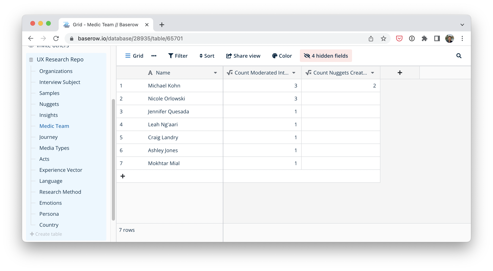

The Medic Product team uses [baserow.io](http://baserow.io) as a place to keep product research. Baserow is very similar to [airtable.com](https://www.airtable.com/), [getgrist.com](http://getgrist.com), and Google Sheets.

The _UX Research Repository_ is based off of concepts from WeWork’s [Polaris](https://tsharon.medium.com/democratizing-ux-670b95fbc07f) project. You can see an example of the Polaris (which uses Airtable) [here](https://www.airtable.com/universe/expShuhNMi0Oc0xpb/polaris-ux-nuggets).

The Baserow interface can be seen below. The items in the list on the left are “tables” that we have created. On the right is the “Grid”. It looks just like a spreadsheet and you can have multiple views of the same grid.

To gain access to the UX Research Repo, please reach out in the #product-owner-chatter Slack channel. The access to the repository is currently restricted to the Medic team.