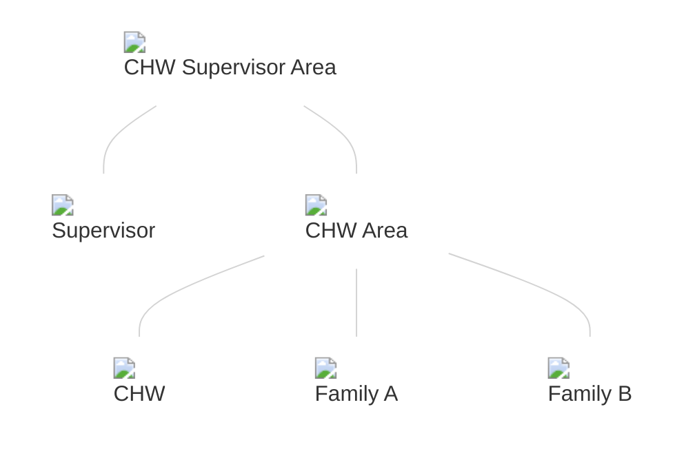

## Known issues

Check the repository for the [latest known issues](https://github.com/medic/cht-core/issues?q=is%3Aissue+label%3A%22Affects%3A+4.18.0%22).

## Upgrade notes

### Breaking changes

None.

### UI/UX changes

- [#9682](https://github.com/medic/cht-core/issues/9682): Add support for Right to Left languages

## Highlights

### Right to Left Language Support



Support for Arabic as a CHT language was [added in `4.16.0`](). Now, the CHT can properly display content in a full RTL layout! This greatly improves the usability of the application for native RTL language speakers.

See [the documentation](  ) for more details.

[#9682](https://github.com/medic/cht-core/issues/9682): Add support for Right to Left languages

### Replicate Primary Contacts Regardless of Depth

Controlling the data accessible to ["offline" CHT users]() is essential. Often, the [`replication_depth` configuration]() is used to limit how much of the contact hierarchy is visible to a user (and downloaded to their device) by preventing the replication of contacts/reports beyond a specified depth.

However, in some cases this configuration is not sufficient. For example, perhaps a CHW Supervisor needs to have access to the contact data for the CHWs they supervise (including the reports for those contacts), but should not have access to all the households/patients served by those CHWs. A typical hierarchy (as seen here) might have the CHW contact and the family household contacts both at the same depth level as children of the CHW Area. If the supervisor user is configured to have a replication depth of `1`, they will not have access to the CHW contact. If the replication depth is set to `2`, the supervisor will have access to all the household contacts.

In this case, the new [`replicate_primary_contacts` configuration]() can be used to ensure the primary contacts of the places at the user's deepest replication depth are also replicated (even if those contacts are technically located deeper in the hierarchy than the configured depth limit). So, with a replication depth of `1` and `replicate_primary_contacts` set to `true`, the supervisor user will have access to the CHW contact, but not the household contacts.

[#8034](https://github.com/medic/cht-core/issues/8034): Add config to allow replicating primary contacts for places at max depth

## And more...

### Features

- [#8034](https://github.com/medic/cht-core/issues/8034): Add config to allow replicating primary contacts for places at max depth
- [#9799](https://github.com/medic/cht-core/issues/9799): Allow configuring headers in outbound push

### Improvements

- [#9586](https://github.com/medic/cht-core/issues/9586): Implement freetext search in cht-datasource

### Security fixes

None.

### Performance improvements

None.

### Bug fixes

- [#9842](https://github.com/medic/cht-core/issues/9842): Use latest bikram-sambat release

### Technical improvements

- [#9653](https://github.com/medic/cht-core/issues/9653): Refactor `shared-libs/validations` to call cht-datasource instead of directly querying freetext index
- [#9759](https://github.com/medic/cht-core/issues/9759): Uplift to Angular 19
- [#9787](https://github.com/medic/cht-core/issues/9787): K3d e2e tests fail due to potential changes in k3d APIs
- [#9796](https://github.com/medic/cht-core/issues/9796): Ignore dependencies in dependabot that cannot auto-update

## Contributors

Thanks to all who committed changes for this release!

- [Joshua Kuestersteffen](https://github.com/jkuester)
- [Diana Barsan](https://github.com/dianabarsan)
- [Sugat Bajracharya](https://github.com/sugat009)
- [Binod Adhikary](https://github.com/binokaryg)
- [witash](https://github.com/witash)
