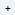
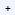
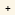
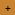
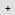
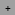
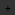

The purpose of this guide is to document the standard aspects of our core framework and allow designers and developers to focus on solving challenges, rather than reinventing interface elements that are already in use.   Changes to the styles in this document should go through product design and be implemented throughout the app before this document is updated. 

## Colors
Color helps users interpret and interact with app content by establishing a hierarchy of information, highlighting actions, indicating states, and conveying meaning.

### Primary colors
These are the primary colors of the navigation tabs. When necessary, use white `#FFFFFF` text over these colors.

|  Blue 	|  Periwinkle 	|  Pink 	|  Teal 	|  Yellow 	|
|:------------------------------------------------------------- 	|:------------------------------------------------------------------- 	|:------------------------------------------------------------- 	|:------------------------------------------------------------- 	|:--------------------------------------------------------------- 	|
| `#63A2C6`                                                     	| `#7193EE`                                                           	| `#F47B63`                                                     	| `#76B0B0`                                                     	| `#E9AA22`                                                       	|
| `rgb(99, 162, 198)`                                           	| `rgb(113, 147, 238)`                                                	| `rgb(244, 123, 99)`                                           	| `rgb(118, 176, 176)`                                          	| `rgb(233, 170, 34)`                                             	|
| Messages                                           	            | Tasks                                                                 | People                                                          | Targets                                                         | Reports                                                           |

### Secondary colors

These are the secondary (highlight) colors of the navigation tabs. 

|  Blue Highlight 	|  Periwinkle Highlight 	|  Pink Highlight 	|  Teal Highlight 	|  Yellow Highlight 	|
|:-------------------------------------------------------------------------	|:------------------------------------------------------------------------------	|:-------------------------------------------------------------------------	|:-------------------------------------------------------------------------	|:---------------------------------------------------------------------------	|
| `#EEF5F9`                                                               	| `#F0F4FD`                                                                     	| `#FDF1EF`                                                               	| `#DFEAEA`                                                               	| `#FCF6E7`                                                                 	|
| `rgb(238, 245, 249)`                                                    	| `rgb(240, 244, 253)`                                                          	| `rgb(253, 241, 239)`                                                    	| `rgb(223, 234, 234)`                                                    	| `rgb(252, 246, 231)`                                                      	|

### Status colors

These are the status indication colors of the system. When necessary, use white `#FFFFFF` text over these colors.

|  Teal Dark 	|  Blue Dark 	|  Yellow Dark 	|  Red 	|
|:-------------------------------------------------------------------	|:------------------------------------------------------------------	|:---------------------------------------------------------------------	|:-------------------------------------------------------------	|
| `#218E7F`                                                          	| `#007AC0`                                                         	| `#C78330`                                                            	| `#E33030`                                                    	|
| `rgb(33, 142, 127)`                                                	| `rgb(0, 122, 192)`                                                	| `rgb(199, 131, 48)`                                                  	| `rgb(227, 48, 48)`                                           	|
| Completed, verified, sent actions                                  	| Primary button, link, info                                        	| Delayed, incomplete actions                                          	| Overdue, unmet, error, delete, failed, denied actions        	|

### Backgrounds

|  Gray Dark 	|  Gray Light 	|  Gray Medium 	|  Gray Ultra Dark 	|  Gray Ultra Light 	|  White 	|
|:-------------------------------------------------------------------	|:--------------------------------------------------------------------	|:---------------------------------------------------------------------	|:-------------------------------------------------------------------------	|:--------------------------------------------------------------------------	|:---------------------------------------------------------------	|
| `#777777`                                                          	| `#E0E0E0`                                                           	| `#A0A0A0`                                                            	| `#333333`                                                                	| `#F2F2F2`                                                                 	| `#FFFFFF`                                                      	|
| `rgb(119, 119, 119)`                                               	| `rgb(224, 224, 224)`                                                	| `rgb(160, 160, 160)`                                                 	| `rgb(51, 51, 51)`                                                        	| `rgb(242, 242, 242)`                                                      	| `rgb(255, 255, 255)`                                           	|
| Disabled statuses, secondary body text                             	| 1px line borders, action bar icons                                  	| Muted or deceased contacts, cleared messages                         	| Overdue, unmet, error, delete, failed, denied actions                    	| App background, list and dropdown highlights                              	| Form background                                                	|

 

For more information on how these colors are applied in the app, see our [color variables file](https://github.com/medic/cht-core/blob/master/webapp/src/css/variables.less). 

## Typography

The default app font is <a href="https://www.google.com/get/noto/">Noto Sans</a>. It is free, ocodepen source, supports 800 languages and was specifically designed for good web legibility. It is bundled with the app so that all users see the same font regardless of their particular device, language, browser, etc. This ensures a consistent experience for all users.

Most text in the app should be the `@text-normal-color: @gray-ultra-dark color`.
The lighter text color `@text-secondary-color: @gray-dark)` is used for labels and condition card filters.
Hyperlinked text color is `@text-hyperlink-color: @blue-dark)`. 

H1 is the highest hierarchical level of text, and should be used sparingly. It is used for the large text underneath percentage bars.

H2 is used as a header style for main content sections on the right-hand side, such as a task title, the name of a person/place on their profile, or the title of a targets widget.

H3 is used for titles of condition cards and section titles on the form summary page.

H4 is the default type size, and should be used for all normal body text throughout the app. Most text should be H4 in size. When in doubt, use H4.

H5 is a smaller body text size that we use sparingly in places where space is tight, such as timestamps in the upper right of content rows, condition card filter text, “belongs to” breadcrumbs, and targets goal labels.

        

## Buttons
Primary buttons are used for actions, such as “Next” and “Submit”. Secondary buttons are the alternative to the primary action, such as "Previous". Text links are used for less important or less commonly used actions, such as “Cancel”.
        

## Checkboxes
Use checkboxes to select multiple items within a form. When necessary, use a descriptive error state.
        

## Radios
Use radio buttons to select a single item within a form. When necessary, use a descriptive error state.
        

## Inputs
Use an input field as a basic text control to enable the user to type a small amount of text. The input size should reflect the amount of text a user is expected to enter. When necessary, use a descriptive error state.
        

## Dropdowns
Dropdowns are used within forms that have 7 or more options and as filters within tabs.
        

## Modals
Use modals when a user is exiting a flow where information may be lost or for experiences outside the main user flows.
        

## Condition Cards
Use these cards in contact summary pages to display an overview of tasks, people, reports, etc
        

## Content Rows
Content rows are used for tasks, messages, reports and people as an overview of the content name, description, date and/or priority.
        

## Targets
Targets include counts and percentages with and without goals.
        

## Action Bars
Use action bars to prompt new actions or workflows on relative pages.
        
