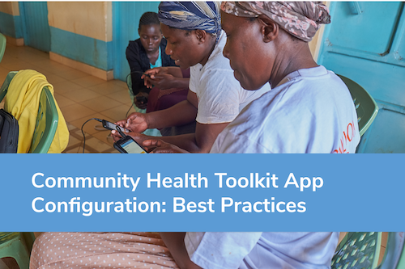
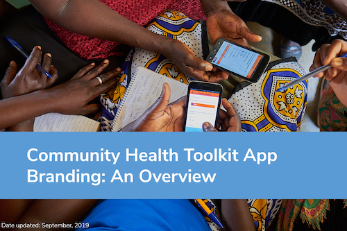

---
title: "Community Health Toolkit"
linkTitle: "Documentation"
identifier: "docs"
<!-- menu:
  main:
    weight: 20 -->
---

{}
The [Community Health Toolkit](https://communityhealthtoolkit.org) is an open source technology for a new model of healthcare that reaches everyone. We envision a world where primary health care is equitable, accessible, and delivered by people who are trusted in their communities. [Find out more here](..)
{}

The Community Health Toolkit (CHT) is a project by a group of leading organizations who have come together to support the development of digital health initiatives in the hardest-to-reach areas. 

The CHT provides you with resources to design, build, deploy, and monitor digital tools for community health. It includes open source software frameworks and applications, guides to help design and use them, and a [community forum](https://forum.communityhealthtoolkit.org/) for collaboration and support.  Together, we envision a world where healthcare is of the highest attainable quality, equitable, accessible, and delivered by the people who are trusted most in their communities.  

With more than 24,000 health workers using these tools to support a million home visits every month, the CHT is the most full-featured, mature, and widely-used open source software toolkit designed specifically for advanced community health systems. 

# Are You Interested In:

## Using Tools Built with the Community Health Toolkit

The resources provided through the Community Health Toolkit can be used to build digital health apps used at the community, health facility, and health system level:

**At the community level,** community health workers (CHWs) use apps built with the CHT to register patients, conduct guided health assessments, screen for specific conditions and danger signs, and refer patients to health facilities.

**At the health facility level,** nurses and CHW supervisors use apps and admin consoles built with the CHT to coordinate care for patients with the CHWs, promote health practices in the community, and report health and service delivery statistics to health system officials

**At the health system level,** data managers and others use apps and admin consoles built with the CHT to collate and report on key community and health system data. Their work often involves following up with supervisors and nurses to verify data for accuracy and completion.

Have questions? Want to learn alongside a community of users? Join our [community forum](https://forum.communityhealthtoolkit.org) and let us know how we can help!

## Customizing and Configuring Our ANC Reference App

While our ANC Reference App can be used as is, most organizations and projects will want to configure and customize the app's tasks, care cuides, reports and even branding. These changes are not made at the Core Framework code level, but often still require technical skills and experience. To explore how we use forms to build the Tasks, Care Guides, and Reports that take health workers through care protocols and provide decision support for interactions with patients, read our [Configuration Best Practices Guide]().

To learn how to add your own logo, project name, and more to our Reference App, read our [App Branding Guide](resources/app-branding-overview.pdf).

We are in the process of writing additional guides and clearer API documentation. Check out the [tutorials]() for more info.

## Contributing Code or Developing on the Core Framework

If you're interested in contributing to the development of the Core Framework, take a look at the [Core Framework's Github repository](https://github.com/medic/cht-core), follow the [development environment setup instructions](https://github.com/medic/medic/blob/master/DEVELOPMENT.md) and take a look at the [contribution guide](https://github.com/medic/medic/blob/master/CONTRIBUTING.md).

