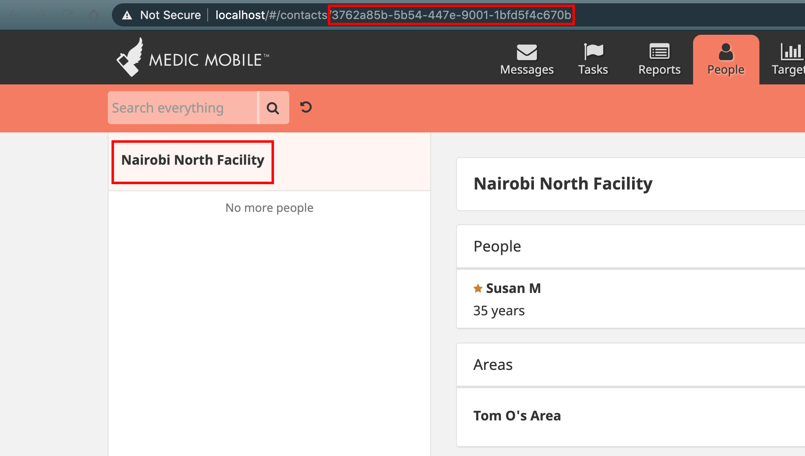

## Purpose of the tutorial

In this tutorial you will learn how to create and edit contacts and their associated users in the CHT application using medic-conf. If you haven't already, have a look at [part 1](creating-and-managing-users-and-contacts.md) of this tutorial for a useful overview of key concepts.

## Brief overview of key concepts

[**medic-conf**](https://github.com/medic/medic-conf) is a command-line interface tool to manage and configure your apps built using the Core Framework of the Community Health Toolkit.

See more [key concepts](creating-and-managing-users-and-contacts.md#brief-overview-of-key-concepts) in part 1 of this tutorial.

## Required resources

You should have a functioning CHT instance and have medic-conf installed locally. Read [How to set up a CHT local configuration environment](setting_up_local_configuration_environment.md)

## Implementation steps

In these steps you are going to create a Health Facility, CHW areas, primary contacts for the CHW areas, and their associated users.

### 1. Create Health Facilities (using medic-conf's csv-to-docs and upload-docs features)

To create contacts and their associated users with medic-conf, you will need to create a CSV file with the information of the contacts and the users that you would like to create. The name of the file determines the type of doc created for rows contained in the file.

For example, file named `place.district_hospital.csv` adds the property `"type":"district_hospital"` and a file named `person.clinic.csv` add the property `"type":"person"`

Create a CSV file named `place.district_hospital.csv` and add the details of the health facilities you would like to create.

| name                   |
| ---                    |
| Nairobi South Facility |
| Nairobi West Facility  |
| Nairobi East Facility  |

Save this file to a folder name `csv` in your project's base directory.

Open terminal or command line. `cd` to your project's base directory and then run the command

```zsh
medic-conf csv-to-docs
```

This will convert rows of the CSV files from the `csv` folder to JSON docs that are stored in a `json-docs` folder.

To upload the JSON docs to your local test instance, run the command

```zsh
medic-conf --url=https://<username>:<password>@localhost --accept-self-signed-certs upload-docs
```

Be sure to replace the values `<username>` and `<password>` with the actual username and password of your test instance.

### 2. Create CHW Areas, CHW Contacts and Users (using medic-conf's create-users feature)

Next you are going to create CHW areas for the health facilities you created in the step above along with the CHW contacts and users for these CHW areas.

Create a CSV file named `users.csv` and add the details of the Users, CHW contacts, and CHW Areas you would like to create. Save this file in the base project directory.

| username | password | roles | name | phone | contact.name | contact.phone | contact.sex | contact.age | place.type | place.name | place.parent |
| --- | --- | --- | --- | --- | --- | --- | --- | --- | --- | --- | --- |
| mmutiso | q3Z5-vH5 | district_admin | Mary Mutiso | 0712345678 | Mary Mutiso | 0712345678 | Female | 36 | health_center | Mary Mutiso's Area | `<facility uuid>` |

The value `place.parent` is the uuid of the Facility to which the CHW Area belongs to. You can get this value by selecting the Facility in the webapp and copying the last portion of the url.



Run the command

```zsh
medic-conf --url=https://<username>:<password>@localhost --accept-self-signed-certs create-users
```

This will create the CHW area, the CHW contact, and the user that the CHW will use to log into the application.

## Frequently Asked Questions

- [Can one person belong to multiple places in the same hierarchy?](https://forum.communityhealthtoolkit.org/t/can-one-person-belong-to-multiple-places-in-the-same-hierarchy/101)