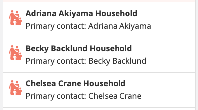

The purpose of this guide is to document the standard aspects of our core framework and provide tips for consideration when choosing a design to encourage consistency by listing existing elements that can be reused.

Changes to the styles in this document should go through product design and be implemented throughout the app before this document is updated. 

Medic in-app sample: https://github.com/medic/medic/blob/master/webapp/src/templates/partials/theme.html

Bootstrap styles: https://getbootstrap.com/docs/4.3/components/alerts/


## Color

Color helps users interpret and interact with app content by establishing a hierarchy of information, highlighting actions, indicating states, and conveying meaning. It can even influence a user’s mood and perceptions.

| ✅Do's 	| ❌ Don'ts 	|
|:----------------------------------------------------------------------------------------------------------------------------------------------------------------------------------------------------------------------------------	|:--------------------------------------------------------------------------------------------------------------------------------------------------------------------------------------------------------------------------------------------------------------	|
| **Keep the meaning of color consistent and predictable** <br>This helps users quickly and easily navigate and interpret content. 	| **Never rely on color alone to communicate meaning or emphasis**<br>Instead, pair color with other visual clues such as text or icons in order to ensure the meaning is conveyed even to those who can’t see the color very well or may even be color blind. 	|
| **Ensure that there is adequate color contrast between foreground and background**<br>Accessible web design aims for high color contrast so that those with low vision or color blindness don’t have difficulty viewing content. 	| **Don't overuse red**<br>Red is a very attention-grabbing color that conveys a sense of urgency, inspires action, and even increases a person’s heart rate. If red appears in too many places in the app it will lose its effectiveness. 	|


### Primary colors

These are the primary colors of the navigation tabs. When necessary, use white `#FFFFFF` text over these colors.


|  Blue 	|  Periwinkle 	|  Pink 	|  Teal 	|  Yellow 	|
|:------------------------------------------------------------- 	|:------------------------------------------------------------------- 	|:------------------------------------------------------------- 	|:------------------------------------------------------------- 	|:--------------------------------------------------------------- 	|
| `#63A2C6`                                                     	| `#7193EE`                                                           	| `#F47B63`                                                     	| `#76B0B0`                                                     	| `#E9AA22`                                                       	|
| `rgb(99, 162, 198)`                                           	| `rgb(113, 147, 238)`                                                	| `rgb(244, 123, 99)`                                           	| `rgb(118, 176, 176)`                                          	| `rgb(233, 170, 34)`                                             	|
| Messages                                           	            | Tasks                                                                 | People                                                          | Targets                                                         | Reports                                                           |


### Secondary colors

These are the secondary (highlight) colors of the navigation tabs. 

|  Blue Highlight 	|  Periwinkle Highlight 	|  Pink Highlight 	|  Teal Highlight 	|  Yellow Highlight 	|
|:-------------------------------------------------------------------------	|:------------------------------------------------------------------------------	|:-------------------------------------------------------------------------	|:-------------------------------------------------------------------------	|:---------------------------------------------------------------------------	|
| `#EEF5F9`                                                               	| `#F0F4FD`                                                                     	| `#FDF1EF`                                                               	| `#DFEAEA`                                                               	| `#FCF6E7`                                                                 	|
| `rgb(238, 245, 249)`                                                    	| `rgb(240, 244, 253)`                                                          	| `rgb(253, 241, 239)`                                                    	| `rgb(223, 234, 234)`                                                    	| `rgb(252, 246, 231)`                                                      	|


### Status colors

These are the status indication colors of the system. When necessary, use white `#FFFFFF` text over these colors.

|  Teal Dark 	|  Blue Dark 	|  Yellow Dark 	|  Red 	|
|:-------------------------------------------------------------------	|:------------------------------------------------------------------	|:---------------------------------------------------------------------	|:-------------------------------------------------------------	|
| `#218E7F`                                                          	| `#007AC0`                                                         	| `#C78330`                                                            	| `#E33030`                                                    	|
| `rgb(33, 142, 127)`                                                	| `rgb(0, 122, 192)`                                                	| `rgb(199, 131, 48)`                                                  	| `rgb(227, 48, 48)`                                           	|
| Completed, verified, sent actions                                  	| Primary button, link, info                                        	| Delayed, incomplete actions                                          	| Overdue, unmet, error, delete, failed, denied actions        	|


### Backgrounds

|  Gray Dark 	|  Gray Light 	|  Gray Medium 	|  Gray Ultra Dark 	|  Gray Ultra Light 	|  White 	|
|:-------------------------------------------------------------------	|:--------------------------------------------------------------------	|:---------------------------------------------------------------------	|:-------------------------------------------------------------------------	|:--------------------------------------------------------------------------	|:---------------------------------------------------------------	|
| `#777777`                                                          	| `#E0E0E0`                                                           	| `#A0A0A0`                                                            	| `#333333`                                                                	| `#F2F2F2`                                                                 	| `#FFFFFF`                                                      	|
| `rgb(119, 119, 119)`                                               	| `rgb(224, 224, 224)`                                                	| `rgb(160, 160, 160)`                                                 	| `rgb(51, 51, 51)`                                                        	| `rgb(242, 242, 242)`                                                      	| `rgb(255, 255, 255)`                                           	|
| Disabled statuses, secondary body text                             	| 1px line borders, action bar icons                                  	| Muted or deceased contacts, cleared messages                         	| Overdue, unmet, error, delete, failed, denied actions                    	| App background, list and dropdown highlights                              	| Form background                                                	|

<br>

For more information on how these colors are applied in the app, see our [color variables file](https://github.com/medic/medic/blob/master/webapp/src/css/variables.less). 

---

## Typography

The default app font is [Noto Sans](https://www.google.com/get/noto/). It is free, open source, supports 800 languages and was specifically designed for good web legibility. It is bundled with the app so that all users see the same font regardless of their particular device, language, browser, etc. This ensures a consistent experience for all users.

**Type size:** A standard minimum size for web content is 14-16 points/pixels.

**Type case:** Lowercase letters are easier to read than text set in all-caps.

**Line spacing:** A general rule is that the line spacing value should be anything between 1.25 and 1.5 times greater than the font size.

**Line length:** The optimal line length for body text is considered to be 50-60 characters per line on desktop and 30-40 on mobile, including spaces.

**Alignment:** Text in the app should be left-aligned by default unless otherwise specified. 

**Color:** Most text in the app should be the ```@text-normal-color: @gray-ultra-dark color```.
The lighter text color ```@text-secondary-color: @gray-dark)``` is used for labels and condition card filters.
Hyperlinked text color is ```@text-hyperlink-color: @blue-dark)```. 


| ✅Do's 	| ❌ Don'ts 	|
|:----------------------------------------------------------------------------------------------------------------------------------------------------------------------------------------------------------------------------------	|:-----------------------------------------------------------------------------------------------------------------------------------	|
| **Use bold to add extra emphasis to items of importance** <br>This includes patient/contact names and target titles. 	| **Do not overuse italics**<br>Aside from Enketo forms where it is used to differentiate explanatory text or suggested actions, do not use italics. 	|
| **Use underlines for links** <br>The general usability association is that underlined text is a hyperlink. 	| **Avoid using both bold and italic at the same time** <br>If you want to add emphasis to something, consider large size text in bold.	|


### Base typeface

```
font-family: Noto, sans-serif
font-size: 16px (1rem)
line-height: 1.375rem (22px)
color: #333333
```

### Type sizes

H1 is the highest hierarchical level of text, and should be used sparingly. It is used for the large text underneath percentage bars.


```
H1
font-size: 24px (1.5rem)
line-height: 2rem (32px)
```

<br> 


<br> 

<br>

H2 is used as a header style for main content sections on the right hand side, such as a task title, the name of a person/place on their profile, or the title of a targets widget. 

```
H2 
font-size: 20px (1.25rem)
Line-height: 1.75rem (26 px)
```

<br> 


<br> 

<br>

H3 is the next lowest level, used for things like the titles of condition cards and section titles on the form summary page. 

```
H3 
font-size: 18px (1.125rem)
line-height: 1.5rem (24px)
```

<br> 


<br> 

<br>

H4 is the default type size, and should be used for all normal body text throughout the app. Most text should be H4 in size - **when in doubt, use H4.**

```
H4 (body)
font-size: 16px (1rem)
line-height: 1.375rem (22px)
```
<br> 




<br> 

<br>

H5 is a smaller body text size that we use sparingly in places where space is tight, such as timestamps in the upper right of content rows, condition card filter text, “belongs to” breadcrumbs, and targets goal labels.

```
H5 (small body)
font-size: 14px (.875rem)
line-height: 1.25rem (20px)
```
<br> 


<br> 

### Alignment

Text in the app should be left-aligned by default unless otherwise specified. Left-aligned text is preferred as it provides a consistent and predictable starting place for each line of text, making text easier to read and scan.

### Type style

The H1 through H5 styles are used in both regular and bold weights, with the occasional italic or underlined styles. 
Bold is used to add extra emphasis to items of importance such as patient/contact names and target titles. 

Italic is rarely used except within Enketo forms, where it is used to differentiate explanatory text or suggested actions for the health worker. Avoid using both bold and italic at the same time. 

The underlined style should only ever be used on actual links because of the general usability association between underlined text and hyperlinks. If you want to add emphasis to something, consider bold instead. If you are quoting the name of something, consider quotation marks instead.

### Type color

Most text in the app should be the @text-normal-color: @gray-ultra-dark color, as this has the best contrast and is easiest to read.
The lighter text color (@text-secondary-color: @gray-dark) is used sparingly for text that is less important than the main body text, such as labels and condition card filters.
Hyperlinked text is colored blue (@text-hyperlink-color: @blue-dark). On hover, it displays an underline. 


## Components

Coming soon

