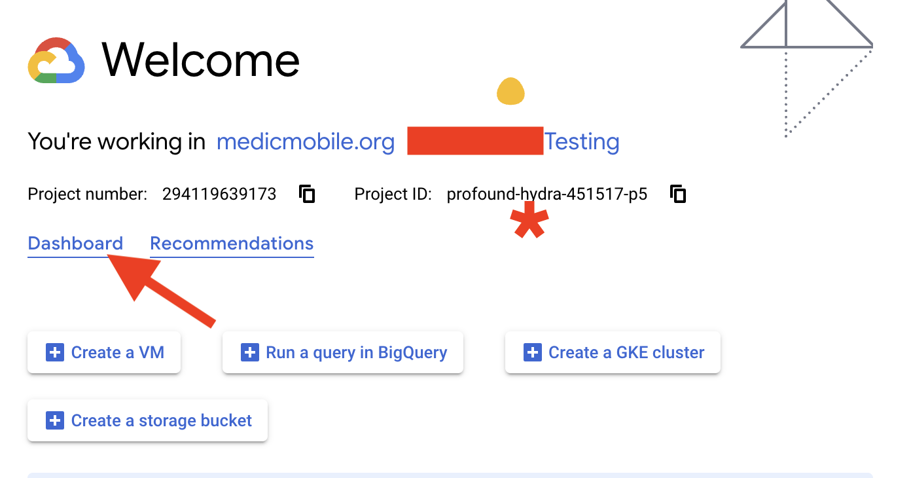
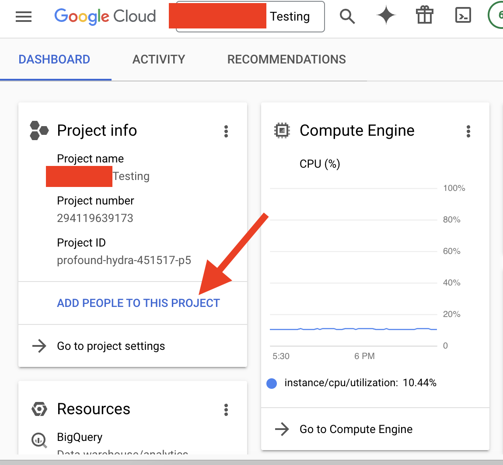
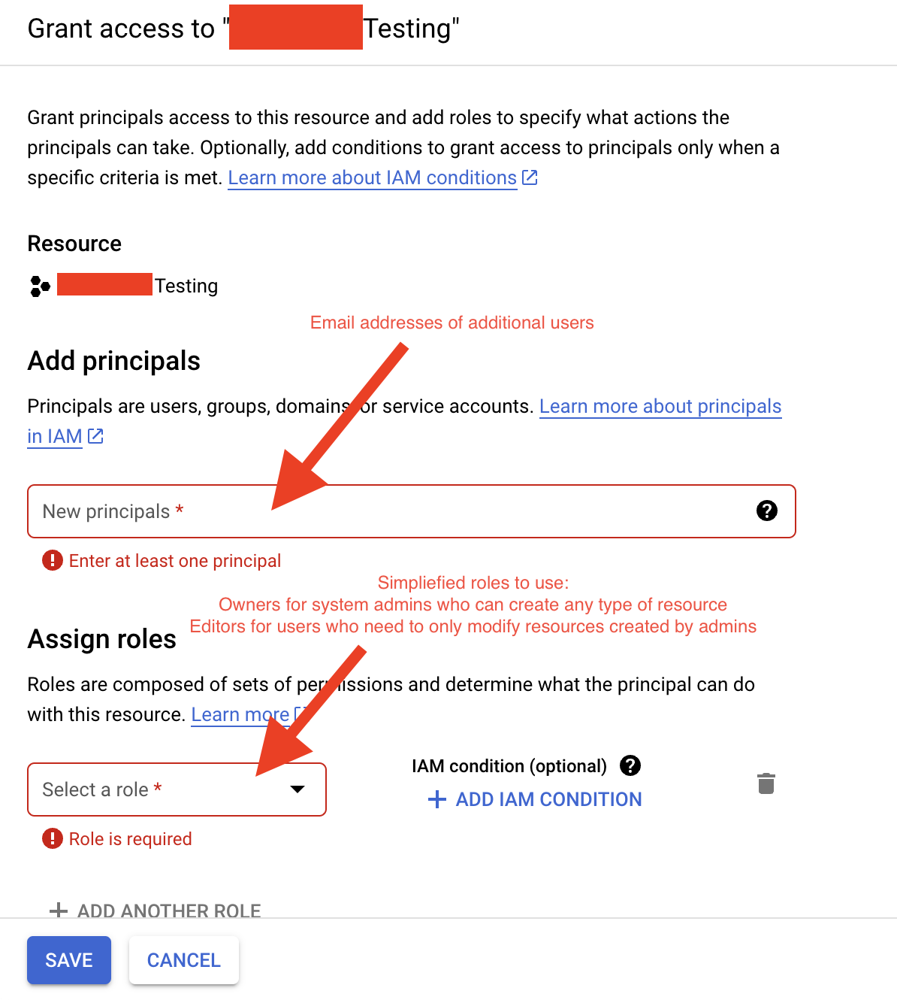
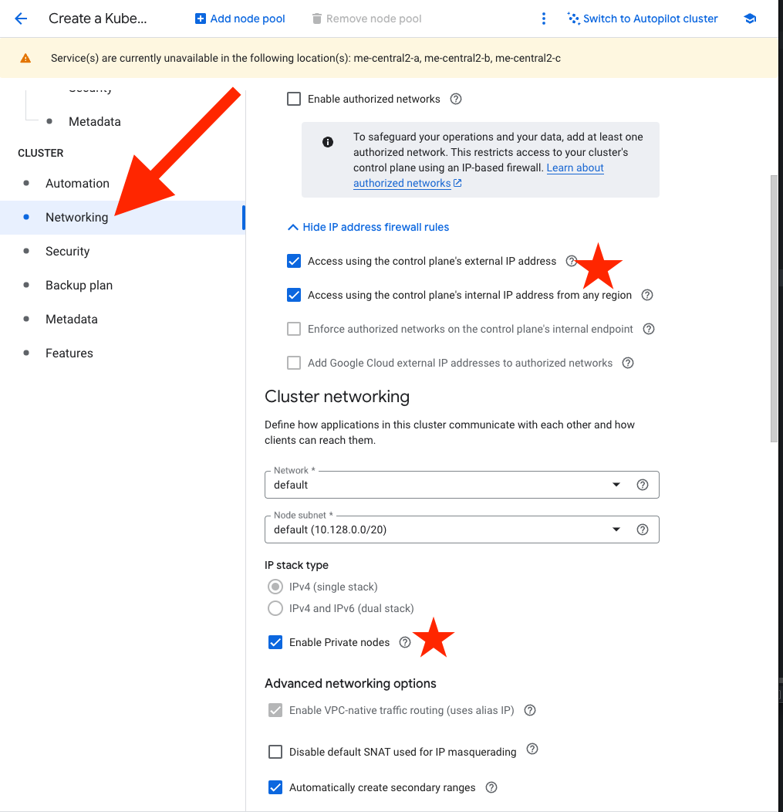
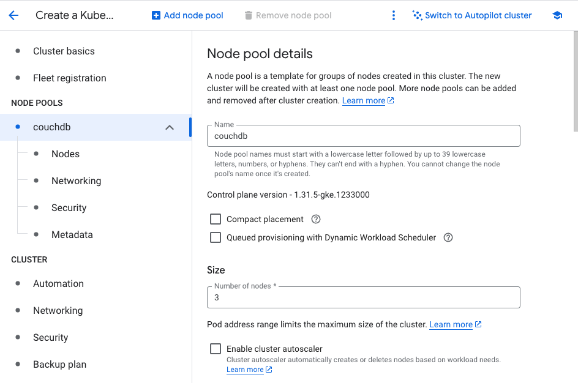
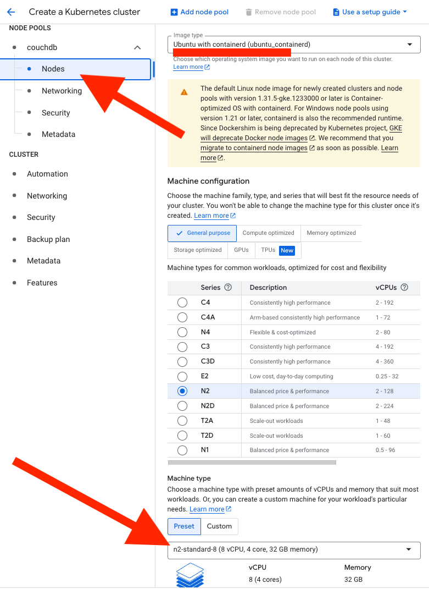
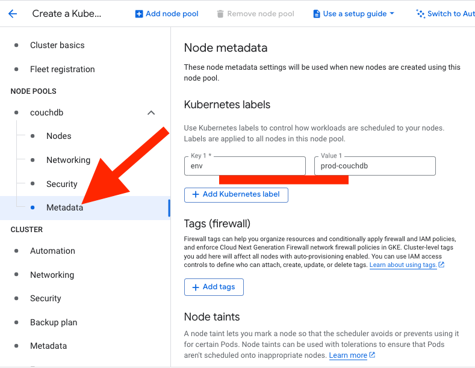
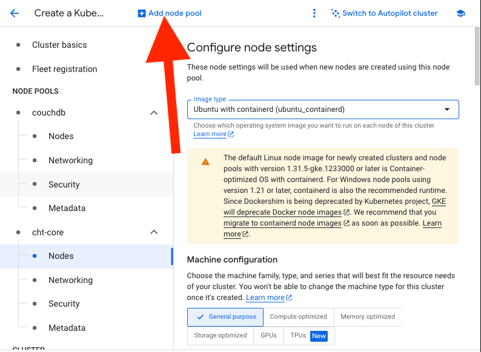

How to deploy the CHT 4.x on Google Cloud Platform

## Audience

This document is intended for system administrators who are setting up a Cht-Core system that has millions of documents, 400+ users and requires high performance. If you are interested in setting up a smaller scale cht-core, please see our guide [here for setting up a simpler installation](../docker). 

## Prerequisites

Before you can start using  Google Cloud Platform (GCP) to host the CHT, you need to meet certain requirements:

1. Google Account:  valid [free Gmail](https://workspace.google.com/intl/en-US/gmail/) or [paid Google Workspace](https://workspace.google.com/pricing.html) account
2. Enable Billing: In GCP, enable [billing](https://console.cloud.google.com/billing), including a valid credit card
3. GCP Project: Each resource in GCP must belong to it's [own project](https://console.cloud.google.com/projectcreate)
  - Create and manage Google Cloud Platform project
  - There are two ways to create a project in GCP

    - a. GCP UI: if you decide to use the UI, [follow these steps](https://console.cloud.google.com/projectcreate)
    - b. GCP CLI: use below command after you have authenticated to your GCP account
   ```
   gcloud projects create my-new-project --set-as-default
   ```

## Setting up access for other users to your GCP Project

Once we have a GCP project, let's make sure everyone else on our team can help out!

At the welcome screen after creating a GCP project, we want to note the * Project ID:, marked by a * in the screenshot below. Clicking on `Dashboard` we arrive at a detailed screen of our GCP project. 



At the Dashboard page, looking at the `Project Info` section, clicking on `ADD PEOPLE TO THIS PROJECT` opens up a dialog where we can add users by their gmail address. To simplify this process until further narrow/specific permissions are determined, we are going to use basic Owner and Editor roles for users we create. If you have a Cht-Core GKE setup with narrow permissions for users and systems, please update these docs - we would greatly appreciate it!



## GKE (Google Kubernetes Engine) Cluster creation

### Create a cluster in GCP project

To create a cluster and easily setup necessary options, we will navigate through the console UI 

UI: Follow the [create cluster steps](https://console.cloud.google.com/kubernetes/list/overview)

You will have to click enable Kubernetes API in the prompt that comes up.

#### Zonal cluster

* Pros: Less costly
* Cons: Single control plane in single zone
* Considerations: A single control plane becoming unavailable (going down) would result in no access for the administrator to modify any resources in the cluster. The workloads, such as containers and the application remain working for the end-user.

#### Regional cluster

* Pros: Multiple control plane replicas across multiple compute zones
* Cons: High cost
* Considerations: Multiple administrators accessing the cluster may benefit from ensuring the control plane servers are redundant. Recommended for national-scale implementations

### VPC Network and Subnets

We are going to create an isolated private network with one public subnet that will contain the Load Balancer, managed and automated by Google. The Load Balancer will have access to the private subnet which contains all of virtual machines or enabled private nodes that run the containers which make up the application. This separation ensures underlying system files and database files are not accessible or modifiable outside of application-level access. 

For troubleshooting underlying VM issues, we will need to [launch a bastion](https://cloud.google.com/kubernetes-engine/docs/tutorials/private-cluster-bastion) server or ssh-jumpbox in the same public subnet as the load balancer that after accessing allows us to jump into the private subnet virtual machines. 

VPC CIDR: `10.128.0.0/20` (default network)

Make sure the 3 option boxes are checked: `Enable Private Nodes`, `Access using the control plane's external IP address`, `Access using the control plane's internal IP address from any region`



### NodePool Configuration

Here we will define how many virtual machines we will run, which ones will run the database cluster, and how much resources (CPU/RAM) the virtual machines will have.

We will be creating 2 nodepools, one for the CouchDB cluster, and one for cht-core services (api, sentinel, haproxy, healthcheck, upgrade-service).

##### Base Image Consideration

In the case of a cht-core project with millions of docs in CouchDB, we have ran into issues with open file descriptors. In order to modify this parameter [(ulimit)]((https://www.geeksforgeeks.org/ulimit-soft-limits-and-hard-limits-in-linux/)), we are required to select a modifiable base image (Ubuntu). [More details for CouchDB performance](https://docs.couchdb.org/en/stable/maintenance/performance.html)

Cloud-vendor optimized container images such as Google-optimized container images **and** Amazon-optimized container images do not allow custom bootstrap scripts that modify parameters to the necessary levels to run CouchDB with large document numbers.

Creating a 3 nodepool configuration for CouchDB:


As noted in the previous paragraph, be sure to select Nodes under your new CouchDB nodepool in the left-side navigation bar. In the node details menu, select `Ubuntu with containerd` for image type, and `n2-standard-8`for machine type.



In order for our CouchDB containers to be placed onto these specific virtual machines we designated for this nodepool, we need to add kubernetes labels to the nodepool, which we will correspond with nodeSelector parameters in our CouchDB deployment templates. 

Clicking on `Metadata` on the left-side navigation bar underneath the nodepool name, we can add Kubernetes Labels.



A separate nodepool configuration created for cht-core services.
For the cht-core nodepool, select a 4 core, 16gb RAM machine, 20gb persistent disk, and there is no need to create specific kubernetes labels.



Click on Create Cluster and wait a few minutes for everything to come up!

## Accessing your GKE Cluster 

#### Install google cloud SDK

**Google Cloud SDK (gcloud CLI)** helps manage GCP resources via command line.

Follow instruction from [here](https://cloud.google.com/sdk/docs/install) to install Google Cloud SDK

Below are some basic Commands

```
# Authenticate CLI with your Google account
gcloud auth login

#install kubectl for cluster management
gcloud components install kubectl

# Set an active project
gcloud config set project [PROJECT_ID]

# List VM instances
gcloud compute instances list 

 # List namespaces
kubectl get namespaces
```

## Create a Storage Disk for CouchDB

Creating separate storage disks are essential for persisting CouchDB data across VM restarts or replacements in your CHT deployment. This dedicated disk ensures your database information remains intact regardless of VM lifecycle events.

Below are the methods and steps to create a storage disk in GCP.
We will need 3 storage disks, 1 for each CouchDB node.

* UI: Follow persistent disk creation [here](https://console.cloud.google.com/compute/disksAdd?inv=1&invt=AbrSOA&authuser=1&project=profound-hydra-451517-p5)
* CLI:  run below command to create volume

```
gcloud compute disks create [DISK_NAME]\
  --size [DISK_SIZE]\
  --type [DISK_TYPE]
  --zone [ZONE]
```

### Migrate existing data to newly created Storage Disk

Skip this step if you do not have pre-existing CouchDB data that you need to migrate into your GKE cluster.

We will launch a virtual machine in the same public subnet as the load balancer, with access via SSH. Attach and mount our created storage disk from the previous steps to this virtual machine.

Once mounted, log into your old server, create a session, and run the following rsync command to send data to your new disk. You may have to format the disk in xfs before being able to complete the mount.

`rsync -avhWt --no-compress --info=progress2 -e "ssh -i /tmp/identity.pem" /opt/couchdb/data ubuntu@<server_ip>:/<mounted_directory>/`

Run this command from each CouchDB node to a separate storage disk in GCP.

### Deploy a StorageClass config to GKE cluster

- To bind and apply the created storage disk to a cluster, use the following YAML script for configuring the storage class:

```yaml
apiVersion: storage.k8s.io/v1
kind: StorageClass
metadata:
  name: <STORAGE_CLASS_NAME>
provisioner: pd.csi.storage.gke.io
parameters:
  type: pd-balanced
  csi.storage.k8s.io/fstype: xfs
volumeBindingMode: Immediate
reclaimPolicy: Retain
allowVolumeExpansion: true
```

- Apply the configuration using kubectl apply

```bash
kubectl apply -f <STORAGE_CLASS_FILE_NAME>.yaml
```

* Verify the StorageClass was successfully created and registered in the cluster:

`Kubernetes Engine > Cluster > Storage`

#### Key Configurations Explained

* **`volumeBindingMode: Immediate`** :
  * Creates and binds Persistent Volume (PV) immediately
  * Triggers PV creation when Persistent Volume Claim (PVC) is created
* **`reclaimPolicy: Retain`** :
  * Preserves volume and data after PVC deletion
  * Prevents accidental data loss
* **`allowVolumeExpansion: true`** :
  * Enables PVC size expansion without recreation
  * Provides storage flexibility

### Persistent Volume Configuration

- After setting up the StorageClass, you need to create a Persistent Volume (PV) that ties the storage disk to your GKE cluster.

- Create 1 PV for each Storage Disk, using naming conventions: `cht-couchdb-1-<project_name_or_namespace>` 

```yaml
apiVersion: v1
kind: PersistentVolume
metadata:
  name: <PV_NAME>
spec:
  storageClassName: <STORAGE_CLASS_NAME>
  capacity:
    storage: <STORAGE_SIZE>
  volumeMode: Filesystem
  accessModes:
    - ReadWriteOnce
  persistentVolumeReclaimPolicy: Retain
  csi:   
    driver: pd.csi.storage.gke.io
    volumeHandle: projects/<PROJECT_ID>/zones/<ZONE>/disks/<DISK_NAME>
    fsType: xfs
```

- Apply the configuration using kubectl:

```bash
kubectl apply -f <PERSISTENT_VOLUME_FILE_NAME>.yaml
```

- Verify the Persistent Volume was successfully created:

```bash
kubectl get pv
```

```bash
kubectl create namespace <NAMESPACE>
```

#### Key Configurations Explained

* **`storageClassName: <STORAGE_CLASS_NAME>`**:
    * References the Storage Class created in the previous step
    * Ensures consistent storage provisioning policies

* **`capacity: storage: <STORAGE_SIZE>`**:
    * Defines the size of the persistent volume (e.g., 100Gi)
    * Should match or be less than the actual GCP disk size

* **`accessModes: - ReadWriteOnce`**:
    * Allows the volume to be mounted as read-write by a single node
    * Appropriate for CouchDB which typically runs on a single node

* **`volumeHandle`**:
    * References the specific GCP disk created earlier
    * Format: projects/<PROJECT_ID>/zones/<ZONE>/disks/<DISK_NAME>

### Persistent Volume Claim Configuration

- After creating the Persistent Volume, you need to create a Persistent Volume Claim (PVC) that ties the PV to your CouchDB container.

```yaml
apiVersion: v1
kind: PersistentVolumeClaim
metadata:
  labels:
    cht.service: <SERVICE_LABEL>
  name: <PVC_NAME>
spec:
  accessModes:
    - ReadWriteOnce
  resources:
    requests:
      storage: <STORAGE_SIZE>
  volumeName: <PV_NAME>
  storageClassName: <STORAGE_CLASS_NAME>
```

- Apply the configuration using kubectl:

```bash
kubectl apply -f <PVC_FILE_NAME>.yaml
```

- Verify the Persistent Volume Claim was successfully created and bound:

```bash
kubectl get pvc
```

#### Key Configurations Explained

* **`labels: cht.service: <SERVICE_LABEL>`**:
    * Identifies the PVC as part of your CHT deployment
    * Used for service discovery and organization

* **`accessModes: - ReadWriteOnce`**:
    * Corresponds to the same access mode defined in the PV
    * Ensures compatibility between PV and PVC

* **`resources: requests: storage: <STORAGE_SIZE>`**:
    * Must be less than or equal to the size specified in the PV
    * Defines how much storage will be claimed from the PV

* **`volumeName: <PV_NAME>`**:
    * Directly references the specific PV created earlier
    * Creates a static binding between this PVC and the specific PV

* **`storageClassName: <STORAGE_CLASS_NAME>`**:
    * Must match the storage class name specified in the PV
    * Ensures consistent storage policies

### Setup CouchDB Cluster Resources in GKE

For CouchDB nodes in a cluster to communicate, they have to be able to resolve each other's location. We utilize kubernetes service resources for this DNS service discovery for cluster databases. 

Deploying a service resource allows you to interact with the process that service forwards traffic to over a DNS route simplified to <service_name>.<namespace>.svc.cluster.local.

Deploy the services first, to ensure the cluster can discover all its members and bootstrap accordingly.

```yaml
---
apiVersion: v1
kind: Service
metadata:
  labels:
    cht.service: couchdb-1
  name: couchdb-1
spec:
  ports:
    - name: couchdb1-service
      port: 5984
      protocol: TCP
      targetPort: 5984
    - name: cluster-api
      port: 5986
      protocol: TCP
      targetPort: 5986
    - name: epmd
      port: 4369
      protocol: TCP
      targetPort: 4369
    - name: erlang
      port: 9100
      protocol: TCP
      targetPort: 9100
  selector:
    cht.service: couchdb-1
---
apiVersion: v1
kind: Service
metadata:
  labels:
    cht.service: couchdb-2
  name: couchdb-2
spec:
  ports:
    - name: couchdb2-service
      port: 5984
      protocol: TCP
      targetPort: 5984
    - name: cluster-api
      port: 5986
      protocol: TCP
      targetPort: 5986
    - name: epmd
      port: 4369
      protocol: TCP
      targetPort: 4369
    - name: erlang
      port: 9100
      protocol: TCP
      targetPort: 9100
  selector:
    cht.service: couchdb-2
---
apiVersion: v1
kind: Service
metadata:
  labels:
    cht.service: couchdb-3
  name: couchdb-3
spec:
  ports:
    - name: couchdb3-service
      port: 5984
      protocol: TCP
      targetPort: 5984
    - name: cluster-api
      port: 5986
      protocol: TCP
      targetPort: 5986
    - name: epmd
      port: 4369
      protocol: TCP
      targetPort: 4369
    - name: erlang
      port: 9100
      protocol: TCP
      targetPort: 9100
  selector:
    cht.service: couchdb-3
---
```

After configuring the storage components, you need to create a deployment for CouchDB that will use the persistent storage. This deployment defines how your CouchDB instance will run within Kubernetes. We will also create configmap and secrets resource to hold our credentials in one location for all templates.

Fill out the configmap resource below with the namespace your cht-core project will run in

For the secrets resource, fill out the necessary environment variable values.

```yaml
apiVersion: v1
kind: ConfigMap
metadata:
  name: couchdb-servers-configmap
data:
  COUCHDB_SYNC_ADMINS_NODE: couchdb-1.<namespace>.svc.cluster.local
  CLUSTER_PEER_IPS: couchdb-2.<namespace>.svc.cluster.local,couchdb-3.<namespace>.svc.cluster.local
  COUCHDB_SERVERS: couchdb-1.<namespace>.svc.cluster.local,couchdb-2.<namespace>.svc.cluster.local,couchdb-3.<namespace>.svc.cluster.local
---
apiVersion: v1
kind: Secret
metadata:
  name: cht-couchdb-credentials
type: Opaque
stringData:
  COUCHDB_PASSWORD: 
  COUCHDB_SECRET: 
  COUCHDB_USER: <admin or medic>
  COUCHDB_UUID: 
  COUCH_URL: http://<USER>:<PASSWSORD>@haproxy.<NAMESPACE>.svc.cluster.local:5984/medic
---
apiVersion: apps/v1
kind: Deployment
metadata:
  labels:
    cht.service: couchdb-1
  name: <DEPLOYMENT_NAME>
spec:
  replicas: 1
  selector:
    matchLabels:
      cht.service: couchdb-1
  strategy:
    type: Recreate
  template:
    metadata:
      labels:
        cht.service: couchdb-1
    spec:
      containers:
      - name: <CONTAINER_NAME>
        image: public.ecr.aws/medic/cht-couchdb:4.15.0
        ports:
        - containerPort: 5984
        env:
        - name: COUCHDB_LOG_LEVEL
          value: "info"
        - name: COUCHDB_PASSWORD
          valueFrom:
            secretKeyRef:
              name: cht-couchdb-credentials
              key: COUCHDB_PASSWORD
        - name: COUCHDB_SECRET
          valueFrom:
            secretKeyRef:
              name: cht-couchdb-credentials
              key: COUCHDB_SECRET
        - name: COUCHDB_USER
          valueFrom:
            secretKeyRef:
              name: cht-couchdb-credentials
              key: COUCHDB_USER
        - name: COUCHDB_UUID
          valueFrom:
            secretKeyRef:
              name: cht-couchdb-credentials
              key: COUCHDB_UUID
        - name: SVC_NAME
          value: "<SERVICE_NAME>.<NAMESPACE>.svc.cluster.local"
        - name: NODE_COUNT
          value: "3"
        - name: CLUSTER_PEER_IPS
          valueFrom:
            configMapKeyRef:
              name: couchdb-servers-configmap
              key: CLUSTER_PEER_IPS
        nodeSelector:
          env: prod-couchdb
        volumeMounts:
        - mountPath: /opt/couchdb/data
          name: <PVC_NAME>
          subPath: data
        - mountPath: /opt/couchdb/etc/local.d
          name: <PVC_NAME>
          subPath: local.d
        securityContext:
          capabilities:
            add: ["SYS_RESOURCE"]
      restartPolicy: Always
      volumes:
      - name: <PVC_NAME>
        persistentVolumeClaim:
          claimName: <PVC_CLAIM_NAME>
---
apiVersion: apps/v1
kind: Deployment
metadata:
  labels:
    cht.service: couchdb-2
  name: cht-couchdb-2
spec:
  replicas: 1
  selector:
    matchLabels:
      cht.service: couchdb-2
  strategy:
    type: Recreate
  template:
    metadata:
      labels:
        cht.service: couchdb-2
    spec:
      containers:
      - name: cht-couchdb-2
        image: public.ecr.aws/medic/cht-couchdb:4.15.0
        ports:
        - containerPort: 5984
        env:
        - name: COUCHDB_SYNC_ADMINS_NODE
          valueFrom:
            configMapKeyRef:
              name: couchdb-servers-configmap
              key: COUCHDB_SYNC_ADMINS_NODE   
        - name: COUCHDB_LOG_LEVEL
          value: "info"
        - name: COUCHDB_PASSWORD
          valueFrom:
            secretKeyRef:
              name: cht-couchdb-credentials
              key: COUCHDB_PASSWORD
        - name: COUCHDB_SECRET
          valueFrom:
            secretKeyRef:
              name: cht-couchdb-credentials
              key: COUCHDB_SECRET
        - name: COUCHDB_USER
          valueFrom:
            secretKeyRef:
              name: cht-couchdb-credentials
              key: COUCHDB_USER
        - name: COUCHDB_UUID
          valueFrom:
            secretKeyRef:
              name: cht-couchdb-credentials
              key: COUCHDB_UUID
        - name: SVC_NAME
          value: couchdb-2.<namespace>.svc.cluster.local
        - name: NODE_COUNT
          value: "3"
        nodeSelector:
          env: prod-couchdb
        volumeMounts:
        - mountPath: /opt/couchdb/data
          name: couchdb2-<namespace>-claim
        - mountPath: /opt/couchdb/etc/local.d
          name: couchdb2-<namespace>-claim
          subPath: local.d
      restartPolicy: Always
      volumes:
      - name: couchdb2-<namespace>-claim
        persistentVolumeClaim:
          claimName: couchdb2-<namespace>-claim
---
apiVersion: apps/v1
kind: Deployment
metadata:
  labels:
    cht.service: couchdb-3
  name: cht-couchdb-3
spec:
  replicas: 1
  selector:
    matchLabels:
      cht.service: couchdb-3
  strategy:
    type: Recreate
  template:
    metadata:
      labels:
        cht.service: couchdb-3
    spec:
      containers:
      - name: cht-couchdb-3
        image: public.ecr.aws/medic/cht-couchdb:4.15.0
        ports:
        - containerPort: 5984
        env:
        - name: COUCHDB_SYNC_ADMINS_NODE
          valueFrom:
            configMapKeyRef:
              name: couchdb-servers-configmap
              key: COUCHDB_SYNC_ADMINS_NODE   
        - name: COUCHDB_LOG_LEVEL
          value: "info"
        - name: COUCHDB_PASSWORD
          valueFrom:
            secretKeyRef:
              name: cht-couchdb-credentials
              key: COUCHDB_PASSWORD
        - name: COUCHDB_SECRET
          valueFrom:
            secretKeyRef:
              name: cht-couchdb-credentials
              key: COUCHDB_SECRET
        - name: COUCHDB_USER
          valueFrom:
            secretKeyRef:
              name: cht-couchdb-credentials
              key: COUCHDB_USER
        - name: COUCHDB_UUID
          valueFrom:
            secretKeyRef:
              name: cht-couchdb-credentials
              key: COUCHDB_UUID
        - name: SVC_NAME
          value: couchdb-3.<namespace>.svc.cluster.local
        - name: NODE_COUNT
          value: "3"
        nodeSelector:
          env: prod-couchdb
        volumeMounts:
        - mountPath: /opt/couchdb/data
          name: couchdb3-<namespace>-claim
        - mountPath: /opt/couchdb/etc/local.d
          name: couchdb3-<namespace>-claim
          subPath: local.d
      restartPolicy: Always
      volumes:
      - name: couchdb3-<namespace>-claim
        persistentVolumeClaim:
          claimName: couchdb3-<namespace>-claim
```

- Apply the deployment configuration:

```bash
kubectl apply -f <COUCHDB_DEPLOYMENT_FILE>.yaml
```

- Verify that the deployment was created successfully:

```bash
kubectl get deployments
kubectl get pods
```

#### Key Configurations Explained

* **`replicas: 1`**:
    * Specifies that only one instance of CouchDB should run
    * CouchDB in the CHT typically runs as a single instance per node

* **`strategy: type: Recreate`**:
    * Ensures the existing pod is terminated before a new one is created
    * Prevents data conflicts since CouchDB uses disk storage that can't be simultaneously accessed

* **`volumeMounts`**:
    * Maps two specific directories from the container to the persistent storage:
        * `/opt/couchdb/data`: Where CouchDB stores all database files
        * `/opt/couchdb/etc/local.d`: Where configuration files are stored
    * Uses `subPath` to organize different types of data within the same PVC

* **`securityContext: capabilities: add: ["SYS_RESOURCE"]`**:
    * This is a critical configuration for CouchDB performance and stability
    * Grants the container the Linux capability to exceed system resource limits
    * Specifically allows to increase the number of open file descriptors (ulimit)
    * Without this capability, CouchDB may encounter "too many open files" errors under heavy load
    * This is particularly important for production CHT instances that handle substantial traffic
    * The `SYS_RESOURCE` capability enables CouchDB to set its own resource limits beyond the defaults

* **`env`**:
    * Contains essential environment variables for CouchDB configuration
    * `COUCHDB_PASSWORD` & `COUCHDB_USER`: Authentication credentials
    * `COUCHDB_SECRET`: Used for cookie authentication between nodes
    * `COUCHDB_UUID`: Unique identifier for this CouchDB instance
    * `SVC_NAME`: The service name that will be used for network discovery

* **`volumes`**:
    * References the Persistent Volume Claim created earlier
    * Creates the link between the deployment and the persistent storage
