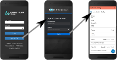


Introduced in 4.20.0


## Overview

The CHT supports Single Sign-On (SSO) via integration with an external authentication server. Users connecting to a CHT instance authenticate with their SSO credentials instead of needing a CHT-specifc username and password.
 
SSO authentication is implemented with the industry standard [OpenID Connect](https://openid.net/) (OIDC) protocol. Any OIDC-compliant authentication server can be integrated the the CHT. For example:

- [Keycloak](https://www.keycloak.org/) - Free and open-source, self-hostable identity and access management server
- [Microsoft Entra ID](https://learn.microsoft.com/en-us/entra/fundamentals/what-is-entra) - Paid, cloud-based identity and access management service.



## Quick Start

1. Add a new client to your OIDC Provider with the redirect URL of `https://<CHT_URL>/medic/login/oidc`. You will need your client id, client secret, and the discovery URL of your OIDC Provider for the next steps. Be sure to replace `CHT_URL` with your real URL.
2. Add the Client App ID (`APP_ID`), OIDC Provider discovery URL (`WELL_KNOWN_OIDC_URL`) and CHT URL (`CHT_URL`) to your [app_settings.json]() using [CHT Conf](). Be sure to replace `APP_ID`, `WELL_KNOWN_OIDC_URL` and `CHT_URL` with your real URLs:

    ```yaml
    "oidc_provider": {
      "client_id": "<APP_ID>",
      "discovery_url": "https://<WELL_KNOWN_OIDC_URL>"
    },
    "app_url": "https://<CHT_URL>/"
    ```
3. Upload the secret from step 1 to the CHT. Be sure to replace `CHT_URL` , `USER`,  `PASSWORD` and `SECRET` with the correct values: `curl -X PUT https://<USER>:<PASSWORD>@<CHT_URL>/api/v1/credentials/oidc:client-secret -H "Content-Type: text/plain" --data "<SECRET>"`
4. Ensure CHT users have their "SSO Email Address" match the OIDC provider's account 
5. Use the "Login with SSO" button 

## Detailed guides 

For more detailed guides and requirements, see the following documents:


  
  
  

