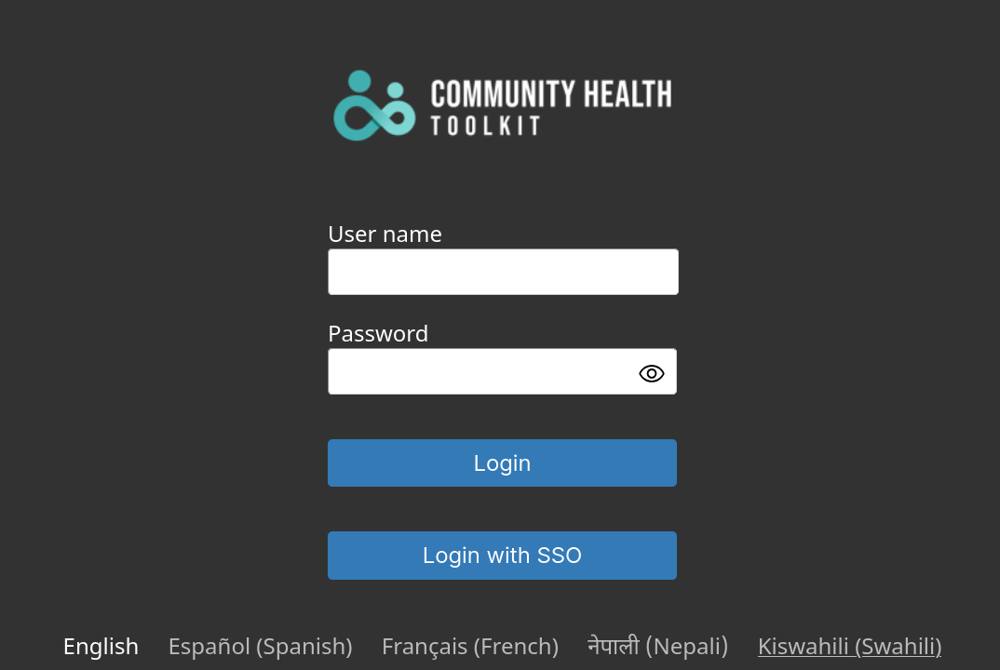


Introduced in 4.20.0


## Introduction

These steps document how to configure Microsoft Entra as the Single Sign On (SSO) identity provider for the CHT. As well, it walks through provisioning a single user for SSO.

## Prerequisites

* [Microsoft Entra](https://entra.microsoft.com) business account with credit card added. Free trial accounts work, but require a credit card.
* CHT server - ensure you are running version `4.20.0` or later
* DNS Entries and TLS enabled on CHT

## Entra Setup

{}

### Login 
Login to [Entra](https://entra.microsoft.com)

### Add new Client

- Navigate to "Applications" > "App registrations" > "New registration"
- Add a "user-facing display name"  of `CHT`
- Under "Redirect URI (optional)" select `Seb`
- Enter `https://<CHT_URL>/medic/login/oidc/get_token` as the redirect URI, being sure to replace `CHT_URL` with your production CHT URL


### Copy Secret

Navigate to "Certificates & secrets" > "Client secrets" > "New client secret"
    - Add a new secret and copy the `Value` string
- On the client app's "Overview" page, note the value displayed for "Application (client) ID". This is the `client_id` value.


### Copy Discovery URL

From the "Overview" page, open the "Endpoints" modal and make a note of the "OpenID Connect metadata document" link value. This is the `discovery_url`.


{}


## CHT Setup

{}

### CHT App Settings

In the config directory for your app, update your `app_settings.json` file to contain this additional JSON at the end, before the very last `}`

Be sure to replace `ENTRA_URL` with the Directory (tenant) ID of your Entra client from step 4 above and `CHT_URL` with the production URL of your CHT instance. If you're using a development instance, be sure the `CHT_URL` includes your port.

```json
    "oidc_provider": {
      "client_id": "CHT",
      "discovery_url": "https://login.microsoftonline.com/<ENTRA_ID>/v2.0/.well-known/openid-configuration"
    },
    "app_url": "https://<CHT_URL>/"
```


### Upload CHT config



Upload the config using CHT Conf. Replace `CHT_URL` with the production URL of your CHT instance, `USER` with your admin user and `PASSWORD` with your password:

```
cht --url=https://<USER>:<PASSWORD>@<CHT_URL> compile-app-settings upload-app-settings
```




Upload the config using CHT Conf.  Replace `CHT_URL` with the docker helper URL, including port:

```
cht --url=https://medic:password@<CHT_URL> compile-app-settings upload-app-settings
```



### Client Secret in CHT

Use the [`/api/v1/credentials` REST api](https://docs.communityhealthtoolkit.org/building/reference/api/#put-apiv1credentials) to set the client secret as the `oidc:client-secret` credential.



Be sure to replace `SECRET` with the value from [step 5 above](#copy-secret). As well, replace `CHT_URL` with the production URL of your CHT instance, `USER` with your admin user and `PASSWORD` with your password:
```shell
curl -X PUT https://<USER>:<PASSWORD>@<CHT_URL>/api/v1/credentials/oidc:client-secret \
     -H "Content-Type: text/plain" \
     --data "<SECRET>"
```



Be sure to replace `SECRET` with the value from [step 5 above](#copy-secret). As well, replace `CHT_URL` with the docker helper URL, including port:
```shell
curl -X PUT https://medic:password@<CHT_URL>/api/v1/credentials/oidc:client-secret \
     -H "Content-Type: text/plain" \
     --data "<SECRET>"
```



Upon success, `curl` should show the JSON `{"ok":true}` .

Further, going to the CHT login screen should now show an extra login button "Login with SSO". You may need to hold down the "shift" key and click reload to clear the browser cache:



{}


## Add a test user (optional)

{}

### Add Entra user

- Navigate to "Users" > "All users" > "New user" > "Create new user"
- Enter details for your test user. Specifically note the "Mail nickname" value as this will need to match the `email` value for your CHT user.
- Specify "User proncipal name" of `test` which will translate to `test@<DOMAIN>.com` where `DOMAIN` is the domain you have configured for Entra.
- Be sure to copy the generated password
  
  


### Set Entra users's password

Go to the user's tk

###  Add CHT user

From the "App Management" console in the CHT, go to "Users" > "Add user"
- User name: `test`
- SSO Email Address: `test@test.com` (must match email [from step #1](#add-keycloak-user))
- **Note** - the `E-mail address` field is not used for SSO.


###  Test login

Logout as the Admin user and then on the CHT login screen, select "Login with SSO"
- Your browser will be redirected to the Keycloak login screen
- Enter the username/password for your Keycloak user
- You will be redirected back to the CHT app and logged in as your CHT user


{}

### References

- tk
