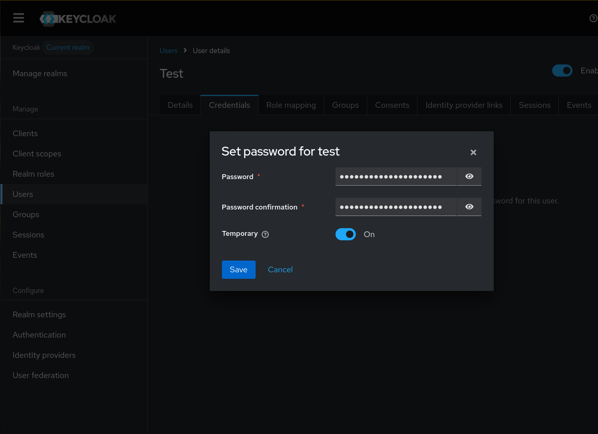

_Introduced in 4.2.0_

## Introduction

These steps document how to configure a single user on a new install of KeyCloak.  

## Prerequisites 




* Current major [version](https://github.com/keycloak/keycloak/security/policy#supported-versions) KeyCloak - 26.x as of CHT 4.20
* CHT 4.2.0 or later
* DNS Entries for CHT and KeyCloak
* TLS enabled on CHT and KeyCloak


Start an instance of [Docker Helper](/hosting/4.x/app-developer/#cht-docker-helper-for-4x) and name it `cht-test`. Add compose file in `~/.medic/cht-docker/cht-test/compose/cht-sso.yml` with this contents:

```yaml
services:
    keycloak:
        image: quay.io/keycloak/keycloak
        environment:
            KEYCLOAK_ADMIN: medic
            KEYCLOAK_ADMIN_PASSWORD: password
        ports: 
          - "8080:8080"
        networks:
          - cht-net
        command: start-dev

networks:
    cht-net:
      name: ${CHT_NETWORK:-cht-net}
```

KeyCloak is now accessible on [http://localhost:8080](http://localhost:8080/). The username is `medic` and the password is `password`





## KeyCloak Setup


{}

### Open Keycloak

Be sure you're logged in


### Add new user (optional)

Optionally create a new user by going to  "Users" > "Add user".  Specify username of `test` and and email of `test@test.com`


### Credentials
Go to the user's "Credentials" tab and select "Set password"




### Add new Client

Add new Client in Keycloak by going to "Clients" > "Create Client" 



Be sure to replace `CHT_URL` with the production URL of your CHT instance

 - Client Type: `OpenID Connect`
 - Client ID: `CHT`
 - Client authentication: `On`
 - Authentication Flow: `Standard flow`
 - Valid redirect URIs: `https://<CHT_URL>/medic/login/oidc/get_token`



Be sure to replace `CHT_URL` with the docker helper URL of your CHT instance. Be sure to include the port at the end of the URL: 
- Client Type: `OpenID Connect`
- Client ID: `CHT`
- Client authentication: `On`
- Authentication Flow: `Standard flow`
- Valid redirect URIs: `https://<CHT_URL>/medic/login/oidc/get_token`





 


### Copy Secret

On the new `CHT` client go to "Credentials" and copy the "Client Secret" value. You'll need this later when configuring the CHT.


{}

## CHT Setup


{}

### CHT login via Keycloak

In the config directory for your app, update your `base_settings.json` file to contain this additional JSON



Be sure to replace `KEYCLOAK_URL` with the production URL of your KeyCloak instance

```json
    "oidc_provider": {
      "client_id": "CHT",
      "discovery_url": "https://<KEYCLOAK_URL>/realms/master/.well-known/openid-configuration"
    },
```




Note that the `discovery_url` is only accessible from docker containers on the `cht-network`, like the CHT API container.  As well,  `allow_insecure_requests` is required when connecting to the OIDC server via `HTTP` instead of `HTTPS`. These settings should not be used in production.

```json
    "oidc_provider": {
      "client_id": "CHT",
      "discovery_url": "http://keycloak:8080/realms/master/.well-known/openid-configuration",
      "allow_insecure_requests": true
    },
```




### Upload CHT config

Upload the config to the CHT with `cht --local compile-app-settings upload-app-settings`

### Client Secret in CHT

Use the [`/api/v1/credentials` REST api](https://docs.communityhealthtoolkit.org/building/reference/api/#put-apiv1credentials) to set the client secret as the `oidc:client-secret` credential.



Be sure to replace `SECRET` with the value from [step 5 above](#copy-secret). As well, replace `CHT_URL` with the production URL of your CHT instance, `USER` with your admin user and `PASSWORD` with your password:
```shell
curl -X PUT http://<USER>:<PASSWORD>@<CHT_URL>/api/v1/credentials/oidc:client-secret \
     -H "Content-Type: text/plain" \
     --data "<SECRET>"
```



Be sure to replace `SECRET` with the value from [step 5 above](#copy-secret). As well, replace `CHT_URL` with the docker helper URL, including port:
```shell
curl -X PUT http://medic:password@<CHT_URL>/api/v1/credentials/oidc:client-secret \
     -H "Content-Type: text/plain" \
     --data "<SECRET>"
```



###  Create CHT user (optional)


- TODO Currently UI for adding SSO user is only in `benkags:9761-sso-user-management-frontend`
  - The workaround is to just add a normal user with the proper `email` value and then update the `_users` doc for that user to include `"oidc": true` via Fauxton
- Navigate to the CHT instance in your browser: `http://localhost:5988/` and login as the admin user
- From the "App Management" console, go to "Users" > "Add user"
  - User name: `test` (can be any unique value)
  - Email-address: `test@test.com` (this must match the email for the Keycloak user)
  - Enable login Via SSO: Checked


###  Test login (optional)

- Logout as the Admin user.
- From the CHT login screen, select "Login with SSO"
    - Your browser will be redirected to the Keycloak login screen
    - Enter the username/password for your Keycloak user
    - You will be redirected back to the CHT app and logged in as your CHT user
- TODO Currently CHT login not working in branch code due to user mapping.

{}

### References

- [Keycloak Docker Quickstart](https://www.keycloak.org/getting-started/getting-started-docker)
