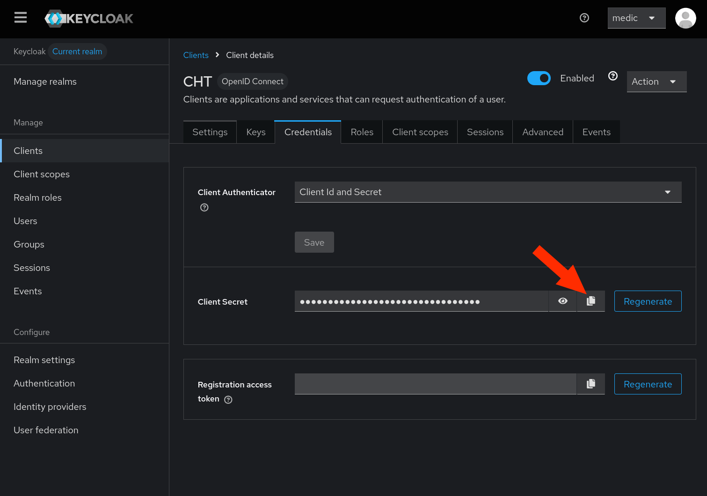


Introduced in 4.20.0. This feature is only compatible with cht-android version `v1.5.2` or greater.


## Introduction

These steps document how to configure Keycloak as the Single Sign On (SSO) identity provider for the CHT. As well, it walks through provisioning a single user for SSO.

## Prerequisites



* Keycloak server - ensure you are running a [supported version](https://github.com/keycloak/keycloak/security/policy#supported-versions)
* CHT server - ensure you are running version `4.20.0` or later
* DNS Entries for CHT and Keycloak
* TLS enabled on CHT and Keycloak



Start with creating a Keycloak compose file and two cert files in a new `~/cht-keycloak` directory by running this code:

```yaml
mkdir -p $HOME/cht-keycloak/data
curl -so $HOME/cht-keycloak/server.crt https://local-ip.medicmobile.org/fullchain
curl -so $HOME/cht-keycloak/server.key https://local-ip.medicmobile.org/key
cat > $HOME/cht-keycloak/compose.yaml << EOF
services:
  keycloak:
    image: quay.io/keycloak/keycloak
    environment:
      KEYCLOAK_ADMIN: medic
      KEYCLOAK_ADMIN_PASSWORD: password
      KC_HTTPS_CERTIFICATE_FILE: /opt/keycloak/conf/server.crt
      KC_HTTPS_CERTIFICATE_KEY_FILE: /opt/keycloak/conf/server.key
    ports:
      - "8443:8443"
    command: start-dev
    volumes:
      - $HOME/cht-keycloak/server.crt:/opt/keycloak/conf/server.crt
      - $HOME/cht-keycloak/server.key:/opt/keycloak/conf/server.key
      - $HOME/cht-keycloak/data:/opt/keycloak/data
EOF
cd $HOME/cht-keycloak
docker compose up -d
```

The Keycloak instance is accessible on your Docker Helper URL, but on port `8443`. For example `https://192-168-68-26.local-ip.medicmobile.org:8443`. The username is `medic` and the password is `password`.

Now create an instance of [Docker Helper](/hosting/4.x/app-developer/#cht-docker-helper-for-4x).




## Keycloak Setup

{}

### Open Keycloak

Be sure you're logged in


### Add new Client

Add new Client in Keycloak by going to "Clients" > "Create Client". Be sure to replace `CHT_URL` with the production URL of your CHT instance. If you're on a development instance be sure to include the port:

 - Client Type: `OpenID Connect`
 - Client ID: `CHT`
 - Client authentication: `On`
 - Authentication Flow: `Standard flow`
 - Valid redirect URIs: `https://<CHT_URL>/medic/login/oidc`

 


### Copy Secret

On the new `CHT` client go to "Credentials" and copy the "Client Secret" value. You'll need this later when configuring the CHT.


{}

## CHT Setup

{}

### CHT App Settings

In the config directory for your app, update your `app_settings.json` file to contain this additional JSON at the end, before the very last `}`

Be sure to replace `KEYCLOAK_URL` with the production URL of your Keycloak instance and `CHT_URL` with the production URL of your CHT instance. If you're using a development instance, be sure the `CHT_URL` includes your port.

```json
    "oidc_provider": {
      "client_id": "CHT",
      "discovery_url": "https://<KEYCLOAK_URL>/realms/master/.well-known/openid-configuration"
    },
    "app_url": "https://<CHT_URL>/"
```


### Upload CHT config



Upload the config using CHT Conf. Replace `CHT_URL` with the production URL of your CHT instance, `USER` with your admin user and `PASSWORD` with your password:

```
cht --url=https://<USER>:<PASSWORD>@<CHT_URL> compile-app-settings upload-app-settings
```




Upload the config using CHT Conf.  Replace `CHT_URL` with the docker helper URL, including port:

```
cht --url=https://medic:password@<CHT_URL> compile-app-settings upload-app-settings
```



### Client Secret in CHT

Use the [`/api/v1/credentials` REST api](https://docs.communityhealthtoolkit.org/building/reference/api/#put-apiv1credentials) to set the client secret as the `oidc:client-secret` credential.



Be sure to replace `SECRET` with the value from [step 5 above](#copy-secret). As well, replace `CHT_URL` with the production URL of your CHT instance, `USER` with your admin user and `PASSWORD` with your password:
```shell
curl -X PUT https://<USER>:<PASSWORD>@<CHT_URL>/api/v1/credentials/oidc:client-secret \
     -H "Content-Type: text/plain" \
     --data "<SECRET>"
```



Be sure to replace `SECRET` with the value from [step 5 above](#copy-secret). As well, replace `CHT_URL` with the docker helper URL, including port:
```shell
curl -X PUT https://medic:password@<CHT_URL>/api/v1/credentials/oidc:client-secret \
     -H "Content-Type: text/plain" \
     --data "<SECRET>"
```



Upon success, `curl` should show the JSON `{"ok":true}` .  

Further, going to the CHT login screen should now show an extra login button "Login with SSO". You may need to hold down the "shift" key and click reload to clear the browser cache:


{}


## Add a test user (optional)

{}

### Add Keycloak user 

In Keycloak,  create a new user by going to  "Users" > "Add user".  Specify username of `test` and and email of `test@test.com`


### Set Keycloak users's password

Go to the user's "Credentials" tab and select "Set password"


###  Add CHT user

From the "App Management" console in the CHT, go to "Users" > "Add user"
  - User name: `test` 
  - SSO Email Address: `test@test.com` (must match email [from step #1](#add-keycloak-user))
  - **Note** - the `E-mail address` field is not used for SSO.


###  Test login 

Logout as the Admin user and then on the CHT login screen, select "Login with SSO"
  - Your browser will be redirected to the Keycloak login screen
  - Enter the username/password for your Keycloak user
  - You will be redirected back to the CHT app and logged in as your CHT user


{}

### References

- [Keycloak Docker Quickstart](https://www.keycloak.org/getting-started/getting-started-docker)
