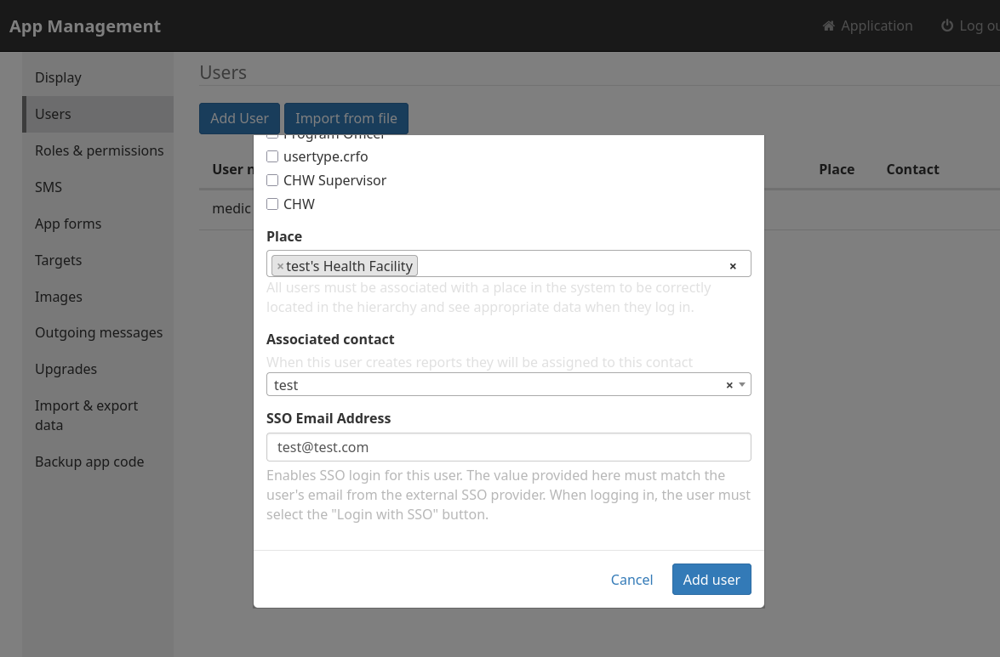

_Introduced in 4.20.0_

## Introduction

These steps document how to configure KeyCloak as the Single Sign On (SSO) identity provider for the CHT. As well, it walks through provisioning a single user for SSO.

## Prerequisites



* Current major [version](https://github.com/keycloak/keycloak/security/policy#supported-versions) KeyCloak - 26.x as of CHT 4.20
* CHT 4.20.0 or later
* DNS Entries for CHT and KeyCloak
* TLS enabled on CHT and KeyCloak


Start an instance of [Docker Helper](/hosting/4.x/app-developer/#cht-docker-helper-for-4x) and name it `cht-test`. Create an extra compose file and two cert files by running this code. Note this is dependant on your Docker Helper instance being called `cht-test` :

```yaml
mkdir -p $HOME/.medic/cht-docker/cht-test-dir
curl -o $HOME/.medic/cht-docker/cht-test-dir/server.crt https://local-ip.medicmobile.org/fullchain
curl -o $HOME/.medic/cht-docker/cht-test-dir/server.key ://local-ip.medicmobile.org/key
cat > $HOME/.medic/cht-docker/cht-test-dir/compose/cht-sso.yaml << EOF
services:
  keycloak:
    image: quay.io/keycloak/keycloak
    environment:
      KEYCLOAK_ADMIN: medic
      KEYCLOAK_ADMIN_PASSWORD: password
      KC_HTTPS_CERTIFICATE_FILE: /opt/keycloak/conf/server.crt
      KC_HTTPS_CERTIFICATE_KEY_FILE: /opt/keycloak/conf/server.key
    ports:
      - "8443:8443"
    command: start-dev
    volumes:
      - $HOME/.medic/cht-docker/cht-test-dir/server.crt:/opt/keycloak/conf/server.crt
      - $HOME/.medic/cht-docker/cht-test-dir/server.key:/opt/keycloak/conf/server.key
EOF
```

KeyCloak is now accessible on [http://localhost:8080](http://localhost:8080/). The username is `medic` and the password is `password`.




## KeyCloak Setup

{}

### Open Keycloak

Be sure you're logged in


### Add new Client

Add new Client in Keycloak by going to "Clients" > "Create Client" 



Be sure to replace `CHT_URL` with the production URL of your CHT instance

 - Client Type: `OpenID Connect`
 - Client ID: `CHT`
 - Client authentication: `On`
 - Authentication Flow: `Standard flow`
 - Valid redirect URIs: `https://<CHT_URL>/medic/login/oidc`



Be sure to replace `CHT_URL` with the docker helper URL of your CHT instance. Be sure to include the port at the end of the URL: 
- Client Type: `OpenID Connect`
- Client ID: `CHT`
- Client authentication: `On`
- Authentication Flow: `Standard flow`
- Valid redirect URIs: `https://<CHT_URL>/medic/login/oidc`



 


### Copy Secret

On the new `CHT` client go to "Credentials" and copy the "Client Secret" value. You'll need this later when configuring the CHT.


{}

## CHT Setup

{}

### CHT App Settings

In the config directory for your app, update your `base_settings.json` file to contain this additional JSON



Be sure to replace `KEYCLOAK_URL` with the production URL of your KeyCloak instance

```json
    "oidc_provider": {
      "client_id": "CHT",
      "discovery_url": "https://<KEYCLOAK_URL>/realms/master/.well-known/openid-configuration"
    },
```




Update `KEYCLOAK_URL` to be the same as your Docker Helper URL, but with `8080` port and `http` instead of `https`. As well,  `allow_insecure_requests` is required when connecting to the OIDC server via `HTTP` instead of `HTTPS`. These settings should not be used in production.

```json
    "oidc_provider": {
      "client_id": "CHT",
      "discovery_url": "https://<KEYCLOAK_URL>:8080/realms/master/.well-known/openid-configuration"
    },
```




### Upload CHT config



Upload the config using CHT Conf.  Replace `CHT_URL` with the docker helper URL, including port:

```
cht --url=https://<USER>:<PASSWORD>@<CHT_URL> compile-app-settings upload-app-settings
```




Upload the config using CHT Conf. Replace `CHT_URL` with the production URL of your CHT instance, `USER` with your admin user and `PASSWORD` with your password:

```
cht --url=https://medic:password@<CHT_URL> compile-app-settings upload-app-settings
```



### Client Secret in CHT

Use the [`/api/v1/credentials` REST api](https://docs.communityhealthtoolkit.org/building/reference/api/#put-apiv1credentials) to set the client secret as the `oidc:client-secret` credential.



Be sure to replace `SECRET` with the value from [step 5 above](#copy-secret). As well, replace `CHT_URL` with the production URL of your CHT instance, `USER` with your admin user and `PASSWORD` with your password:
```shell
curl -X PUT https://<USER>:<PASSWORD>@<CHT_URL>/api/v1/credentials/oidc:client-secret \
     -H "Content-Type: text/plain" \
     --data "<SECRET>"
```



Be sure to replace `SECRET` with the value from [step 5 above](#copy-secret). As well, replace `CHT_URL` with the docker helper URL, including port:
```shell
curl -X PUT https://medic:password@<CHT_URL>/api/v1/credentials/oidc:client-secret \
     -H "Content-Type: text/plain" \
     --data "<SECRET>"
```



{}


## Add a test user (optional)

{}

### Add KeyCloak user 

In KeyCloak,  create a new user by going to  "Users" > "Add user".  Specify username of `test` and and email of `test@test.com`


### Set KeyCloak users's password

Go to the user's "Credentials" tab and select "Set password"


###  Add CHT user

From the "App Management" console in the CHT, go to "Users" > "Add user"
  - User name: `test` 
  - SSO Email Address: `test@test.com` (must match email [from step #1](#add-keycloak-user))
  - **Note** - the `E-mail address` field is not used for SSO.




###  Test login 

Logout as the Admin user and then on the CHT login screen, select "Login with SSO"
  - Your browser will be redirected to the Keycloak login screen
  - Enter the username/password for your Keycloak user
  - You will be redirected back to the CHT app and logged in as your CHT user


{}

### References

- [Keycloak Docker Quickstart](https://www.keycloak.org/getting-started/getting-started-docker)
