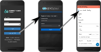


Introduced in 4.20.0. This feature is only compatible with cht-android version `v1.5.2` or greater.


## Overview

The CHT supports Single Sign-On (SSO) via integration with an external authentication server. Users connecting to a CHT instance authenticate with their SSO credentials instead of needing a CHT-specific username and password.
 
SSO authentication is implemented with the industry standard [OpenID Connect](https://openid.net/) (OIDC) protocol. Any OIDC-compliant authentication server can be integrated with the CHT. For example:

- [Keycloak](https://www.keycloak.org/) - Free and open-source, self-hostable identity and access management server
- [Microsoft Entra ID](https://learn.microsoft.com/en-us/entra/fundamentals/what-is-entra) - Paid, cloud-based identity and access management service.



## Quick Start

1. Add a new client to your OIDC Provider with the redirect URL of `https://<CHT_URL>/medic/login/oidc`. You will need your client id, client secret, and the discovery URL of your OIDC Provider for the next steps. Be sure to replace `CHT_URL` with your real URL.
2. Add the Client App ID (`APP_ID`), OIDC Provider discovery URL (`WELL_KNOWN_OIDC_URL`) and CHT URL (`CHT_URL`) to your [app_settings.json](/building/reference/app-settings/oidc_provider) using [CHT Conf](/technical-overview/architecture/cht-conf). Be sure to replace `APP_ID`, `WELL_KNOWN_OIDC_URL` and `CHT_URL` with your real URLs:

    ```json
    "oidc_provider": {
      "client_id": "<APP_ID>",
      "discovery_url": "https://<WELL_KNOWN_OIDC_URL>"
    },
    "app_url": "https://<CHT_URL>/"
    ```
3. Upload the secret from step 1 to the CHT. Be sure to replace `CHT_URL` , `USER`,  `PASSWORD` and `SECRET` with the correct values: `curl -X PUT https://<USER>:<PASSWORD>@<CHT_URL>/api/v1/credentials/oidc:client-secret -H "Content-Type: text/plain" --data "<SECRET>"`
4. Before logging into the CHT, each SSO user must have a CHT user [provisioned with an "SSO Email Address"](/building/reference/api/#/User/v3UsersPost) that matches the email address configured for the user with the OIDC Provider.
5. Use the "Login with SSO" button on the CHT login page.

### Require re-authentication


Added in TODO


By default, SSO Authentication will use the user's current session with the OIDC provider (if one exists). If the user has already authenticated with the OIDC provider and has an active session on the device, the user may be automatically logged in to the CHT when clicking the "Login with SSO" button (without actually needing to re-authenticate with the OIDC provider).

In some cases, this behavior is not desired and the user should be required to re-authenticate with the OIDC provider. For example, if you have multiple users sharing the same device, it may be challenging for an SSO user to log out of the CHT and have a different user log in to the CHT. The previous user's active session with the OIDC provider might get used during the SSO login flow (even though the previous user's _CHT session_ was ended when they logged out). This results in the new user being logged into the CHT account for the previous user.

To avoid this behavior, you can define the maximum allowed age of the user's current session with the OIDC Provider, after which the user will be required to re-authenticate when logging into the CHT even if their session is still active. Set the `oidc_provider.max_age` setting to the allowable elapsed time in seconds since the last time the user was actively authenticated by the OIDC Provider. If the elapsed time is greater than this value, the user will be required to re-authenticate.

Setting `max_age: 0` will always require re-authenticating with the OIDC Provider when logging into the CHT.

## Detailed Guides 

For more detailed guides and requirements, see the following documents:

  
  
  

