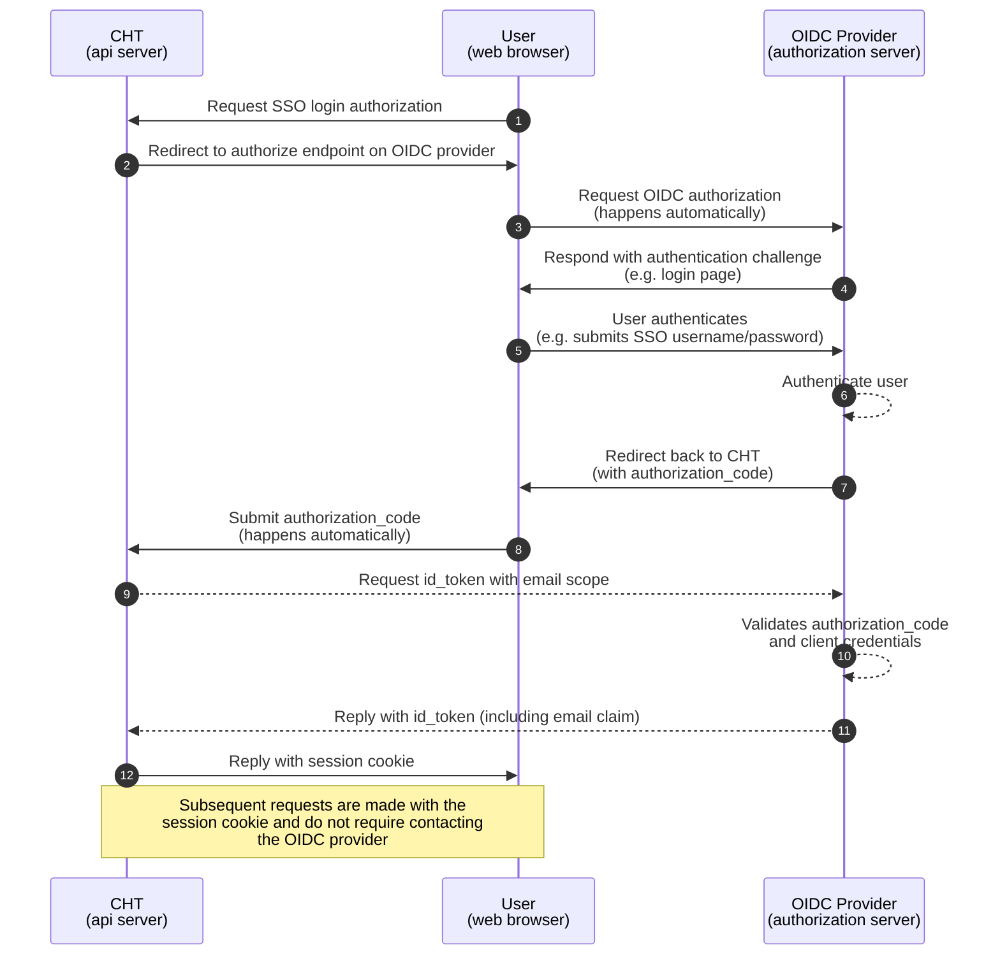


Introduced in 4.20.0


CHT 4.20 introduced the single sign on (SSO) feature allowing deployments to use the industry standard [OpenID Connect](https://openid.net/) (OIDC) protocol to authenticate users.  See the entire [technical design document](https://docs.google.com/document/d/1LUn1ZRetAmYE04CtdcTmp-bEBvl37AZ0CvFXZChXqfU/edit?tab=t.0) for all the details, otherwise read on below for key points on how SSO in the CHT works.

## Setup 

CHT 4.20 and later has all the code to support SSO.  The "Login with SSO" button is not visible until `oidc_provider` JSON stanze is added to the app config and uploaded to the CHT instance.  See [step 1 in Keycloak Setup](/hosting/sso/keycloak/#cht-app-settings) for example.

After the config is uploaded, not only will the login screen be updated for all users, an additional "SSO Email Address" field will be shown when editing a user in the admin area of the CHT.  Internally this is called `oidc_username` and it separate from the `email` field.  See [the API on users](/building/reference/api/#supported-properties-2) for more information. 

## CHT accounts and session 

To prevent username collisions, a user that has been provisioned for SSO, may not use the native "Login" button in in CHT. They will see "Incorrect user name or password. Please try again."

As well, if a user has a correctly provisioned SSO login, but their CHT user isn't provisioned, or is incorrectly provisioned, they will see an error "You are not allowed to log in with SSO. Please contact your administrator or supervisor.".  This may be especially confusing for a first time users.  They will click "Login with SSO", they will then successfully login in the SSO system, and then the CHT will show the error.  Subsequent attempts of clicking "Login with SSO" will immediately show the error, bypassing the SSO system as they're already logged in there.  

Two CHT users can not share the same SSO login.  If you enter the same value in the "SSO Email Address", an error will be shown, "A different user already exists with the same SSO Email Address."

Users who successfully authenticates on the SSO system, will be sent to the CHT which verifies the user is historized to login.  Upon getting a confirmation, a cookie is given to the user with their session information.  At this point, the CHT can not distinguish the user from a non-SSO user. Only an admin looking at the user account could tell how the user logged in. 

A user may be removed from using SSO by deleting the email address from "SSO Email Address" on their CHT account. The user can then login using the password on their CHT user.

## Sequence diagram

## Caveats

While completely compliant with the OIDC specification, SSO was implemented using a "minimum viable product" (MVP) approach.  This means more robust features were not implemented in certain areas:

* Creating a user in your SSO system does not automatically create a corresponding user in the CHT.  Users need to be provisioned by hand in the CHT admin app or via bulk import into the CHT
* Users who logged in to the CHT via SSO and have their SSO account deactivated, are not automatically logged out of the CHT.  To log the user out, their password must be changed in the CHT.  
