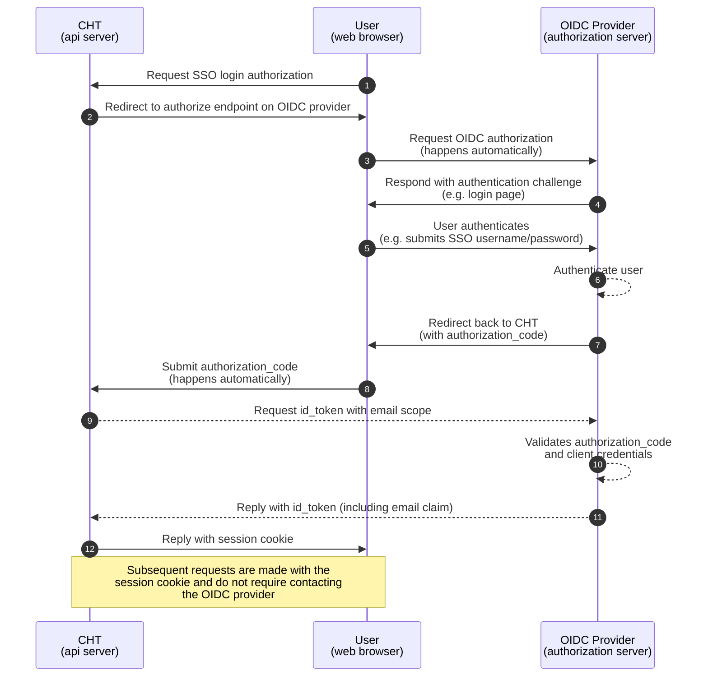


Introduced in 4.20.0. This feature is only compatible with cht-android version `v1.5.2` or greater.


Single Sign-On (SSO) feature allows deployments to use the industry standard [OpenID Connect](https://openid.net/) (OIDC) protocol to authenticate users. Below are some key points on the SSO functionality in the CHT. See the [technical design document](https://docs.google.com/document/d/1LUn1ZRetAmYE04CtdcTmp-bEBvl37AZ0CvFXZChXqfU/edit?tab=t.0) for more details.

## Setup 

Follow the [setup steps](//hosting/sso) to [configure your CHT instance](/building/reference/app-settings/oidc_provider) for SSO Login. Once the server has been properly configured, the "Login with SSO" button will be visible on the CHT Login page. CHT users with the [`oidc_username` property](/building/reference/api/#login-by-oidc) will be able to log in with their SSO credentials. The "SSO Email Address" field will be also be visible in the create/update users modal in the [App Management interface](/building/admin/admin-overview). 

## User Mapping

Note that the "SSO Email Address" field is used to populate the user's `oidc_username` property. The `oidc_username` is stored separately from the user's normal `email` property (populated from the "Email Address" field in the App Management interface) and different values can be provided for each. Only the `oidc_username` will be considered when logging in an SSO user. Users with the `can_edit_profile` permission are able to edit their `email` value, but only administrators can edit a user's `oidc_username`.

If someone selects the "Login with SSO" button and successfully authenticates with the OIDC provider, but their OIDC user account does not have a corresponding CHT user (the `email` claim from the OIDC user does not match any CHT user `oidc_username`), they will not be logged into the CHT. Instead they will be redirected back to the login page with an error message indicating that they are not allowed to log in with SSO.

Users with a currently active OIDC session may not be required to re-authenticate. Instead, when logging into the CHT for the first time they will be prompted by their OIDC Provider to allow the CHT to access their user information.

A user with the `oidc_username` property is only allowed to log in with SSO. Any other authentication method (e.g. username/password or token login) will fail.

To convert an SSO user in the CHT back to a normal CHT user (with username/password authentication), simply remove the user's `oidc_username` (by deleting the value from the "SSO Email Address" field). A new password must then be set for the user. All the user's existing sessions will be invalidated and the user must log in again (this time by using their CHT username/password).

## CHT User Session 

Once an SSO user has successfully authenticated with the CHT (by completing the OIDC flow), their browser receives a valid Couch session cookie (equivalent to the session cookies provided to normal CHT users). For all subsequent operations, the CHT does not distinguish between SSO and non-SSO users since both types of users are authenticating with the same type of session cookie.

It is very important to note that once an SSO user has successfully authenticated with the CHT, the CHT does not contact the OIDC Provider for subsequent requests from that user. If the user is removed from the OIDC Provider (or their OIDC session is otherwise invalidated), they will still be able to access the CHT. This is because their CHT session cookie is still valid. You can prevent the user from accessing the CHT by disabling their CHT user account, updating their "SSO Email Address" or removing it and setting a new password for the user.

## OIDC Login Sequence

The following diagram demonstrates the sequence of events when a user logs in to the CHT using SSO:

## Limitations

While completely compliant with the OIDC specification, the SSO functionality in the CHT currently has several notable limitations (any of which may be addressed in future releases):

* User auto-provisioning is not supported. Users must be created in the CHT before they can log in with SSO.  The CHT does not automatically create users when they log in with SSO for the first time.
* Back-channel logout is not supported. As noted above, when a user's OIDC session is ended, it does not automatically end their CHT session.
* User mapping between OIDC and CHT users only supports matching on the `email` claim from the OIDC user. The CHT does not support mapping on other claims (e.g. `sub` or `preferred_username`).
