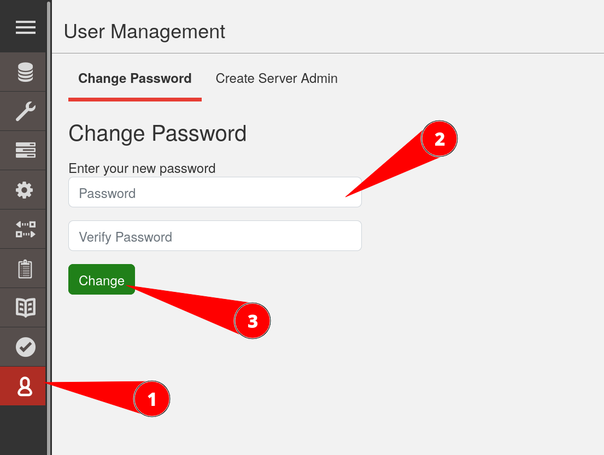

The `medic` username and password play a special role: not only can CHT administrators use it in the web GUI or for API calls, but all docker services also use it internally when connecting to CouchDB.

To change the password, first update it in CouchDB, then update your settings file and finally restart. A down time of less than 10 minutes will be incurred, so plan accordingly. 

## CHT is running, current password is known

{}

### Log in

Using the CHT URL the the `medic` user, log into the CHT. Assuming a URL of `cht.example.com` go to the login page at `https://cht.example.com/medic/login`.

If there is already an active session, the CHT will redirect you to `/admin/` - there is then no need to login.

###  Go to Fauxton

Every CHT instance ships with the default CouchDB web GUI called [Fauxton](https://docs.couchdb.org/en/stable/fauxton/index.html).  It is accessible at `/_utils/`, so if the CHT URL is `cht.example.com`, Fauxton can be found at `https://cht.example.com/_utils/`.

###  Change the password in Fauxton

Click the user icon in the lower left, enter the new password in "Password" and in "Verify Password" and click "Change".  Your CHT instance is now no longer accessible because API is locked out (Error 503). The following steps fix API's access.



###  Update environment variable

Assuming a [production install](/hosting/cht/docker/installation/), edit the `.env` file located at `/home/ubuntu/cht/upgrade-service/.env` on your CHT server.  Find the line starting with `COUCHDB_PASSWORD`.  Edit the password there to match what you used in the prior step.

For example, if the password used in step #3 above was  `hug-guide-twirl-grew-angel-poise-squad`, the final line would look like this:

```shell
COUCHDB_PASSWORD=hug-guide-twirl-grew-angel-poise-squad 
```

###  Restart the CHT

Still assuming a [production install](/hosting/cht/docker/installation/), restart the CHT with the following 2 commands. This grants API and all other services access with the new password:

```shell
cd /home/ubuntu/cht/upgrade-service/
docker compose up --detach
```

{}

## CHT is failing to start, current password  _not_ known

There may be a scenario where either the `medic` user password was lost or if password was changed in step #3 above was miss-typed such that it is not known.

{}

### Check the password in the .env file

Run this command to output your current password:

```shell
grep COUCHDB_PASSWORD /home/ubuntu/cht/upgrade-service/.env | cut -d'=' -f2
```

Before continuing, check if this password works in a web browser to log into the CHT.  If it works, it is a much more simple recovery process than below. If that password does not work, continue with the steps below.

### Get a shell on the CouchDB container

On the command line of the server where the CHT is hosted, run the following command:

```shell
docker exec -it $(docker ps --filter "name=^cht-couchdb*" -q) bash
```

A command prompt for the `root` user should now be shown:

```shell
$ docker exec -it $(docker ps --filter "name=^cht-couchdb*" -q) bash
root@e87a858793d6:/#
```

### Update the ini file for couch

Still using the `root` user on the CouchDB container, replace `PASSWORD` with the password from step #1 above and run these two commands:

```shell
P="PASSWORD"
sed -i "s/medic =.*/medic = $P/g" /opt/couchdb/etc/local.d/cluster-credentials.ini
```

For example, if step #1 gave a result of `hug-guide-twirl-grew-angel-poise-squad`, this would be the two commands to run:

```shell
P="hug-guide-twirl-grew-angel-poise-squad"
sed -i "s/medic =.*/medic = $P/g" /opt/couchdb/etc/local.d/cluster-credentials.ini
```

###  Restart the CHT

Restart the CouchDB inside CHT with the following command, assuming default [install process](/hosting/cht/docker/installation/):

```shell
docker restart $(docker ps --filter "name=^cht-couchdb*" -q)
```

{}