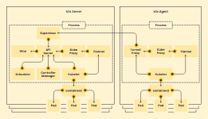

## Introduction

[K3s](https://k3s.io/?ref=traefik.io) is a lightweight Kubernetes distribution. Easy to install, half the memory, all in a binary of less than 100 MB. K3s is highly available and production-ready and very low resource requirements.
Great for:

* Edge
* IoT
* CI
* Development
* ARM
* Embedding k8s
* Situations where a PhD in k8s clusterology is infeasible

## Architecture

### Servers and Agents

* A server node is defined as a host running the k3s server command, with control-plane and datastore components managed by K3s.
* An agent node is defined as a host running the k3s agent command, without any datastore or control-plane components.
* Both servers and agents run the kubelet, container runtime, and CNI.



## Configuration Options

K3s offers a variety of configuration options to tailor the setup to your needs.
Here are some key options:

### Basic Configuration Options

#### **Installation Script**

Use the installation script to set up K3s as a service and by using the installation script we install K3s as systemd and openrc based systems.

To install K3s using the installation script, follow these steps:

1. **Download the Installation Script** :

```
   curl -sfL https://get.k3s.io | sh -
```

   This command downloads the script and runs it, installing K3s as a service on your system1.

1. **Verify the Installation** :

```
   k3s kubectl get nodes
```

   This command checks if K3s is running and lists the nodes in your cluster.

1. **Additional Utilities** :

* The script also installs additional utilities like `kubectl`, `crictl`, `ctr`, `k3s-killall.sh`, and `k3s-uninstall.sh`1.

1. **Configuration Options** :

* You can use environment variables prefixed with `K3S_` or pass command flags to configure K3s2.
* For example, to set the server address:
  **sh**Copy

  ```
  exportK3S_SERVER=https://your-server-address:6443
  curl -sfL https://get.k3s.io | sh -
  ```

1. **Edit Configuration** :

* After installation, you can edit the service configuration or environment file to change settings.
* A [kubeconfig](https://kubernetes.io/docs/concepts/configuration/organize-cluster-access-kubeconfig/) file will be written to `/etc/rancher/k3s/k3s.yaml` and the kubectl installed by K3s will automatically use it
* You can use a combination of `INSTALL_K3S_EXEC`, `K3S_` environment variables, and command flags to pass configuration to the service configuration. The prefixed environment variables, `INSTALL_K3S_EXEC` value, and trailing shell arguments are all persisted into the service configuration. After installation, configuration may be altered by editing the environment file, editing the service configuration, or simply re-running the installer with new options.

```
curl -sfL https://get.k3s.io | INSTALL_K3S_EXEC="server" sh -s - --flannel-backend none --token 12345
curl -sfL https://get.k3s.io | INSTALL_K3S_EXEC="server --flannel-backend none" K3S_TOKEN=12345 sh -s -
curl -sfL https://get.k3s.io | K3S_TOKEN=12345 sh -s - server --flannel-backend none
#server is assumed below because there is no K3S_URL
curl -sfL https://get.k3s.io | INSTALL_K3S_EXEC="--flannel-backend none --token 12345" sh -s -
curl -sfL https://get.k3s.io | sh -s - --flannel-backend none --token 12345
```

### Configuration with binary

The installation script is primarily concerned with configuring K3s to run as a service.
If you choose to not use the script, you can run K3s simply by downloading the binary from our release page, placing it on your path, and executing it.

```
curl -Lo /usr/local/bin/k3s https://github.com/k3s-io/k3s/releases/download/v1.26.5+k3s1/k3s; chmod a+x /usr/local/bin/k3s
```

You can pass configuration by setting K3S_ environment variables:

```
k3s server --write-kubeconfig-mode=644
```

Or command flags:

```
k3s server --write-kubeconfig-mode=644
```

### Configuration File

In addition to configuring K3s with environment variables and CLI arguments, K3s can also use a config file.

By default, values present in a YAML file located at /etc/rancher/k3s/config.yaml will be used on install.

```
write-kubeconfig-mode: "0644"
tls-san:
  - "foo.local"
node-label:
  - "foo=bar"
  - "something=amazing"
cluster-init: true
```

This is equivalent to the following CLI arguments:

```
k3s server \
  --write-kubeconfig-mode "0644"    \
  --tls-san "foo.local"             \
  --node-label "foo=bar"            \
  --node-label "something=amazing"  \
  --cluster-init

```

### Advanced Options / Configuration

There are some advance ways to run and manage K3s.

You can access them [here](https://docs.k3s.io/advanced)

<style>
svg g .nodes #flowchart-couchInner2-4 .label div {
    padding: 40px 0 40px 0;
}
svg g .nodes #flowchart-couchInner4-8 .label div,
svg g .nodes #flowchart-couchInner5-9 .label div,
svg g .nodes #flowchart-couchInner6-10 .label div
{
    padding: 15px 0 15px 0;
}
.mermaid  {
    justify-content: center;
    align-items: center;
    display: flex;
}
</style>
