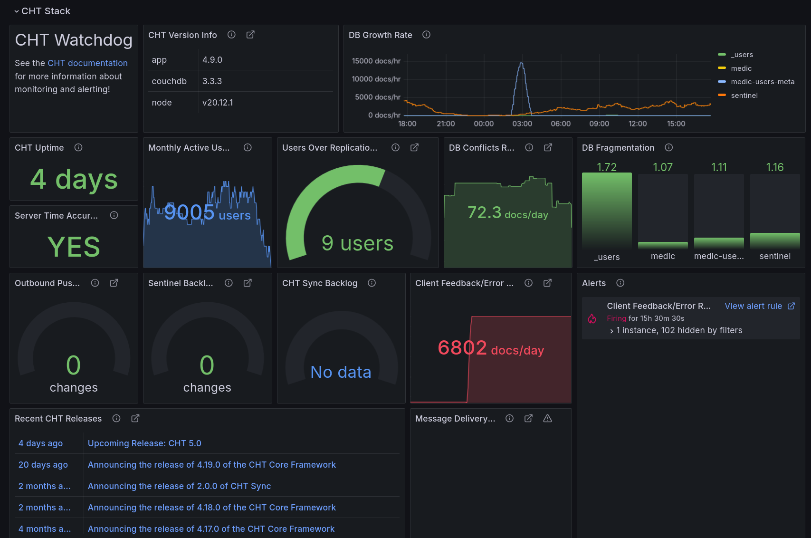
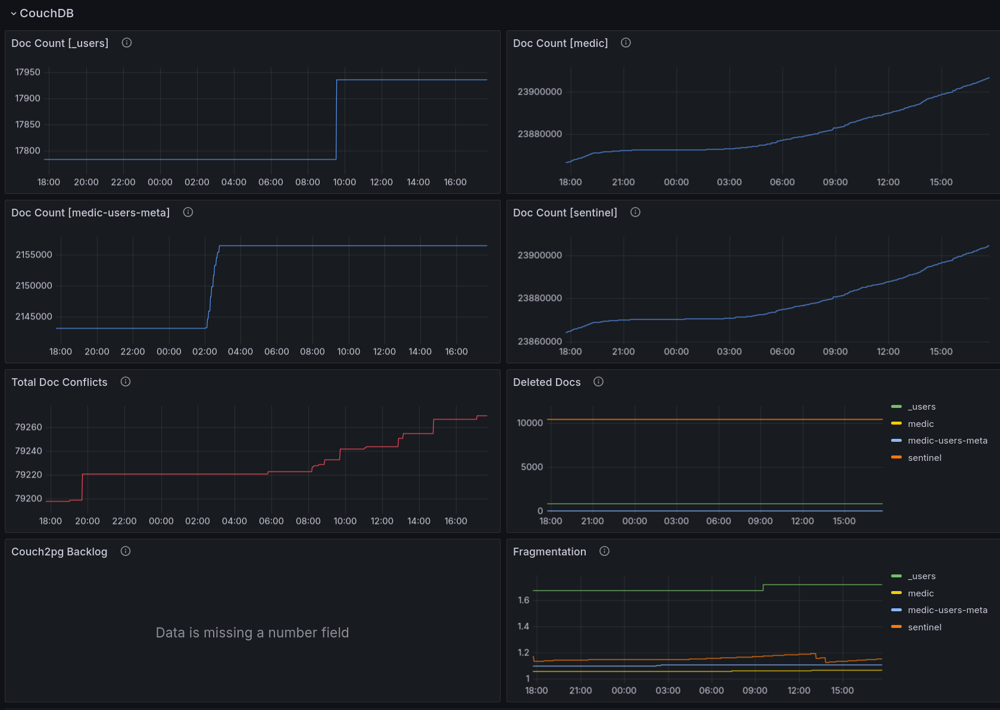
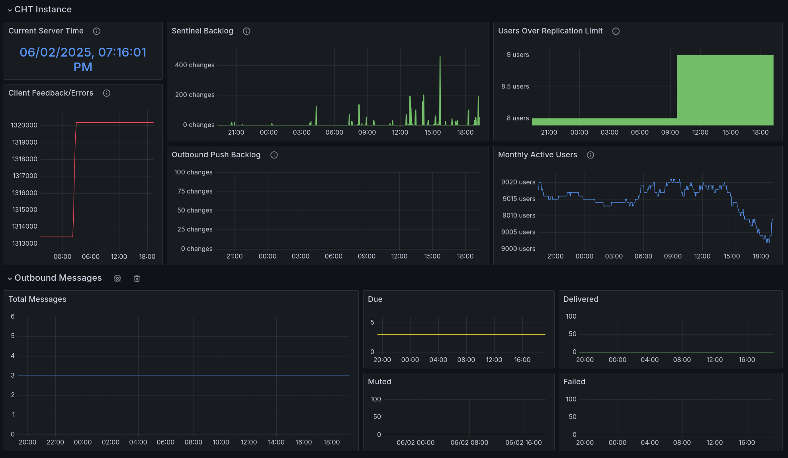
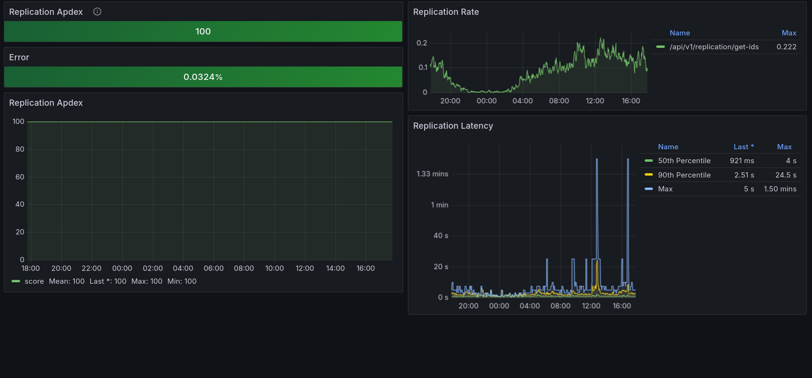
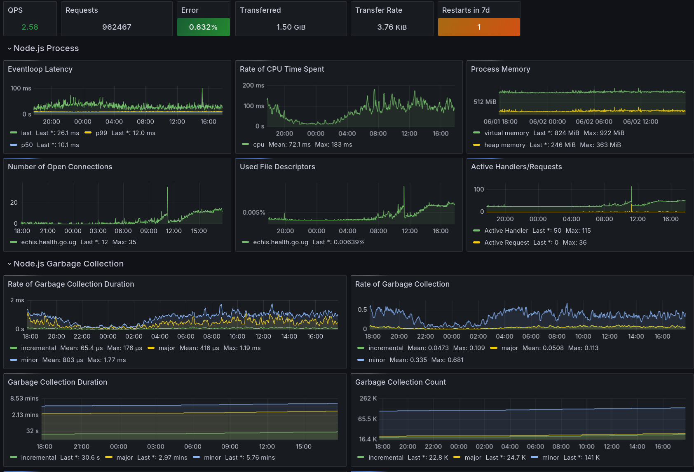


These instructions apply to both CHT 3.x (beyond 3.12) and CHT 4.x.  


## Overview

This is the main dashboard for Watchdog.  It gives you high level details on your CHT instance.  Starting from the upper left and going from right to left you have:

1. Watchdog title and link to docs
2. CHT version information
3. Growth of 4 main databases:  This is good to check the health of your instance.  Are you seeing the same growth day over day?  Your users are probably good and successfully uploading documents.  Do you see a drop off of growth?  Maybe you deployed an app settings that changed or broke your deployment!
4. CHT Uptime: How long since the last reboot
5. Server time accurate: Is your server's time in sync with the correct time
6. Monthly active users: This is nice to compare with number of users in your database vs how many are active.  From this you can derive your engagement rate
7. User over replication limit: the number of users that are trying to replicate in excess of 10k docs
8. DB Conflicts rate: Rate of creation of doc conflicts which need to be resolved manually.
9. DB Fragmentation: The fragmentation of the db, lower is better, “1” is no fragmentation.
10. Outbound push backlog: Number of changes yet to be processed by Outbound Push. If this is persistently above 0 you likely have a configuration error in your outbound push
11. Sentinel backlog: Number of changes yet to be processed by Sentinel. If this is persistently above 0 you may have resource contention
12. CHT Sync Backlog: Number of CouchDB changes that have not yet been processed by CHT Sync. Requires setup of [SQL integration](/hosting/monitoring/setup/#additional-configuration).
13. Client Feedback/Error Rate: CHT Sync Backlog: Number of feedback docs created usually indicative of client side errors.
14. Alerts: Alerts that need attention.  In this screenshot, you can see that the Client Feedback/Error Rate is too high and should be investigated.  See [alerts](/hosting/monitoring/setup/#alerts) for more information.

## Details

These 8 graphs show growth overtime of the respective sources.  This is really great to get a timestamp for changes in growth which can then be further investigated to see what else changed.

If CHWs are complaining that they're not seeing the data they're expecting, or if syncing is taking a long time, the "Sentinel Backlog" graph is great first place to check. In this case, there's small healthy spikes of backlog that resolved over a short amount of time.  If there were gaps in data that would represent an outage. If there were an ever increasing backlog, that would suggest resource contention (CPU).

## Replication

Replication Apdex: A score of 100 means all successful syncs proceeded by the server are fast enough to satisfy user's expectations (the sync completes in less than 3 mins). When the server takes longer than 3 minutes, users begin to be less satisfied and this ApDex number reduces. Users tolerate syncs which take between 3mins and 6mins. Users are frustrated by sync times over 6mins. See the [Apdex Wikipedia article](https://en.wikipedia.org/wiki/Apdex) for more details.

| User State | Threshold                   |
|------------|-----------------------------|
| Satisfied  | <180s (3min)                |
| Tolerated  | >= 180 (3min) < 360s (6min) |
| Frustrated | >= 360s (6min)              |

Note that this is not the same as [client side form Apdex](/building/guides/performance/telemetry/#performance-data).

## API Server

API server metrics (see [prometheus-api-metrics](https://www.npmjs.com/package/prometheus-api-metrics)).

## Metrics Reference

All CHT metrics in Prometheus:

| OpenMetrics name                      | Type    | label(s)                   | Description                                                                                                                                                                                                                                                                                        |
|---------------------------------------|---------|----------------------------|----------------------------------------------------------------------------------------------------------------------------------------------------------------------------------------------------------------------------------------------------------------------------------------------------|
| `cht_api_*`                           | N/A     |                            | API server metrics (see [prometheus-api-metrics](https://www.npmjs.com/package/prometheus-api-metrics)). Requires CHT Core 4.3.0 or later. Includes stats like server response time in seconds and response size in bytes.                                                                         |
| `cht_conflict_count`                  | Gauge   |                            | Number of doc conflicts which need to be resolved manually.                                                                                                                                                                                                                                        |
| `cht_connected_users_count`           | Gauge   |                            | Number of users that have connected to the api recently. By default the time interval is 7 days. Otherwise it is equal to the connected_user_interval parameter value used when making the /monitoring request.                                                                                    |
| `cht_couchdb_doc_del_total`           | Counter | `db`                       | The number of deleted docs in the db.                                                                                                                                                                                                                                                              |
| `cht_couchdb_doc_total`               | Counter | `db`                       | The number of docs in the db.                                                                                                                                                                                                                                                                      |
| `cht_couchdb_fragmentation`           | Gauge   | `db`                       | The fragmentation of the entire db (including view indexes) as stored on disk. A lower value is better. `1` is no fragmentation.                                                                                                                                                                   |
| `cht_couchdb_size_bytes`              | Gauge   | `db`, `type`               | The size in bytes of the database. This includes documents, metadata, and attachments, but does not include view indexes. Type: `active` is the size of the live data inside the database, while type: `file` value is the size of the database file on disk. Requires CHT Core `4.11.0` or later. |
| `cht_couchdb_update_sequence`         | Counter | `db`                       | The number of changes in the db.                                                                                                                                                                                                                                                                   |
| `cht_couchdb_view_index_size_bytes`   | Gauge   | `db`, `type`, `view_index` | The size in bytes of the view index. Type: `active` is the size of the live data inside the view, while type: `file` value is the size of the view as stored on disk. Requires CHT Core `4.11.0` or later.                                                                                         |
| `cht_date_current_millis`             | Counter |                            | The current server date in millis since the epoch, useful for ensuring the server time is correct.                                                                                                                                                                                                 |
| `cht_date_uptime_seconds`             | Counter |                            | How long API has been running.                                                                                                                                                                                                                                                                     |
| `cht_feedback_total`                  | Counter |                            | Number of feedback docs created usually indicative of client side errors.                                                                                                                                                                                                                          |
| `cht_messaging_outgoing_last_hundred` | Gauge   | `group`, `status`          | Counts of last 100 messages that have received status updates.                                                                                                                                                                                                                                     |
| `cht_messaging_outgoing_total`        | Counter | `status`                   | Counts of the total number of messages.                                                                                                                                                                                                                                                            |
| `cht_outbound_push_backlog_count`     | Gauge   |                            | Number of changes yet to be processed by Outbound Push.                                                                                                                                                                                                                                            |
| `cht_replication_limit_count`         | Gauge   |                            | Number of users that exceeded the replication limit of documents.                                                                                                                                                                                                                                  |
| `cht_sentinel_backlog_count`          | Gauge   |                            | Number of changes yet to be processed by Sentinel.                                                                                                                                                                                                                                                 |
| `cht_version`                         | N/A     | `app`, `node`, `couchdb`   | Version information for the CHT instance (recorded in labels)                                                                                                                                                                                                                                      |
