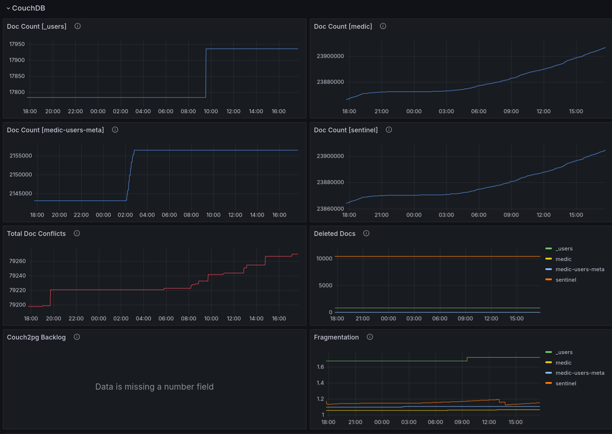


These instructions apply to both CHT 3.x (beyond 3.12) and CHT 4.x.  


## Overview

## Details

## API Server

## Replication

| User State | Theshold                    |
|------------|-----------------------------|
| Satisfied  | <180s (3min)                |
| Tolerated  | >= 180 (3min) < 360s (6min) |
| Frustrated | >= 360s (6min)              |

