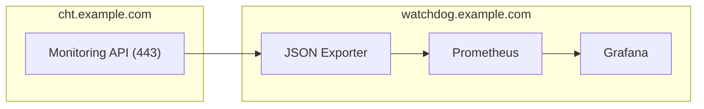
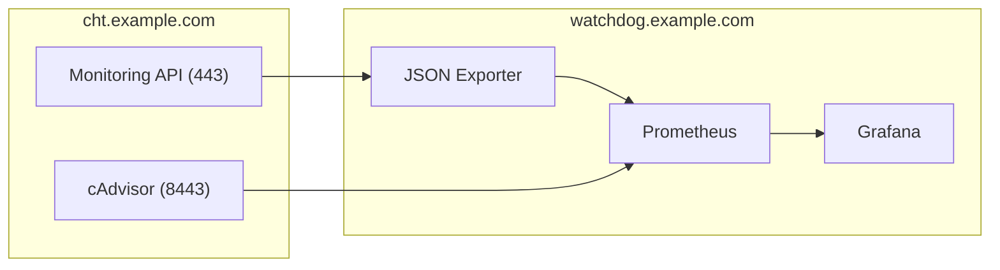


  Scraping and alerting external sources with CHT Watchdog



  These instructions apply to both CHT 3.x (beyond 3.12) and CHT 4.x.  


## Going beyond basic setup

After you have done the [setup of CHT Watchdog]() and configured it to run [with TLS and have backups enabled](), you may want to extend it to scrape other Prometheus data sources so that Grafana can send alerts on non-CHT Core metrics.

This guide uses example instances of CHT Core (`cht.example.com`) and CHT Watchdog (`watchdog.example.com`). When deploying, be sure to replace with your own hostnames.

### Default Flow

Let's look at how the default deployment of Watchdog works when configured to only gather metrics from [CHT Core's monitoring API]():



### Additional Flows

Your Prometheus instance from CHT Watchdog can ingest data from any [supported data source](https://prometheus.io/docs/instrumenting/exporters/) accessible via an HTTPS request. These data sources might be hosted on the same server as CHT Core or on a completely different server. 

The focus of this guide is to collect metrics on Docker container usage and performance from the server hosting our CHT Core instance using [cAdvisor](https://prometheus.io/docs/guides/cadvisor/).



Note that because CHT Core is listening on port 443 already, we'll have cAdvisor listen on port 8443.

By reading this guide you should not only be able to set up cAdvisor, but also be familiar with extending CHT Watchdog to support any other vital metrics.

### Steps to new integrations

While this is a specific example for cAdvisor, these same steps will be taken to extend Watchdog for other metrics:

1. CHT Core: [Create both cAdvisor and Caddy Docker Compose files]()
2. CHT Core: [Start the Caddy and a cAdvisor containers along with the CHT Core]()
3. CHT Watchdog: [Adding new scrape and compose configs]()
4. CHT Watchdog: [Restart the Prometheus and Grafana server to include the new scrape config mounts]()
5. CHT Watchdog: [Importing an existing cAdvisor dashboard from `grafana.com`]()

After completing these steps, we now have Docker metrics we can alert on:



Read on below on how to set this up!

## Integrating with cAdvisor

### On CHT Core

#### cAdvisor Compose file

On your CHT instance, add a Docker composer file for the new cAdvisor service. Note this also includes a Redis caching layer. Also note that we're reducing cAdvisors CPU usage by adding 3 extra flags in the `command` stanza.  In our example, we've put this file in `/home/ubuntu/cht/compose/cadvisor_compose.yml` with these contents:

```yaml
version: '3.9'
services:
  cadvisor:
    image: gcr.io/cadvisor/cadvisor:latest
    container_name: cadvisor
    volumes:
      - /:/rootfs:ro
      - /var/run:/var/run:rw
      - /sys:/sys:ro
      - /var/lib/docker/:/var/lib/docker:ro
    depends_on:
      - redis
    networks:
      - cht-net
    command:
      - "--housekeeping_interval=30s"
      - "--docker_only=true"
      - "--disable_metrics=percpu,sched,tcp,udp,disk,diskIO,accelerator,hugetlb,referenced_memory,cpu_topology,resctrl"
  redis:
    image: redis:latest
    container_name: redis
    networks:
      - cht-net
```

#### Caddy Config and Compose files

Like we did in the [TLS section](), we'll add both a `/home/ubuntu/Caddyfile` and a `/home/ubuntu/cht/compose/caddy-compose.yml`.

Starting with the `Caddyfile`, let's assume your server's DNS entry is `cht.example.com`.  We can expose cAdvisor's service running on localhost port `8443` with this compose file. This tells Caddy to reverse proxy requests to the public interface to the private Docker network interface on port `8080` where cAdvisor is running:

```yaml
cht.example.com:8443 {
    reverse_proxy cadvisor:8080
}
```

Then we can add the compose file to run Caddy. Note that it's mounting the config file we just created:

```yaml
version: "3.9"
services:
  caddy:
    image: caddy:2-alpine
    restart: unless-stopped
    ports:
      - "8443:8443"
    volumes:
      - /home/ubuntu/Caddyfile:/etc/caddy/Caddyfile
    networks:
      - cht-net
```

#### Start cAdvisor, Caddy and CHT Core with Docker

Now that we have all the config files in place, you need to have Docker start everything together. This is so that the containers can see each other on the same `CHT Net` Docker network.  You will need to specify each of the compose files every time you start, stop or restart CHT instance so all the services stay running and connected.

Assuming you followed the [production steps]() to install the CHT, you use this Compose call to first stop all containers and then start them all up, including the new services:

```shell
cd /home/ubuntu/cht/upgrade-service
docker stop $(docker ps --quiet)
docker compose up --detach
```

Note that the CHT Upgrade Service will process all Docker Compose file in the `/home/ubuntu/cht/compose` directory for us and we don't need to explicitly specify them in the `docker compose up` command.

### On CHT Watchdog

#### Scrape config

We'll first create the `~/cadvisor-prometheus-conf.yml` file and point the config to our CHT Core URL:

```yaml
scrape_configs:
  - job_name: 'cadvisor'
    scrape_interval: 5s
    scheme: 'https'
    static_configs:
      - targets: ['cht.example.com:8443']
```

CHT Watchdog allows you to use additional Docker Compose files to add as many additional Prometheus scrape configs as are needed.  Here, we'll create one in `~/cadvisor-compose.yml` pointing to our `cadvisor-prometheus-conf.yml` file from above. 

```yaml
version: "3.9"
services:
  prometheus:
    volumes:
      - /root/cadvisor-prometheus-conf.yml:/etc/prometheus/scrape_configs/cadvisor.yml:ro
```

#### Load new Compose files with existing ones

Now that you've added the new configuration files, we can load it alongside the existing ones.  Assuming you've followed the [Watchdog Setup](), this would be:

```shell
cd ~/cht-monitoring
docker compose -f docker-compose.yml -f ../cadvisor-compose.yml up -d
```

#### Import Grafana Dashboard

Now that cAdvisor is running on your CHT Core instance and CHT Watchdog's Prometheus has additional scrape configs to ingest the cAdvisor metrics, we can now visualize it in a Grafana Dashboard and then alert on it. 

1. Log into your Watchdog instance
2. Click the upper left hamburger menu and click "Dashboards"
3. Find the "New" button on the left, click and choose "Import" from the drop down
4. On the next page, scroll down to find "Import via grafana.com", enter ID `193` (for the [Docker monitoring](https://grafana.com/grafana/dashboards/193-docker-monitoring/) dashboard) and click "Load"
5. Confirm the "Name" and "Folder" values and select "Prometheus" as the data source in the dropdown. Finally, click the "Import" button at the bottom of the page.

That's it! After following these steps, you should be looking at the cAdvisor dashboard [as shown above](#steps-to-new-integrations).  From here, you can both customize this dashboard as well as add alerts as needed.
