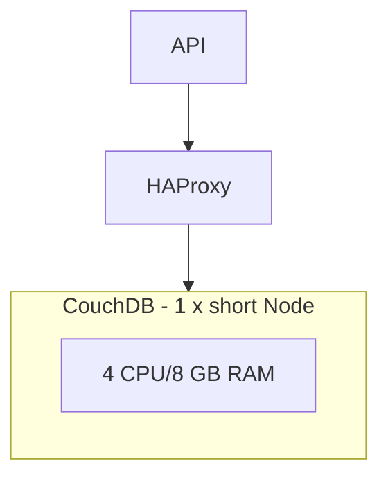
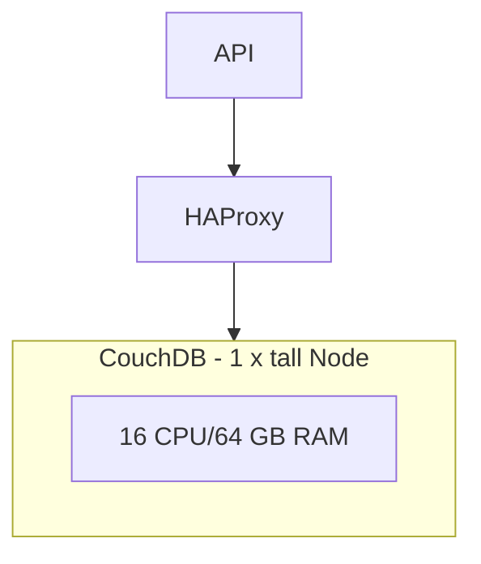
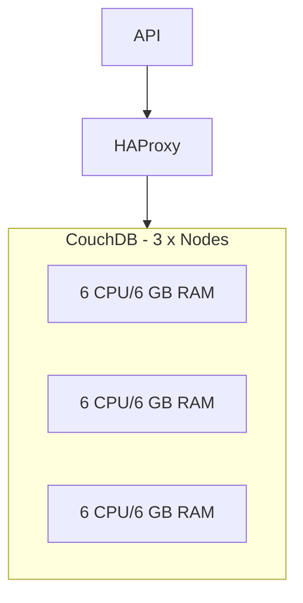


  The power of clustered CouchDB to horizontally scale the CHT  


## Introduction

Horizontally scaling is the ability to add more servers to an application to make it more performant.  This often yields better performance than vertical scaling, which is adding more resources like RAM or CPU to a single server.

CHT Core 4.0.0 introduces [a new architecture]() for hosting which gives it the ability to easily scale horizontally.  This enables large deployments to support more concurrent users and better utilize the underlying server hardware.

## Vertical scaling in 3.x and 4.x

Before getting into how the CHT horizontally scales, it should be well understood the importance of vertical scaling and what it is.  This is the ability of the CHT to support more users by adding more RAM and CPU to either the bare-metal or virtual machine host. This ensures key services like API, Sentinel and, most importantly, CouchDB, can operate without performance degradation. 

When thousands of users are simultaneously trying to synchronize with the CHT, the load can overwhelm CouchDB. As discovered [through extensive research](https://forum.communityhealthtoolkit.org/t/how-we-tested-scalability-of-cht-infrastructure/1532) and [large production deployments](https://github.com/medic/cht-core/issues/8324#issuecomment-1691411542), administrators will start to see errors in their logs and end users will complain of slow sync times.  Before moving to more CouchDB nodes, administrators should consider adding more RAM and CPU to the single server where the CHT is hosted. This applies to both CHT 3.x and CHT 4.x. Given the ease of allocating more resources, presumably in virtualized environment like [EC2](https://aws.amazon.com/ec2/), [Proxmox](https://www.proxmox.com/en/) or [ESXi](https://www.vmware.com/products/cloud-infrastructure/esxi-and-esx), this is much easier than moving [from a single to multi-node CouchDB instance]().

Here we see a normal deployment following the bare minimum [hosting requirements]() for the CHT.  We'll call this a "short" deployment because it is not yet vertically scaled:

After looking at the logs, and seeing error messages about API timeouts to CouchDB, the CHT admin can make this "taller" by adding both more RAM and CPU, so it looks like this:

Since both CHT 3.x and 4.x support this, vertical scaling is an easy, good first step in addressing performance issues in the CHT. 

### Re-sharding

For those self hosting who are looking to maximize their vertically scaled deployment, consider [splitting CouchDB shards](https://docs.couchdb.org/en/stable/cluster/sharding.html#splitting-shards) to have more shards. CouchDB uses 1 core to manage each shard.  By default, a CHT Core 4.x deployment will have 8 shards.  If you have available unused CPUs, by re-sharding you divide up CouchDB's shard management to take advantage of more cores. 

## Horizontal scaling 4.x

When:

* you can no longer vertically scale your CHT instance because of hardware limitations
* vertically scaling stops yielding better performance (currently estimated to be 32 cores and 200GB of RAM)
* you're starting a new deployment and you predict a large number of users (in excess of 1k)

it is time to consider horizontally scaling your CHT instance.  The benefit is that CouchDB has been [proven to use resources much better](https://forum.communityhealthtoolkit.org/t/how-we-tested-scalability-of-cht-infrastructure/1532) when there's multiple of instances of it, each taking a share of the work.  Here we see 18 CPUs being spread across 3 nodes (vs 16 CPUs on one instance above) with a load balancer (HAProxy) distributing requests :

To read up on how to migrate your data from a single to multi-node, please see the  [data migration guide]().

It should be noted that, unlike vertical scaling, horizontal scaling of a large, existing dataset can take a while to prepare the transfer (hours to days) and may involve a brief service outage. This should be taken into consideration when planning a move of a CHT instance with a lot of data.

