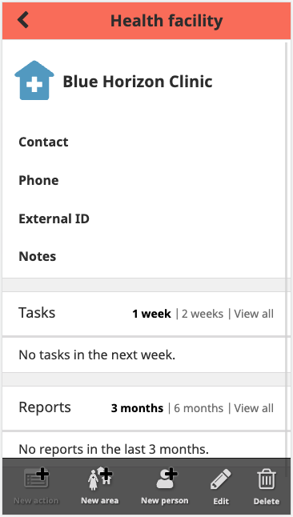
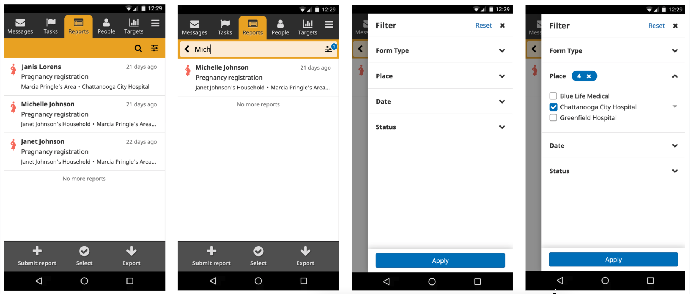
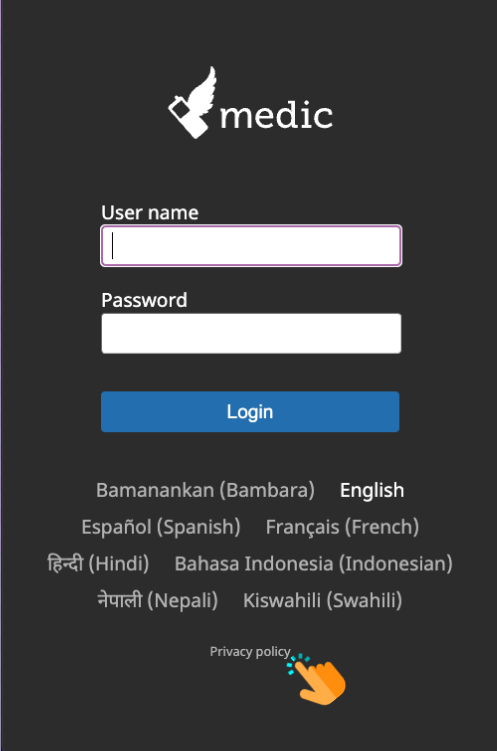

## Known issues

Check the repository for the [latest known issues](https://github.com/medic/cht-core/issues?q=is%3Aissue+label%3A%22Affects%3A+3.17.0%22).

## Upgrade notes

### Breaking changes

None.

### UI/UX changes

#### Action button labels now show for all devices

Action button labels now show on lower resolution phones, making it easier to understand what each action button does.

- [#7721](https://github.com/medic/cht-core/issues/7721): Icon labels on action buttons are not showing at the default dp for commonly used mobile devices.

#### Update to search and filters on the Contacts and Reports tabs

Search and filters on the Contacts and Reports tabs have been updated to more closely align with Android UX and [material design patterns](https://material.io/). This is the first of several incremental UI/UX changes that will improve app learnability by providing a familiar user interface that is consistent with other Android apps. To learn more about the other planned material design UI/UX changes, check out [this forum post](https://forum.communityhealthtoolkit.org/t/updates-to-the-cht-ui-ux/1998).

NOTE: The old version of the UI can be temporarily re-enabled by following the instructions [in the documentation]({}), but will be completely removed in a future release.

- [#7653](https://github.com/medic/cht-core/issues/7653): Report's filter redesign.
- [#7746](https://github.com/medic/cht-core/issues/7746): Search bar redesign.

## Highlights

### Places created with bulk upload now have a primary contact

We have improved the [bulk upload]() feature to automatically assign a primary contact to a newly created place.

- [#7724](https://github.com/medic/cht-core/issues/7724): Places created with bulk upload don't have a primary contact.

### Privacy policy is now public

Android app submission now requires a URL to the apps' privacy policy. To facilitate this process we have made the [privacy policy]() public in the login page.

- [#7662](https://github.com/medic/cht-core/issues/7662): Expose privacy policy at a public URL.

### Breadcrumbs improvement

To improve clarity, breadcrumbs on the left-hand side list of the Messages and Reports tabs will no longer display the level the user themselves belongs to. Also, breadcrumbs have been added to the Tasks tab to make it easier to know which household the task subject belongs to.





- [#5710](https://github.com/medic/cht-core/issues/5710): Add "belongs to" breadcrumbs to tasks on the left-hand side list.
- [#5697](https://github.com/medic/cht-core/issues/5697): Update the levels displayed in breadcrumbs across the app.

## Full list

### Features

- [#7653](https://github.com/medic/cht-core/issues/7653): Report's filter redesign.
- [#7746](https://github.com/medic/cht-core/issues/7746): Search bar redesign.

### Improvements

- [#7662](https://github.com/medic/cht-core/issues/7662): Expose privacy policy at a public URL.
- [#7724](https://github.com/medic/cht-core/issues/7724): Places created with bulk upload don't have a primary contact.
- [#7721](https://github.com/medic/cht-core/issues/7721): Icon labels on action buttons are not showing at the default dp for commonly used mobile devices.
- [#5710](https://github.com/medic/cht-core/issues/5710): Add "belongs to" breadcrumbs to tasks on the left hand side list.
- [#5697](https://github.com/medic/cht-core/issues/5697): Update the levels displayed in breadcrumbs across the app.

### Security fixes

None.

### Performance improvements

None.

### Bug fixes

- [#6215](https://github.com/medic/cht-core/issues/6215): The can_edit permission doesn't stop you from editing documents.

### Technical improvements

None.
