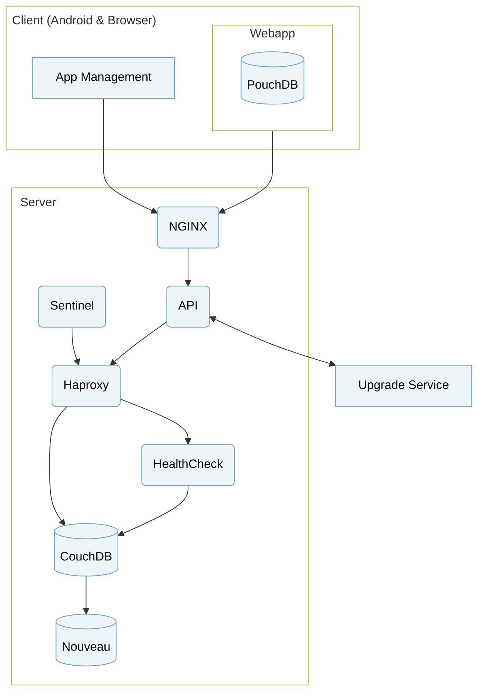

The CHT Core Framework is the primary component of the CHT. The server comes with authentication, role based authorization, data security, and a range of protected data access endpoints. Read more detail in [cht-core GitHub repository](https://github.com/medic/cht-core).

## Server

#### API

A NodeJS service that runs on the server and provides security and APIs for browsers and integrations. It also includes a custom implementation of filtered replication to allow it to support more concurrent users. See more at the [CHT Core API repo](https://github.com/medic/cht-core/tree/master/api) on GitHub.

#### Sentinel

Another NodeJS service running on the server, `sentinel` performs actions called transitions every time a document in CouchDB is added or modified. Some examples are validations, generating scheduled messages, automatic responses, creating patients, and sending alerts. See more at the [CHT Core Sentinel repo](https://github.com/medic/cht-core/tree/master/sentinel) on GitHub.

#### CouchDB

A free and open source NoSQL database used as the primary store for all app data and configuration. This can be multiple instances clustered together for additional scalability. CouchDB is really good at replication which is the process of sending the data to another database and back again, which makes it ideal for replicating data to the phone for offline access. See more at the [CouchDB](https://couchdb.apache.org) site.

#### Nouveau

Nouveau is a CouchDB service, added to the CHT in version `5.0.0`, leverages the [Lucene search engine](https://en.wikipedia.org/wiki/Apache_Lucene) to modernize how freetext searches are done.  Nouveau is faster at running these queries and more efficient at storing and creating the indexes. Offline users do not use this.  

#### NGINX

[NGINX](https://www.nginx.com/) provides SSL termination and routes requests to API.

#### HAProxy

[HAProxy](https://www.haproxy.com/) provides logging and reverse proxying for any request that makes it to CouchDB.

#### HealthCheck

A service that periodically verifies the health status of the CouchDb cluster. HAProxy uses this service for checking server status. 

#### CHT Upgrade Service

The CHT Upgrade Service is used within the CHT to update individual Docker containers when an upgrade is requested. Read more detail in the [cht-upgrade-service GitHub repository](https://github.com/medic/cht-upgrade-service/).

## Client

The CHT Core Framework provides two web applications: the [CHT Web App]({}) for care teams and program staff, and [App Management]({}) for program administrators.

#### CHT Web Application

The CHT Web Application is used by Community Health Workers and provides a large variety of [features](/building). View the source code in [our GitHub repository](https://github.com/medic/cht-core/tree/master/webapp).

##### Technology

The CHT Web Application is [reactive](https://angular.io/guide/rx-library), responsive, and a single page application built with [Angular](https://angular.io/) and [NgRx](https://ngrx.io) frameworks. Additionally, it uses the following technology:

| Technology                                                       | Usage                                                                                                                                                                                                                                                                                                                                                                                       |
|------------------------------------------------------------------|---------------------------------------------------------------------------------------------------------------------------------------------------------------------------------------------------------------------------------------------------------------------------------------------------------------------------------------------------------------------------------------------|
| [PouchDB](https://pouchdb.com)                                   | To implement an [Offline-First]() strategy, which means the data is stored on the client and all pages can load immediately regardless of whether the user has a fast connection, slow connection, or no connection at all. The data is stored in PouchDB, which replicates changes back and forth in the background with the server CouchDB. |
| [Enketo](https://enketo.org)                                     | To render configured xforms and help with styling and dynamic elements such as show/hide and validation rules.                                                                                                                                                                                                                                                                              | |
| [ngx-bootstrap](https://github.com/valor-software/ngx-bootstrap) | To integrate Bootstrap components in the Angular application.                                                                                                                                                                                                                                                                                                                               |
| [ngx-translate](https://github.com/ngx-translate/core)           | To automatically translate the labels from a Angular application. Read more about [how to configure translations](https://docs.communityhealthtoolkit.org/apps/reference/translations/).                                                                                                                                                                                                    |
| [Karma](https://github.com/karma-runner/karma)                   | A test runner for [unit tests](https://github.com/medic/cht-core/tree/master/webapp/tests)                                                                                                                                                                                                                                                                                                  |
| [MochaJS](https://mochajs.org/)                                  | A test framework to run the [unit tests](https://github.com/medic/cht-core/tree/master/webapp/tests)                                                                                                                                                                                                                                                                                        |
| [WebDriverIO](https://webdriver.io/)                             | To run the [e2e tests](https://github.com/medic/cht-core/tree/master/tests/e2e)                                                                                                                                                                                                                                                                                                             |
| [Less](http://lesscss.org/)                                      | A CSS preprocessor                                                                                                                                                                                                                                                                                                                                                                          |
##### Structure

The CHT Web Application has the following high level structure:

- **/js**: Contains the vanilla JavaScript scripts, for example: Enketo widgets, MomentJS locales, etc.
- **/ts**: Contains the Angular application source code which uses TypeScript.
  - **/actions**, **/effects**, **/reducers** and **/selectors**: Contain the implementation for the application’s reactive state which uses [NgRx](https://ngrx.io) framework.
  - **/components**, **/directives**, **/pipes**, **/providers** and **/services**: Contain the reusable elements from [Angular](https://angular.io/) framework.
  - **/modals**: Contains the all application’s modals components.
  - **/modules**: Contains the application’s modules, each of them has components that are associated to the modules’ routing.
- **/css**:  Contains the style files. It uses [Less](http://lesscss.org/) as a CSS preprocessor.
- **/fonts**: Contains the fonts.
- **/img**: Contains the static images.

#### App Management
[App Management](https://docs.communityhealthtoolkit.org/apps/features/admin/) is an interface for non-technical administrative users to manage users and settings.

View the application source code in [our GitHub repository](https://github.com/medic/cht-core/tree/master/admin).

##### Technology
App Management is a single page application built with [AngularJS](https://angularjs.org) framework and implements [Redux](https://github.com/reduxjs/redux) to manage a reactive state. Additionally, it uses the following technology:

| Technology                                                                  | Usage                                                                                                                                                                                   |
|-----------------------------------------------------------------------------| --------------------------------------------------------------------------------------------------------------------------------------------------------------------------------------- |
| [Angular Translate](https://github.com/angular-translate/angular-translate) | To automatically translate the labels from a AngularJS application. Read more about [how to manage translations](https://docs.communityhealthtoolkit.org/apps/reference/translations/). |
| [Karma](https://github.com/karma-runner/karma)                              | A test runner for [unit tests](https://github.com/medic/cht-core/tree/master/admin/tests)                                                                                               |
| [MochaJS](https://mochajs.org/)                                             | A test framework to run the [unit tests](https://github.com/medic/cht-core/tree/master/admin/tests)                                                                                     |
| [WebDriverIO](https://webdriver.io/)                                        | To run the [e2e tests](https://github.com/medic/cht-core/tree/master/tests/e2e)                                                                                                         |
| [Less](http://lesscss.org/)                                                 | A CSS preprocessor                                                                                                                                                                      |

##### Structure
- **/css**: Contains style files. It uses [Less](http://lesscss.org/) as a CSS preprocessor.
- **/js**: Contains the JavaScript code.
  - **/actions**, **/reducers** and **/selectors**: Contain the implementation of [Redux](https://github.com/reduxjs/redux).
  - **/controllers**, **/directives**, **/filters** and **/services**: Contain the reusable elements from [AngularJS](https://angularjs.org) framework.
  - **/modules**: Contains the vanilla JavaScript scripts.
- **/template**: Contains the HTML templates that are used in the AngularJS components and directives.

