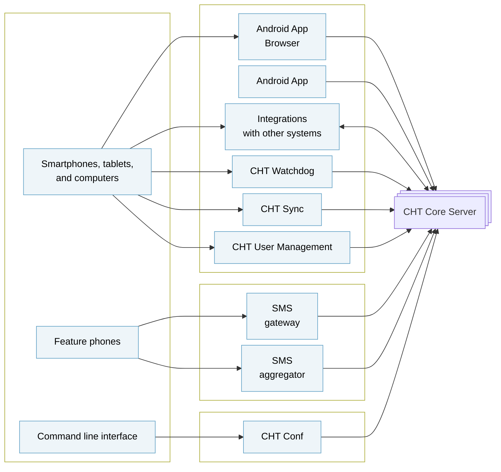

## CHT Core Framework

The [CHT Core Framework]() makes it faster to build full-featured, scalable digital health apps by providing a foundation developers can build on. These apps can support most languages, are [Offline-First](), and work on basic phones (via SMS), smartphones, tablets, and computers.

App developers are able to define health system roles, permissions and reporting hierarchies, and make use of five highly configurable areas of functionality: messaging, task and schedule management, decision support workflows, longitudinal person profiles, and analytics.



The Core Framework can be used to support the unique needs of a given health system and the work of community health workers, frontline supervisors, facility-based nurses, health system managers, and even patients and caregivers. Visit the Commuity Health Toolkit website to request a [self-guided demo](https://communityhealthtoolkit.org/contact) of an app built with the Core Framework. You can also explore an [overview of the Core Framework]() and its key features.

Read more about the [architecture of the CHT Core](/technical-overview/architecture/cht-core).

## CHT Conf

A command-line interface tool to manage and configure CHT application. The 
[CHT Conf architecture page](/technical-overview/architecture/cht-conf) has more information.

## CHT Sync

A suite of tools for extracting and normalizing data from the Core Framework's CouchDB, and rendering the data in analytics dashboards to visualize key data for a CHT deployment.

Read more detail on the CHT Sync [overview page](),  the [GitHub repository](https://github.com/medic/cht-sync), or the [technical overview](/technical-overview/architecture/cht-sync).

## CHT Watchdog

Monitoring and alerting for the CHT Core Framework to ensure CHWs are able to deliver care without interruption caused by server downtime.  Read more detail on the CHT Watchdog [technical overview page](/technical-overview/architecture/cht-watchdog) or the [GitHub repository](https://github.com/medic/cht-watchdog).

## CHT Android

CHT Web Application works in the browser or wrapped in the [CHT Android]() app which allows for project branding, sets the project URL, and hides browser elements like the URL bar. The app also provides some deeper integration with other android apps and native phone functions that are otherwise unavailable to webapps.

## CHT Gateway

[CHT Gateway](https://github.com/medic/cht-gateway) is an android app for sending and receiving SMS messages. Each SMS enabled project has one gateway running. It polls an api endpoint to write incoming SMS into the CouchDB and retrieve outgoing SMS to send.

## CHT Interoperability

[CHT Interoperability]() implements interoperability between the CHT and other health information systems based on OpenHIE architecture and HL7 FHIR messaging format.

## CHT User Management Tool

[CHT User Management Tool]() is a web application that works with the CHT to decentralize the user management. 
