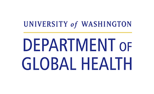
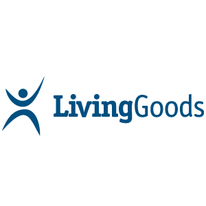
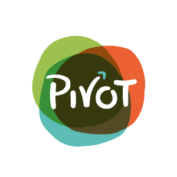

{}
The [Community Health Toolkit](https://communityhealthtoolkit.org) is a collection of open-source technologies and open-access resources developed by a community focused on global health equity. We envision a world where primary health care is equitable, accessible, and delivered by people who are trusted in their communities. Start with the [CHT overview](), and join our [community forum](https://forum.communityhealthtoolkit.org/)!
{}

Community health systems can dramatically improve the accessibility, quality, speed, and equity of primary health care, but only if health workers are effectively equipped and supported. Advances in open source technology are making it easier and more affordable than ever to deliver impactful, dignified care in even the hardest-to-reach communities. 

With thousands of health workers using these tools to support a million home visits every month, the CHT is the most full-featured, mature, and widely-used open source software toolkit designed specifically for community health systems. Hundreds of individuals contribute to the CHT as designers, developers, researchers, health policy experts, health system implementers, and frontline health workers. 



 

## The CHT Community

The CHT is 100% open source--it always has been and always will be freely available as a public good. This is possible thanks to a diverse community of contributors that includes global health NGOs, technical organizations, governments, and research institutions, with the non-profit organization [Medic Mobile](https://medicmobile.org) serving as a technical steward. 

Our longterm focus on community-driven health systems, integrated care, and universal health coverage has surfaced innumerable insights that make the CHT unique. We're also deeply committed to [human-centered and participatory design](https://doi.org/10.1080/02681102.2019.1667289), as an approach to building technology with and for hard-to-reach communities. These principles have helped us to foster a remarkably dynamic and innovative community; learning and building with this community is one of the key reasons people decide to work with the CHT. 

  
  
  
  
  
  
  
  
  
  
  
  
  
  
  
  

If you’re contributing to the CHT and would like to see your organization’s logo featured here, please send an email to hello@medicmobile.org.

## Speeding up app development with the CHT Core Framework

The Core Framework makes it faster to build full-featured, scalable digital health apps by providing a foundation developers can build on. These apps can support most languages, are offline-first, and work on basic phones (via SMS), smartphones, tablets, and the web. Rich interactive applications that would take 6-18 months to build from scratch can be built using CHT Core in as little as 1-2 months. Some of our COVID-19 response applications shipped in under 2 weeks. 

App developers are able to define health system roles, permissions and reporting hierarchies, and make use of five highly configurable areas of functionality: messaging, task and schedule management, decision support workflows, longitudinal person profiles, and analytics. 

The Core Framework can be used to support the unique needs of a given health system and the work of community health workers, frontline supervisors, facility-based nurses, health system managers, and even patients and caregivers.

## Offline-first technology

Digital health apps need to support health systems in a wide range of low infrastructure environments. Apps built with the Core Framework are designed to be offline-first and work with only an occasional internet connection.

These apps store a user’s data locally on their device so that workflows can be completed without syncing to the server. When a connection becomes available, data will automatically sync to and from the server. Offline-first technology enables health workers to carry out important duties even when opportunities to sync may be weeks apart. As with any app, there is a limit to how much data can be stored locally, particularly on a mobile device. For users needing access to large amounts of data, online user roles are available. 

## Build one application and run it across smartphones, tablets, and the web

A responsive web app is a hybrid of a website and a native mobile application. On desktop and laptop computers, it runs in the web browser. On Android devices (such as cell phones or tablets), it is downloaded as an app. The same source code powers the experience, meaning that the app you see on your desktop is the same app you see on your mobile device. 

Web apps built with the Core Framework are fully responsive, which means content will scale to fill the available space. Users accessing the app on a mobile device will see a single-panel mobile layout. Users accessing the app on a desktop or laptop device will see a two-panel layout. 

Progressive Web Application (PWA) is another term for web apps that are built and enhanced with modern APIs to deliver offline-first, native-like capabilities while reaching anyone, anywhere, on any device with a single codebase. For more about how CHT Apps and other PWAs integrate the best of native apps and the open web, see the post [What are Progressive Web Apps?](https://web.dev/what-are-pwas/) on web.dev.

## Made for localization

Apps can be customized for different deployments and types of workflows. The Core Framework has been used in dozens of countries around the world with [localization settings]().

Users can currently interact with the app in English, French, Hindi, Nepali, Spanish, Swahili, or Indonesian and new languages can be added in the admin console. The app also supports Bikram Sambat or Gregorian calendars and localized date formatting.

## Example and reference apps

The Community Health Toolkit’s [Example and Reference Apps]() provide organizations with a template for structuring and organizing a community health workflow, its configuration code, and testing framework. They include a foundation for forms, data fields, and even analytics, and can be deployed as-is or easily customized by a developer for your unique context.
